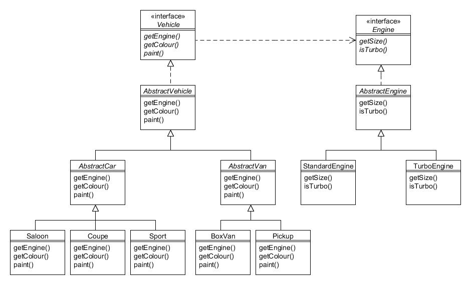

# 1. ¿Qué son los patrones de diseño?

Imagine que le acaban de asignar la tarea de diseñar un sistema de software. Su cliente le dice que necesita modelar los Gadgets que fabrica su fábrica y que cada Gadget consta de los mismos componentes, pero esas piezas son un poco diferentes para cada tipo de Gadget. Y también fabrica Gizmos, donde cada Gizmo viene con una selección de extras opcionales, de los cuales se puede elegir cualquier combinación. Y también necesita un número de serie secuencial único estampado en cada artículo fabricado.

¿Cómo harías para diseñar estas clases?

Lo más probable es que, sin importar en qué dominio del problema esté trabajando, alguien más haya tenido que diseñar una solución similar en el pasado. No necesariamente para Gadgets y Gizmos, por supuesto, pero conceptualmente similares en términos de objetivos y estructura. En otras palabras, existe una buena posibilidad de que ya exista una solución o enfoque genérico, y todo lo que necesita hacer es aplicar ese enfoque para resolver su enigma de diseño.

Para eso están los patrones de diseño. Describen soluciones genéricas a problemas de diseño de software. Una vez versado en patrones, podrías pensar "esos Gadgets podrían modelarse usando el patrón *Abstract Factory*, los Gizmos usando el patrón *Decorator* y la generación de números de serie usando el patrón *Singleton*".

## Cómo utiliza este libro los patrones {#h2-1}

Este libro ofrece ejemplos elaborados para cada uno de los 23 patrones descritos en la obra de referencia clásica *Patrones de diseño: elementos de software reutilizable orientado a objetos* (Gamma, 1995) más cuatro patrones útiles adicionales, incluido Modelo-Vista-Controlador (MVC).

Cada uno de los ejemplos trabajados en este libro utiliza un tema común extraído del mundo empresarial, siendo el de un fabricante de vehículos ficticio llamado Foobar Motor Company. La empresa fabrica una gama de coches y furgonetas junto con los motores utilizados para propulsar los vehículos. Por lo tanto, debería familiarizarse con las clases descritas en esta introducción.

La jerarquía de clases se ve así:



Figura 1.1 : Jerarquías de las clases `Vehicle` y `Engine`

`Vehicle` y `Engine` son las interfaces raíz de las jerarquías, y cada objeto de vehículo requiere una referencia a un objeto `Engine`. `AbstractVehicle` es una clase abstracta que implementa la interfaz `Vehicle`, y `AbstractEngine` también implementa la interfaz `Engine`. En cuanto a los vehículos, también tenemos como tipos de coches `AbstractCar` y `AbstractVan` junto con las subclases concretas `Saloon`, `Coupe` y `Sport`. `AbstractVan` tiene las subclases concretas `BoxVan` y `Pickup` como tipos de furgonetas.

Las subclases concretas de `AbstractEngine` son `StandardEngine` y `TurboEngine`.

A pesar de que hay varias clases en las jerarquías, el código de cada una se ha mantenido deliberadamente simple para que puedas concentrarte en comprender los patrones en lugar de tener que descifrar código complejo. Para ilustrar esto, aquí está el código fuente de Java para la interfaz de `Engine`:

```java
public interface Engine {  
    public int getSize();  
    public boolean isTurbo();  
} 
```

Esta interfaz simple simplemente requiere métodos captadores para devolver el tamaño del motor (en centímetros cúbicos) y si tiene turbocompresor. La clase `AbstractEngine` se ve así:

```java
public abstract class AbstractEngine implements Engine {  
    private int size;  
    private boolean turbo;  
   
    public AbstractEngine(int size, boolean turbo) {  
        this.size = size;  
        this.turbo = turbo;  
    }  
   
    public int getSize() {  
        return size;  
    }  
   
    public boolean isTurbo() {  
        return turbo;  
    }  
   
    public String toString() {  
        return getClass().getSimpleName() + " (" + size + ")";  
    }  
} 
```

Esta implementación simplificada de un motor requiere que los atributos apropiados en el constructor. El método `toString()` ha sido implementado para producir una salida en este formato:

```text
StandardEngine (1300)  
TurboEngine (2000) 
```

Los métodos `equals()` y `hashCode()` heredarán de `Object` y, por lo tanto, utilizarán la identidad del objeto. Esto tiene sentido, ya que por ejemplo, dos motores estándar de 1300 cc separados son entidades lógicamente diferentes y así deberían ser tratadas como tales (un motor iría en un vehículo y el otro en un vehículo diferente).

Las subclases concretas son trivialmente simples:

```java
public class StandardEngine extends AbstractEngine {  
    public StandardEngine(int size) {  
        super(size, false); // no turboalimentado  
    }  
} 


public class TurboEngine extends AbstractEngine {  
    public TurboEngine(int size) {  
        super(size, true); // turboalimentado
    }  
} 
```

Ahora que ha visto la jerarquía de `Engine`, podemos ver la interfaz de `Vehicle`:

```java
public interface Vehicle {  
    public enum Colour {UNPAINTED, BLUE, BLACK, GREEN, RED, SILVER, WHITE, YELLOW};  
   
    public Engine getEngine();  
    public Vehicle.Colour getColour();  
    public void paint(Vehicle.Colour colour);  
} 
```

Una `enum` anidada llamada `Colour` define los colores posibles que cada objeto `Vehicle` podría tener.

Así es como la clase `AbstractVehicle` implementa `Vehicle`:

```java
public abstract class AbstractVehicle implements Vehicle {  
    private Engine engine;  
    private Vehicle.Colour colour;  
   
    public AbstractVehicle(Engine engine) {  
        this(engine, Vehicle.Colour.UNPAINTED);  
    }  
   
    public AbstractVehicle(Engine engine, Vehicle.Colour colour) {  
        this.engine = engine;  
        this.colour = colour;  
    }  
   
    public Engine getEngine() {  
        return engine;  
    }  
   
    public Vehicle.Colour getColour() {  
        return colour;  
    }  
   
    public void paint(Vehicle.Colour colour) {  
        this.colour = colour;  
    }  
   
    public String toString() {  
        return getClass().getSimpleName() + " (" + engine + ", " + colour + ");  
    }  
} 
```

Los constructores sobrecargados en `AbstractVehicle` requieren que se proporcione un objeto `Engine` y, opcionalmente, un color de vehículo.

La salida de las llamadas a `toString()` serán en este formato:

```text
Saloon (StandardEngine (1300), RED)  
BoxVan (TurboEngine (2200), WHITE) 
```

Las clases `AbstractCar` y `AbstractVan` simplemente reenvían a los constructores (obviamente, las clases reales definirían las diferencias entre autómoviles y camionetas):

```java
public abstract class AbstractCar extends AbstractVehicle {  
    public AbstractCar(Engine engine) {  
        this(engine, Vehicle.Colour.UNPAINTED)  
    }  
   
    public AbstractCar(Engine engine, Vehicle.Colour colour) {  
        super(engine, colour);  
    }  
} 


public abstract class AbstractVan extends AbstractVehicle {  
    public AbstractVan(Engine engine) {  
        this(engine, Vehicle.Colour.UNPAINTED)  
    }  
   
    public AbstractVan(Engine engine, Vehicle.Colour colour) {  
        super(engine, colour);  
    }     
} 
```

Las subclases concretas también reenvían a los constructores:

```java
public class Saloon extends AbstractCar {  
    public Saloon(Engine engine) {  
        this(engine, Vehicle.Colour.UNPAINTED)  
    }  
   
    public Saloon(Engine engine, Vehicle.Colour colour) {  
        super(engine, colour);  
    }  
} 


public class Coupe extends AbstractCar {  
    public Coupe(Engine engine) {  
        this(engine, Vehicle.Colour.UNPAINTED)  
    }  
   
    public Coupe(Engine engine, Vehicle.Colour colour) {  
        super(engine, colour);  
    }     
} 


public class Sport extends AbstractCar {  
    public Sport(Engine engine) {  
        this(engine, Vehicle.Colour.UNPAINTED)  
    }  
   
    public Sport(Engine engine, Vehicle.Colour colour) {  
        super(engine, colour);  
    }  
} 


public class BoxVan extends AbstractVan {  
    public BoxVan(Engine engine) {  
        this(engine, Vehicle.Colour.UNPAINTED)  
    }  
   
    public BoxVan(Engine engine, Vehicle.Colour colour) {  
        super(engine, colour);  
    }  
} 


public class Pickup extends AbstractVan {  
    public Pickup(Engine engine) {  
        this(engine, Vehicle.Colour.UNPAINTED)  
    }  
   
    public Pickup(Engine engine, Vehicle.Colour colour) {  
        super(engine, colour);  
    }  
} 
```

Muchos de los patrones en este libro utilizan uno o más de las clases de arriba de alguna forma, a menudo agregando funcionalidad adicional o clases para los propósitos de explicar el patrón en cuestión. También verá frecuentemente la referencia a una clase `Client`; esto simplemente se refiere a cualquier clase que esté haciendo uso del patrón en discusión.

## Cómo se clasifican los patrones {#h2-2}

Cada uno de los patrones descritos en este libro caen bajo una de las tres categorías; *Creacional*, *Estructural* o *Conductual*:

+ Los patrones *creacionales* proporcionan enfoques para la creación de instancias de objetos. Donde coloque la palabra clave new afectará a qué tan estrechamente o débilmente están acopladas sus clases;

+ Los patrones *estructurales* proporcionan enfoques para combinar las clases y objetos para formar estructuras más grandes. Decidir si usar la herencia o la composición afecta a la flexibilidad y adaptación de su software;

+ Los patrones *de comportamiento* proporcionan enfoques para manejar la comunicación entre objetos.

## Principios comunes en patrones de diseño {#h2-3}

La experiencia ha demostrado que algunos enfoques orientados a objetos son más flexibles que otros. A continuación se incluye un resumen de los principios fundamentales que los patrones de este libro se esfuerzan por cumplir:

1. ***Programa para una interfaz, no para una implementación.*** Por "interfaz" se entiende el concepto general de abstracción, que podría referirse a una interfaz de Java o a una clase abstracto. Para lograr esto, use el tipo más general (por ejemplo, la interfaz) posible cuando declare las variables, el constructor y los argumentos del método, etc. Hacerlo brinda flexibilidad adicional en cuanto a los tipos reales que se usan en tiempo de ejecución.

2. ***Preferir la composición de objetos a la herencia.*** Cuando una clase está relacionada con otra de alguna manera, se debe distinguir entre relaciones "es un" (o "es un tipo de") y "tiene un". En las jerarquías `Vehicle` y `Engine` descritas anteriormente, es verdad decir que `AbstractCar` "es un" `Vehicle`, y que `Saloon` "es un" `AbstractCar`. Pero no sería verdad decir que `Vehicle` "es un" `Engine`, sino que un `Vehicle` "tiene un" `Engine`. Por lo tanto, la herencia se usa legítimamente para `AbstractCar` y `Saloon`, pero la composición de objetos se usa entre `Vehicle` y `Engine`. No caiga en la tentación de utilizar la herencia solo para evitar tener que escribir algunos métodos. Algunas veces usar una relación "tiene un" es más flexible incluso cuando una relación "es un" parece la elección natural. Verá un ejemplo de esto en el patrón *Decorador*.

3. ***Mantenga los objetos débilmente acoplados.*** Idealmente, las clases debería modelar simplemente una cosa, y solo estar compuestas de otros objetos que son genuinamente requeridas (tales como un `Vehicle` requiere un `Engine`). Pregúntese a usted mismo que ocurriría si quisiera usar una clase que ha escrito en una aplicación completamente diferente; ¿Qué "equipaje" (es decir, otras clases) también sería necesario copiar? Al mantener esto al mínimo, hace que su clase sea más reutilizable. Un buen ejemplo de un patrón que utiliza acoplamiento flexible es *Observador*.

4. ***Encapsula el concepto que varía.*** Si ha escrito una clase en la cual algunas partes son lo mismo para cada instancia pero otra parte de la clase varía para cada instancia, considere extraer este último en una clase propia, a la que hace referencia la clase original. Un ejemplo de patrón que usa este principio es *Estrategia*.

## Algunos consejos generales {#h2-4}

Los principios enumerados anteriormente se volverán más evidentes a medida que exploremos los patrones en detalle. También debe tener en cuenta que los patrones descritos en este libro dan un enfoque general a un problema particular. Es bastante aceptable que los modifique o adapte para que se ajusten mejor a su problema particular. Y es muy común que se combinen múltiples patrones para resolver problemas complejos.

Sin embargo, recuerde que debe esforzarse por mantener las cosas simples. Es fácil, después de leer un libro como este, pensar que hay que encontrar un patrón para resolver un problema particular cuando podría haber disponible una solución aún más simple. Uno de los mantras de la Programación Extrema (XP) es *"No lo vas a necesitar"*, la idea es que debes evitar agregar características antes de que sean requeridas, y esta filosofía también podría aplicarse a los patrones; tenga cuidado de agregar una característica innecesaria solo para poder aplicar un patrón. Los patrones no son una "bala mágica", sino simplemente otro conjunto de herramientas en su caja de herramientas, aunque sean un conjunto indispensable.

Utilice su conocimiento y experiencia para juzgar si un patrón debe aplicarse a sus circunstancias y, de ser así, en qué medida necesita adaptarlo. Un buen ejemplo de cuándo aplicar patrones puede resultar beneficioso es cuando se "refactoriza" código existente. La refactorización es cuando se cambia la estructura de algún software pero no su comportamiento, para mejorar su mantenibilidad y flexibilidad. Esto brinda una buena oportunidad para examinar su código para ver si un patrón podría proporcionar una mejor estructura, como reemplazar condicionales o definir clases de fábrica para ayudar a la creación de instancias de objetos.

Los patrones se han aplicado a muchos lenguajes de programación además de Java, particularmente a los lenguajes orientados a objetos y, de hecho, a otros campos, y se originaron aplicándolos al diseño arquitectónico. Y periódicamente se desarrollan y aplican nuevos patrones, por lo que puede considerar este libro simplemente como un punto de partida en el tema.
