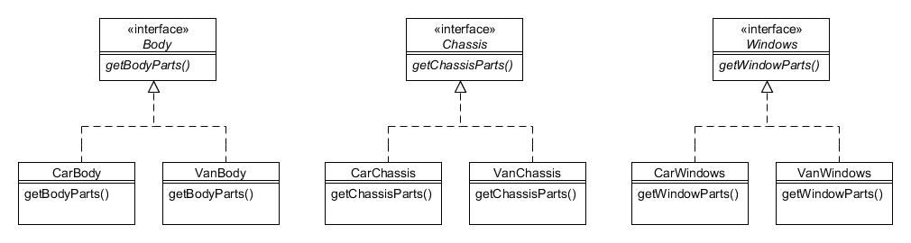

# 2. Factoría abstracta (abstract factory)

Tipo: Creacional

Objetivo: Proporcionar una interfaz para crear familias de objetos relacionados o dependientes sin tener que especificar sus clases concretas.

La Compañía de Motores Foobar fabrica coches y furgonetas que, durante su construcción, comprenden (entre muchas otras cosas) una carrocería, un chasis y cristalería para las ventanas. Aunque tanto los coches como las furgonetas necesitan los mismos tipos de componentes, las especificaciones de cada tipo difieren dependiendo de si se utiliza para un coche o una furgoneta.

En otras palabras:

* La carrocería de un coche es diferente de la carrocería de una furgoneta;
* El chasis de un coche es diferente del chasis de una furgoneta;
* Las ventanas de un coche son diferentes de las ventanas de una furgoneta.

Por lo tanto, cuando necesitamos construir un vehículo podemos pensar que los componentes provienen de diferentes 'familias'; esto es, cuando construimos un coche usamos una familia de componentes y cuando construimos una furgoneta usamos una familia diferente de componentes.

De este modo podemos modelar los componentes en jerarquías simples, como se ilustra en la siguiente figura:



Figura 2.1 : Jerarquía de clases _Body_, _Chassis_ y _Windows_

Como puede ver, hay una interfaz para _Body_ que tiene implementaciones de _CarBody_ y _VanBody_. Asimismo, tenemos jerarquías separadas similares para _Chassis_ y _Windows_.

El código para la jerarquía de _Body_ es muy simple:

```java
public interface Body {
    public String getBodyParts();
}


public class CarBody implements Body {
    public String getBodyParts() {
        return "Piezas de carrocería para un coche.";
    }
}


public class VanBody implements Body {
    public String getBodyParts() {
        return "Piezas de carrocería para una caravana";
    }
}
```

El código para la jerarquía de _Chassis_ es casi idéntico:

```java
public interface Chassis {
    public String getChassisParts();
}


public class CarChassis implements Chassis {
    public String getChassisParts() {
        return "Piezas de chasis para un coche.";
    }
}


public class VanChassis implements Chassis {
    public String getChassisParts() {
        return "Piezas de chasis para una furgoneta.";
    }
}
```

Y lo mismo el código para la jerarquía de _Windows_:

```java
public interface Windows {
   public String getWindowParts();
}


public class CarWindows implements Windows {
    public String getWindowParts() {
        return "Cristalería para ventanas de un coche.";
    }
}


public class VanWindows implements Windows {
    public String getWindowParts() {
        return "Cristalería para ventanas de una furgoneta.";
  }
}
```

Ahora necesitamos una forma de obtener la familia correcta de las piezas (o para un coche o para una furgoneta) pero sin tener que instanciar explícitamente el tipo específico en los programas cliente cada vez que lo requiramos. Para lograr esto, definiremos clases "factoría" que harán esto por nosotros:


Figura 2.2 : Patrón de Factoría Abstracta

La clase _AbstractVehicleFactory_ es una clase abstracta que define los métodos abstractos _createBody()_, _createChassis()_ y _createWindows()_, devolviendo un objeto _Body_, _Chassis_ y _Windows_ respectivamente:

```java
public abstract class AbstractVehicleFactory {
    public abstract Body createBody();
    public abstract Chassis createChassis();
    public abstract Windows createWindows();
}
```

La subclase concreta _CarFactory_ devuelve los objetos específicos para la familia de _Car_:

```java
public class CarFactory extends AbstractVehicleFactory {
    public Body createBody() {
        return new CarBody();
    }
 
    public Chassis createChassis() {
        return new CarChassis();
    }
 
    public Windows createWindows() {
        return new CarWindows();
    }
}
```

La subclase concrata _VanFactory_ devuelve los objetos específicos para la familia _Van_:

```java
public class VanFactory extends AbstractVehicleFactory {
    public Body createBody() {
        return new VanBody();
    }
 
    public Chassis createChassis() {
        return new VanChassis();
    }
 
    public Windows createWindows() {
        return new VanWindows();
    }
}
```

Ahora solo queda que los programas clientes instancien la 'factoría' apropiada después de lo cual pueden obtener las piezas correctas sin tener que especificar si son para un coche o una furgoneta:


Figura 2.3 : Cómo usan los clientes la Factoría Abstracta

```java
String whatToMake = "car"; // o "van"
AbstractVehicleFactory factory = null;
 
// Creamos la 'factoría' correcta...
if (whatToMake.equals("car")) {
    factory = new CarFactory();
} else {
    factory = new VanFactory();
}
 
// Creamos los componentes del vehículo
// Estas serán todas las piezas de automóviles o todas las piezas de furgonetas.
Body vehicleBody = factory.createBody();
Chassis vehicleChassis = factory.createChassis();
Windows vehicleWindows = factory.createWindows();
 
// Mostramos qué hemos creado...
System.out.println(vehicleBody.getBodyParts());
System.out.println(vehicleChassis.getChassisParts());
System.out.println(vehicleWindows.getWindowParts());
```

Por lo tanto, su programa cliente necesita saber si está fabricando un automóvil o una camioneta, pero una vez que ha creado una instancia de la fábrica correcta, todos los métodos para crear las piezas se pueden realizar utilizando un conjunto idéntico de llamadas a métodos.

La principal desventaja del patrón _**Abstract Factory**_ surge si necesita agregar 'productos' adicionales. Por ejemplo, si ahora necesitamos incluir _Lights_ en la familia de componentes, necesitaríamos modificar _AbstractVehicleFactory_, _CarFactory_ y _VanFactory_, además de crear una nueva jerarquía de _Lights_ (_CarLights_ y _VanLights_).
