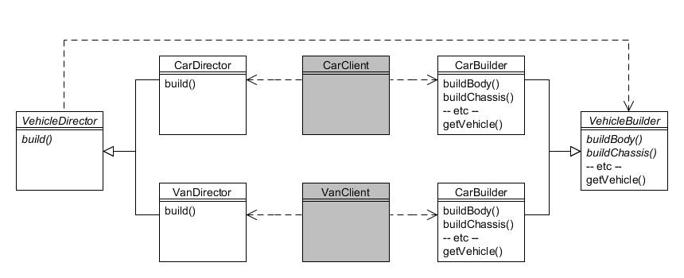

# 3. Constructor (Builder) {#h2-5}

Tipo: Creacional

Objetivo: Separar la construcción de un objeto complejo de su representación de forma que el mismo proceso de construcción pueda crear representaciones diferentes.

La Compañía de Motores Foobar fabrica coches y furgonetas, y el proceso de construcción para cada uno difiere en el detalle; por ejemplo, la carrocería de una furgoneta se compone de una zona de cabina y una gran zona de almacenamiento reforzada, mientras que un coche berlina se compone de una zona de pasajeros y una zona de equipaje (por ejemplo, el maletero). Y, por supuesto, hay un número de pasos complejos que deben realizarse independientemente del tipo de vehículo se esté construyendo.

El patrón _**Constructor**_ facilita la construcción de objetos complejos separando los pasos individuales en métodos separados en una jerarquía del _**Constructor**_, y después usa un objeto _**Director**_ para especificar los pasos requeridos en el orden correcto. Finalmente, el producto terminado se recupera del _**Constructor**_.

El siguiente diagrama muestra estas relaciones:



Figura 3.1 : Patrón constructor

Comenzamos con la clase abstracta _VehicleBuilder_:

```java
public abstract class VehicleBuilder {
    public void buildBody() {}
    public void buildBoot() {}
    public void buildChassis() {}
    public void buildPassengerArea() {}
    public void buildReinforcedStorageArea() {}
    public void buildWindows() {}
    public abstract Vehicle getVehicle();
}
```

Observe cómo esta clase define todos los métodos de 'construcción' posibles tanto para automóviles como para camionetas, y proporciona implementaciones vacías para cada uno de forma predeterminada. El método abstracto `getVehicle()` sirve para devolver el vehículo terminado.

La clase `CarBuilder` hereda de `VehicleBuilder` y anula los métodos apropiados:

```java
public class CarBuilder extends VehicleBuilder {
    private AbstractCar carInProgress;
 
    public CarBuilder(AbstractCar car) {
        carInProgress = car;
    }
 
    public void buildBody() {
        // Agrega Body a carInProgress
        System.out.println("Construyendo la carrocería del coche");
    }
 
    public void buildBoot() {
        // Agrega el maeletero a carInProgress
        System.out.println("Construyendo el maletero del coche");
    }
 
    public void buildChassis() {
        // Agrega el chasis a carInProgress
        System.out.println("Construyendo el chasis del coche");
    }
 
    public void buildPassengerArea() {
        // Agrega la zona de pasajeros a carInProgress
        System.out.println("Construyendo la zona de pasajeros");
    }
 
    public void buildWindows() {
        // Agrega las ventanas a carInProgress
        System.out.println("Construyendo las ventanas del coche");
    }
 
    public Vehicle getVehicle() {
        return carInProgress;
    }
}
```

Observe que el método `buildReinforcedStorageArea()` no estaba sobreescrito ya que no es aplicable a los coches. La clase _VanBuilder_ sobreescribe los métodos apropiados para construir una furgoneta:

```java
public class VanBuilder extends VehicleBuilder {
    private AbstractVan vanInProgress;
 
    public VanBuilder(AbstractVan van) {
        vanInProgress = van;
    }
 
    public void buildBody() {
        // Agrega la carrocería a vanInProgress
        System.out.println("construyendo la carrocería de la furgoneta");
    }
 
    public void buildChassis() {
        // Agrega el chasis a vanInProgress
        System.out.println("construyendo el chasis de la furgoneta");
    }
 
    public void buildReinforcedStorageArea() {
        // Agrega la zona de almacenamiento a vanInProgress
        System.out.println("Construyendo la zona de almacenamiento de la furgoneta");
    }
 
    public void buildWindows() {
        // Agrega las ventanas a  vanInProgress
        System.out.println("Construyendo las ventanas de la furgoneta");
    }
 
    public Vehicle getVehicle() {
        return vanInProgress;
    }
}
```

Observe que los métodos `buildBoot()` y `buildPassengerArea()` no fueron sobreescritos ya que no son aplicables a los furgonetas. La clase abstracta _VehicleDirector_ requiere que se pase un objeto _VehicleBuilder_ a su método `build()` para su implementación por las subclases:

```java
public abstract class VehicleDirector {
    public abstract Vehicle build(VehicleBuilder builder);
}
```

La clase _CarDirector_ heredas de _VehicleDirector_ y proporciona el proceso paso a paso para construir un coche:

```java
public class CarDirector extends VehicleDirector {
    public Vehicle build(VehicleBuilder builder) {
        builder.buildChassis();
        builder.buildBody();
        builder.buildPassengerArea();
        builder.buildBoot();
        builder.buildWindows();
        return builder.getVehicle();
    }
}
```

La clase VanDirector proporciona el proceso paso a paso para construir una furgoneta:

```java
public class VanDirector extends VehicleDirector {
    public Vehicle build(VehicleBuilder builder) {
        builder.buildChassis();
        builder.buildBody();
        builder.buildReinforcedStorageArea();
        builder.buildWindows();
        return builder.getVehicle();
    }
}
```

Como ejemplo de cómo utilizar las clases anteriores, supongamos que queremos construir una berlina (Tipo `Saloon` en inglés):

```java
AbstractCar car = new Saloon(new StandardEngine(1300));
VehicleBuilder builder = new CarBuilder(car);
VehicleDirector director = new CarDirector();
Vehicle v = director.build(builder);
System.out.println(v);
```

Puede ver que el objeto `Builder` requerido se construye y se pasa al objeto `Director` requerido, después de lo cual invocamos el método para construir el producto y luego recuperamos el artículo terminado. El resultado debería mostrar:

```text
Construyendo la carrocería del coche
Construyendo la zona de pasajeros
Construyendo el maletero del coche
Construyendo las ventanas del coche
Saloon (StandardEngine (1300), UNPAINTED)
```
