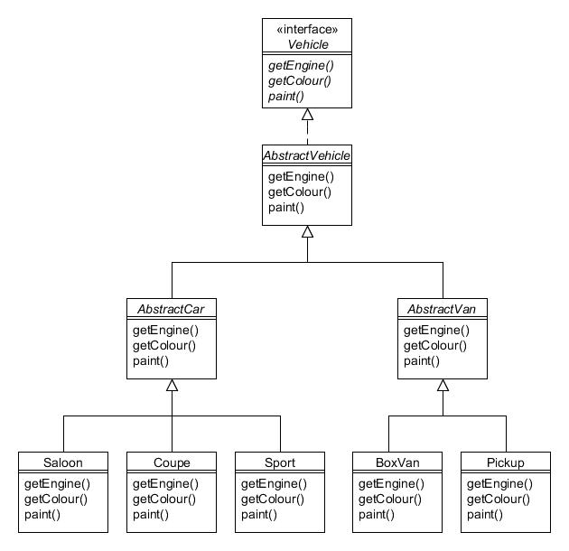

# 4. Método de factoría (Factory Method) {#h2-6}

Tipo: Creacional

Objetivo: Define una interfaz para crear un objeto, pero deja que las subclases decidan con qué clase crear una instancia.

Recordará de la introducción la siguiente jerarquía de clases para los vehículos fabricados por la Compañía de Motores Foobar:



Figura 4.1 : Jerarquía de la clase Vehicle

Cuando necesitamos crear instancias de un tipo particular de vehículo (como un Coupé), suele ser más flexible definir una clase separada cuya responsabilidad sea gestionar la instanciación. Esta clase separada se conoce como Fábrica (Factory en inglés).

El patrón de Método de Factoría define una clase abstracta que sirve como 'fábrica' y que tiene un método abstracto dentro para determinar de qué producto (en nuestro caso, vehículo) crear una instancia. Las subclases concretas de la fábrica toman esa determinación. Así es como se podría usar el patrón Método de fábrica con la jerarquía de clases de Vehículo:


Figura 4.2 : Patrón del Método de Factoría

En el diagrama anterior podemos ver que hemos creado una clase abstracta _VehicleFactory_ que tiene dos subclases concretas, _CarFactory_ y _VanFactory_. Veamos cómo se define _VehicleFactory_:

```java
public abstract class VehicleFactory {
    public enum DrivingStyle {ECONOMICAL, MIDRANGE, POWERFUL};
 
    public Vehicle build(DrivingStyle style, Vehicle.Colour colour) {
        Vehicle v = selectVehicle(style);
        v.paint(colour);
        return v;
    }
 
    // This is the "factory method"
    protected abstract Vehicle selectVehicle(DrivingStyle style);
}
```

VehicleFactory contiene el método público build() que toma como argumentos el estilo de conducción (económico, medio o potente) y el color con el que  se debe pintar el vehículo. El método build() llama al método abstracto protegido selectVehicle(), que es el "método de fábrica" que da nombre al patrón. Por lo tanto, la implementación de selectVehicle() se delega a las subclases de modo que cada subclase determine el tipo específico de vehículo que se instanciará. El método está protegido porque sólo queremos que las subclases lo utilicen; no está destinado a ser invocado por los clientes.

Aquí está la subclase concreta de CarFactory:

```java
public class CarFactory extends VehicleFactory {
    protected Vehicle selectVehicle(DrivingStyle style) {
     if (style == DrivingStyle.ECONOMICAL) {
            return new Saloon(new StandardEngine(1300));
 
        } else if (style == DrivingStyle.MIDRANGE) {
            return new Coupe(new StandardEngine(1600));
 
        } else {
            return new Sport(new TurboEngine(2000));
        }
    }
}
```

Como puede ver, el método selectVehicle() se implementa de tal manera que a partir de los argumentos proporcionados determina exactamente qué tipo de automóvil se debe instanciar y devolver.

VanFactory es similar, utiliza el argumento para decidir qué tipo de instancia de furgoneta va a crear y devolver:

```java
public class VanFactory extends VehicleFactory {
    protected Vehicle selectVehicle(DrivingStyle style) {
        if ((style == DrivingStyle.ECONOMICAL) ||
            (style == DrivingStyle.MIDRANGE)) {
            return new Pickup(new StandardEngine(2200));
 
        } else {
            return new BoxVan(new TurboEngine(2500));
        }
    }
}
```

Los programas cliente crean una instancia de la fábrica requerida y llaman a su método build():

```java
// Quiero un coche económico, pintado de azul...
VehicleFactory carFactory = new CarFactory();
Vehicle car = carFactory.build(VehicleFactory.DrivingStyle.ECONOMICAL, Vehicle.Colour.BLUE);
System.out.println(car);
 
// Soy un "hombre de furgoneta blanca"...
VehicleFactory vanFactory = new VanFactory();
Vehicle van = vanFactory.build(VehicleFactory.DrivingStyle.POWERFUL, Vehicle.Colour.WHITE);
System.out.println(van);
```

Deberías ver el siguiente resultado:

```text
Saloon (StandardEngine (1300), BLUE)
BoxVan (TurboEngine (2500), WHITE)
```

## Usando métodos de factoría estáticos {#h2-5}

Una variación común y útil es definir un método de fábrica estático. Supongamos que definimos la siguiente enumeración adicional en la clase VehicleFactory:

```java
public enum Category {CAR, VAN};
```

Ahora podemos definir el siguiente método estático make() también en VehicleFactory que determina qué subclase instanciar:

```java
public static Vehicle make(Category category, DrivingStyle style, Vehicle.Colour colour) {
    VehicleFactory factory = null;
 
    if (category == Category.CAR) {
        factory = new CarFactory();

    } else {
        factory = new VanFactory();
    }
 
    return factory.build(style, colour);
}
```

Usar el método estático make() es muy sencillo:

```java
// Creo un coche deportivo rojo...
Vehicle sporty = VehicleFactory.make(VehicleFactory.Category.CAR, VehicleFactory.DrivingStyle.POWERFUL, Colour.RED);
System.out.println(sporty);
```

Esto debería dar el siguiente resultado:

```text
Sport (TurboEngine (2000), RED)
```
