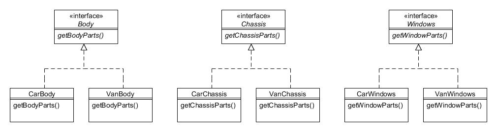
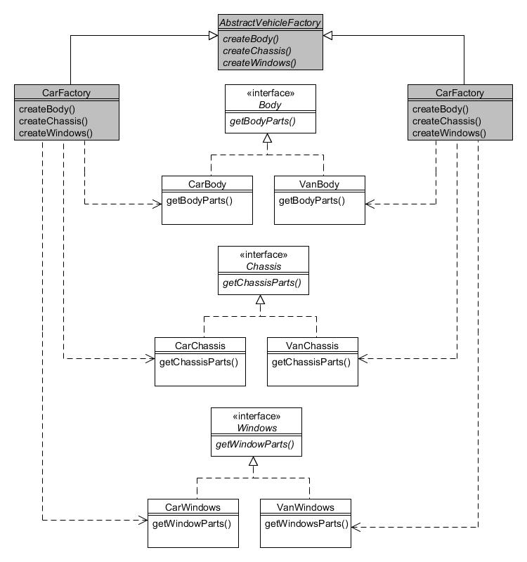
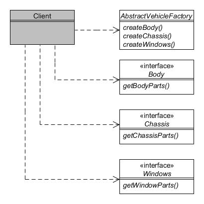

# 2. Factoría abstracta (abstract factory)

Tipo: Creacional

Objetivo: Proporcionar una interfaz para crear familias de objetos relacionados o dependientes sin tener que especificar sus clases concretas.

La Compañía de Motores Foobar fabrica coches y furgonetas que, durante su construcción, comprenden (entre muchas otras cosas) una carrocería, un chasis y cristalería para las ventanas. Aunque tanto los coches como las furgonetas necesitan los mismos tipos de componentes, las especificaciones de cada tipo difieren dependiendo de si se utiliza para un coche o una furgoneta.

En otras palabras:

* La carrocería de un coche es diferente de la carrocería de una furgoneta;
* El chasis de un coche es diferente del chasis de una furgoneta;
* Las ventanas de un coche son diferentes de las ventanas de una furgoneta.

Por lo tanto, cuando necesitamos construir un vehículo podemos pensar que los componentes provienen de diferentes 'familias'; esto es, cuando construimos un coche usamos una familia de componentes y cuando construimos una furgoneta usamos una familia diferente de componentes.

De este modo podemos modelar los componentes en jerarquías simples, como se ilustra en la siguiente figura:



Figura 2.1 : Jerarquía de clases _Body_, _Chassis_ y _Windows_

Como puede ver, hay una interfaz para _Body_ que tiene implementaciones de _CarBody_ y _VanBody_. Asimismo, tenemos jerarquías separadas similares para _Chassis_ y _Windows_.

El código para la jerarquía de _Body_ es muy simple:

```java
public interface Body {
    public String getBodyParts();
}


public class CarBody implements Body {
    public String getBodyParts() {
        return "Piezas de carrocería para un coche.";
    }
}


public class VanBody implements Body {
    public String getBodyParts() {
        return "Piezas de carrocería para una caravana";
    }
}
```

El código para la jerarquía de _Chassis_ es casi idéntico:

```java
public interface Chassis {
    public String getChassisParts();
}


public class CarChassis implements Chassis {
    public String getChassisParts() {
        return "Piezas de chasis para un coche.";
    }
}


public class VanChassis implements Chassis {
    public String getChassisParts() {
        return "Piezas de chasis para una furgoneta.";
    }
}
```

Y lo mismo el código para la jerarquía de _Windows_:

```java
public interface Windows {
   public String getWindowParts();
}


public class CarWindows implements Windows {
    public String getWindowParts() {
        return "Cristalería para ventanas de un coche.";
    }
}


public class VanWindows implements Windows {
    public String getWindowParts() {
        return "Cristalería para ventanas de una furgoneta.";
  }
}
```

Ahora necesitamos una forma de obtener la familia correcta de las piezas (o para un coche o para una furgoneta) pero sin tener que instanciar explícitamente el tipo específico en los programas cliente cada vez que lo requiramos. Para lograr esto, definiremos clases "factoría" que harán esto por nosotros:



Figura 2.2 : Patrón de Factoría Abstracta

La clase _AbstractVehicleFactory_ es una clase abstracta que define los métodos abstractos _createBody()_, _createChassis()_ y _createWindows()_, devolviendo un objeto _Body_, _Chassis_ y _Windows_ respectivamente:

```java
public abstract class AbstractVehicleFactory {
    public abstract Body createBody();
    public abstract Chassis createChassis();
    public abstract Windows createWindows();
}
```

La subclase concreta _CarFactory_ devuelve los objetos específicos para la familia de _Car_:

```java
public class CarFactory extends AbstractVehicleFactory {
    public Body createBody() {
        return new CarBody();
    }
 
    public Chassis createChassis() {
        return new CarChassis();
    }
 
    public Windows createWindows() {
        return new CarWindows();
    }
}
```

La subclase concrata _VanFactory_ devuelve los objetos específicos para la familia _Van_:

```java
public class VanFactory extends AbstractVehicleFactory {
    public Body createBody() {
        return new VanBody();
    }
 
    public Chassis createChassis() {
        return new VanChassis();
    }
 
    public Windows createWindows() {
        return new VanWindows();
    }
}
```

Ahora solo queda que los programas clientes instancien la 'factoría' apropiada después de lo cual pueden obtener las piezas correctas sin tener que especificar si son para un coche o una furgoneta:



Figura 2.3 : Cómo usan los clientes la Factoría Abstracta

```java
String whatToMake = "car"; // o "van"
AbstractVehicleFactory factory = null;
 
// Creamos la 'factoría' correcta...
if (whatToMake.equals("car")) {
    factory = new CarFactory();
} else {
    factory = new VanFactory();
}
 
// Creamos los componentes del vehículo
// Estas serán todas las piezas de automóviles o todas las piezas de furgonetas.
Body vehicleBody = factory.createBody();
Chassis vehicleChassis = factory.createChassis();
Windows vehicleWindows = factory.createWindows();
 
// Mostramos qué hemos creado...
System.out.println(vehicleBody.getBodyParts());
System.out.println(vehicleChassis.getChassisParts());
System.out.println(vehicleWindows.getWindowParts());
```

Por lo tanto, su programa cliente necesita saber si está fabricando un automóvil o una camioneta, pero una vez que ha creado una instancia de la fábrica correcta, todos los métodos para crear las piezas se pueden realizar utilizando un conjunto idéntico de llamadas a métodos.

La principal desventaja del patrón _**Abstract Factory**_ surge si necesita agregar 'productos' adicionales. Por ejemplo, si ahora necesitamos incluir _Lights_ en la familia de componentes, necesitaríamos modificar _AbstractVehicleFactory_, _CarFactory_ y _VanFactory_, además de crear una nueva jerarquía de _Lights_ (_CarLights_ y _VanLights_).

## 3. Constructor (Builder) {#h2-5}

Tipo: Creacional

Objetivo: Separar la construcción de un objeto complejo de su representación de forma que el mismo proceso de construcción pueda crear representaciones diferentes.

La Compañía de Motores Foobar fabrica coches y furgonetas, y el proceso de construcción para cada uno difiere en el detalle; por ejemplo, la carrocería de una furgoneta se compone de una zona de cabina y una gran zona de almacenamiento reforzada, mientras que un coche berlina se compone de una zona de pasajeros y una zona de equipaje (por ejemplo, el maletero). Y, por supuesto, hay un número de pasos complejos que deben realizarse independientemente del tipo de vehículo se esté construyendo.

El patrón _**Constructor**_ facilita la construcción de objetos complejos separando los pasos individuales en métodos separados en una jerarquía del _**Constructor**_, y después usa un objeto _**Director**_ para especificar los pasos requeridos en el orden correcto. Finalmente, el producto terminado se recupera del _**Constructor**_.

El siguiente diagrama muestra estas relaciones:


Figura 3.1 : Patrón constructor

Comenzamos con la clase abstracta _VehicleBuilder_:

```java
public abstract class VehicleBuilder {
    public void buildBody() {}
    public void buildBoot() {}
    public void buildChassis() {}
    public void buildPassengerArea() {}
    public void buildReinforcedStorageArea() {}
    public void buildWindows() {}
    public abstract Vehicle getVehicle();
}
```

Observe cómo esta clase define todos los métodos de 'construcción' posibles tanto para automóviles como para camionetas, y proporciona implementaciones vacías para cada uno de forma predeterminada. El método abstracto `getVehicle()` sirve para devolver el vehículo terminado.

La clase `CarBuilder` hereda de `VehicleBuilder` y anula los métodos apropiados:

```java
public class CarBuilder extends VehicleBuilder {
    private AbstractCar carInProgress;
 
    public CarBuilder(AbstractCar car) {
        carInProgress = car;
    }
 
    public void buildBody() {
        // Agrega Body a carInProgress
        System.out.println("Construyendo la carrocería del coche");
    }
 
    public void buildBoot() {
        // Agrega el maeletero a carInProgress
        System.out.println("Construyendo el maletero del coche");
    }
 
    public void buildChassis() {
        // Agrega el chasis a carInProgress
        System.out.println("Construyendo el chasis del coche");
    }
 
    public void buildPassengerArea() {
        // Agrega la zona de pasajeros a carInProgress
        System.out.println("Construyendo la zona de pasajeros");
    }
 
    public void buildWindows() {
        // Agrega las ventanas a carInProgress
        System.out.println("Construyendo las ventanas del coche");
    }
 
    public Vehicle getVehicle() {
        return carInProgress;
    }
}
```

Observe que el método `buildReinforcedStorageArea()` no estaba sobreescrito ya que no es aplicable a los coches. La clase _VanBuilder_ sobreescribe los métodos apropiados para construir una furgoneta:

```java
public class VanBuilder extends VehicleBuilder {
    private AbstractVan vanInProgress;
 
    public VanBuilder(AbstractVan van) {
        vanInProgress = van;
    }
 
    public void buildBody() {
        // Agrega la carrocería a vanInProgress
        System.out.println("construyendo la carrocería de la furgoneta");
    }
 
    public void buildChassis() {
        // Agrega el chasis a vanInProgress
        System.out.println("construyendo el chasis de la furgoneta");
    }
 
    public void buildReinforcedStorageArea() {
        // Agrega la zona de almacenamiento a vanInProgress
        System.out.println("Construyendo la zona de almacenamiento de la furgoneta");
    }
 
    public void buildWindows() {
        // Agrega las ventanas a  vanInProgress
        System.out.println("Construyendo las ventanas de la furgoneta");
    }
 
    public Vehicle getVehicle() {
        return vanInProgress;
    }
}
```

Observe que los métodos `buildBoot()` y `buildPassengerArea()` no fueron sobreescritos ya que no son aplicables a los furgonetas. La clase abstracta _VehicleDirector_ requiere que se pase un objeto _VehicleBuilder_ a su método `build()` para su implementación por las subclases:

```java
public abstract class VehicleDirector {
    public abstract Vehicle build(VehicleBuilder builder);
}
```

La clase _CarDirector_ heredas de _VehicleDirector_ y proporciona el proceso paso a paso para construir un coche:

```java
public class CarDirector extends VehicleDirector {
    public Vehicle build(VehicleBuilder builder) {
        builder.buildChassis();
        builder.buildBody();
        builder.buildPassengerArea();
        builder.buildBoot();
        builder.buildWindows();
        return builder.getVehicle();
    }
}
```

La clase VanDirector proporciona el proceso paso a paso para construir una furgoneta:

```java
public class VanDirector extends VehicleDirector {
    public Vehicle build(VehicleBuilder builder) {
        builder.buildChassis();
        builder.buildBody();
        builder.buildReinforcedStorageArea();
        builder.buildWindows();
        return builder.getVehicle();
    }
}
```

Como ejemplo de cómo utilizar las clases anteriores, supongamos que queremos construir una berlina (Tipo `Saloon` en inglés):

```java
AbstractCar car = new Saloon(new StandardEngine(1300));
VehicleBuilder builder = new CarBuilder(car);
VehicleDirector director = new CarDirector();
Vehicle v = director.build(builder);
System.out.println(v);
```

Puede ver que el objeto `Builder` requerido se construye y se pasa al objeto `Director` requerido, después de lo cual invocamos el método para construir el producto y luego recuperamos el artículo terminado. El resultado debería mostrar:

```text
Construyendo la carrocería del coche
Construyendo la zona de pasajeros
Construyendo el maletero del coche
Construyendo las ventanas del coche
Saloon (StandardEngine (1300), UNPAINTED)
```

## 4. Método de factoría (Factory Method) {#h2-6}

Tipo: Creacional

Objetivo: Define una interfaz para crear un objeto, pero deja que las subclases decidan con qué clase crear una instancia.

Recordará de la introducción la siguiente jerarquía de clases para los vehículos fabricados por la Compañía de Motores Foobar:


Figura 4.1 : Jerarquía de la clase Vehicle

Cuando necesitamos crear instancias de un tipo particular de vehículo (como un Coupé), suele ser más flexible definir una clase separada cuya responsabilidad sea gestionar la instanciación. Esta clase separada se conoce como Fábrica (Factory en inglés).

El patrón de Método de Factoría define una clase abstracta que sirve como 'fábrica' y que tiene un método abstracto dentro para determinar de qué producto (en nuestro caso, vehículo) crear una instancia. Las subclases concretas de la fábrica toman esa determinación. Así es como se podría usar el patrón Método de fábrica con la jerarquía de clases de Vehículo:


Figura 4.2 : Patrón del Método de Factoría

En el diagrama anterior podemos ver que hemos creado una clase abstracta _VehicleFactory_ que tiene dos subclases concretas, _CarFactory_ y _VanFactory_. Veamos cómo se define _VehicleFactory_:

```java
public abstract class VehicleFactory {
    public enum DrivingStyle {ECONOMICAL, MIDRANGE, POWERFUL};
 
    public Vehicle build(DrivingStyle style, Vehicle.Colour colour) {
        Vehicle v = selectVehicle(style);
        v.paint(colour);
        return v;
    }
 
    // This is the "factory method"
    protected abstract Vehicle selectVehicle(DrivingStyle style);
}
```

VehicleFactory contiene el método público build() que toma como argumentos el estilo de conducción (económico, medio o potente) y el color con el que  se debe pintar el vehículo. El método build() llama al método abstracto protegido selectVehicle(), que es el "método de fábrica" que da nombre al patrón. Por lo tanto, la implementación de selectVehicle() se delega a las subclases de modo que cada subclase determine el tipo específico de vehículo que se instanciará. El método está protegido porque sólo queremos que las subclases lo utilicen; no está destinado a ser invocado por los clientes.

Aquí está la subclase concreta de CarFactory:

```java
public class CarFactory extends VehicleFactory {
    protected Vehicle selectVehicle(DrivingStyle style) {
     if (style == DrivingStyle.ECONOMICAL) {
            return new Saloon(new StandardEngine(1300));
 
        } else if (style == DrivingStyle.MIDRANGE) {
            return new Coupe(new StandardEngine(1600));
 
        } else {
            return new Sport(new TurboEngine(2000));
        }
    }
}
```

Como puede ver, el método selectVehicle() se implementa de tal manera que a partir de los argumentos proporcionados determina exactamente qué tipo de automóvil se debe instanciar y devolver.

VanFactory es similar, utiliza el argumento para decidir qué tipo de instancia de furgoneta va a crear y devolver:

```java
public class VanFactory extends VehicleFactory {
    protected Vehicle selectVehicle(DrivingStyle style) {
        if ((style == DrivingStyle.ECONOMICAL) ||
            (style == DrivingStyle.MIDRANGE)) {
            return new Pickup(new StandardEngine(2200));
 
        } else {
            return new BoxVan(new TurboEngine(2500));
        }
    }
}
```

Los programas cliente crean una instancia de la fábrica requerida y llaman a su método build():

```java
// Quiero un coche económico, pintado de azul...
VehicleFactory carFactory = new CarFactory();
Vehicle car = carFactory.build(VehicleFactory.DrivingStyle.ECONOMICAL, Vehicle.Colour.BLUE);
System.out.println(car);
 
// Soy un "hombre de furgoneta blanca"...
VehicleFactory vanFactory = new VanFactory();
Vehicle van = vanFactory.build(VehicleFactory.DrivingStyle.POWERFUL, Vehicle.Colour.WHITE);
System.out.println(van);
```

Deberías ver el siguiente resultado:

```text
Saloon (StandardEngine (1300), BLUE)
BoxVan (TurboEngine (2500), WHITE)
```

### Usando métodos de factoría estáticos {#h2-7}

Una variación común y útil es definir un método de fábrica estático. Supongamos que definimos la siguiente enumeración adicional en la clase VehicleFactory:

```java
public enum Category {CAR, VAN};
```

Ahora podemos definir el siguiente método estático make() también en VehicleFactory que determina qué subclase instanciar:

```java
public static Vehicle make(Category category, DrivingStyle style, Vehicle.Colour colour) {
    VehicleFactory factory = null;
 
    if (category == Category.CAR) {
        factory = new CarFactory();

    } else {
        factory = new VanFactory();
    }
 
    return factory.build(style, colour);
}
```

Usar el método estático make() es muy sencillo:

```java
// Creo un coche deportivo rojo...
Vehicle sporty = VehicleFactory.make(VehicleFactory.Category.CAR, VehicleFactory.DrivingStyle.POWERFUL, Colour.RED);
System.out.println(sporty);
```

Esto debería dar el siguiente resultado:

```text
Sport (TurboEngine (2000), RED)
```

## 5. Prototipo (Prototype) {#h2-8}

Tipo: Creacional

Objetivo: Especifica los tipos de objetos que se crearán utilizando una instancia prototípica y crea nuevos objetos copiando el prototipo.

En este capítulo asumiremos que crear instancias de objetos de automóviles y camionetas es un proceso que requiere mucho tiempo y, por lo tanto, necesitamos encontrar una manera de acelerar el tiempo de creación de instancias cada vez que necesitemos un nuevo objeto de vehículo. Aquí hay un recordatorio de la jerarquía de clases de vehículos:


Figura 5.1 : Jerarquía de la clase Vehicle

Un enfoque que puede mejorar el tiempo de creación de instancias es utilizar el método clone() de Java. Por lo tanto, especificaremos que la interfaz Vehículo extiende Cloneable y definiremos el método clone(). El código para realizar la clonación se definirá en AbstractVehicle. Por lo tanto, este capítulo utiliza una versión modificada de la interfaz Vehicle y la clase AbstractVehicle como se enumera a continuación, donde el código adicional se indica en negrita:

```java
public interface Vehicle extends Cloneable {
    public enum Colour {UNPAINTED, BLUE, BLACK, GREEN, RED, SILVER, WHITE, YELLOW};
    public Engine getEngine();
    public Vehicle.Colour getColour();
    public void paint(Vehicle.Colour colour);
    public Object clone();
}


public abstract class AbstractVehicle implements Vehicle {
    private Engine engine;
    private Vehicle.Colour colour;
 
    public AbstractVehicle(Engine engine) {
        this(engine, Vehicle.Colour.UNPAINTED);
    }
 
    public AbstractVehicle(Engine engine, Vehicle.Colour colour) {
        this.engine = engine;
        this.colour = colour;
         // ... followed by lots of time-consuming stuff
    }
 
    public Engine getEngine() {
        return engine;
    }
 
    public Vehicle.Colour getColour() {
        return colour;
    }
 
    public void paint(Vehicle.Colour colour) {
        this.colour = colour;
    }
 
    public Object clone() {
        Object obj = null;
        try {
            obj = super.clone();
        } catch (CloneNotSupportedException x) {
            // Should not happen...
        }
        return obj;
    }
 
    public String toString() {
        return getClass().getSimpleName() +
                " (" + engine + ", + colour + ");
    }
}
```

El método clone() sobreescribible se ha hecho público para permitir más fácilmente su uso por parte de otros objetos.

Ninguna de las subclases de automóviles o camionetas necesita cambiar ya que heredan de Vehicle en la raíz de la jerarquía.

Ahora definiremos una clase VehicleManager que creará los vehículos iniciales de los que podremos obtener clones:

```java
public class VehicleManager {
    private Vehicle saloon, coupe, sport, boxVan, pickup;
 
    public VehicleManager() {
        // Para simplificar, todos los vehículos utilizan el mismo tipo de motor...
        saloon = new Saloon(new StandardEngine(1300));
        coupe = new Coupe(new StandardEngine(1300));
        sport = new Sport(new StandardEngine(1300));
        boxVan = new BoxVan(new StandardEngine(1300));
        pickup = new Pickup(new StandardEngine(1300));
    }
 
    public Vehicle createSaloon() {
        return (Vehicle) saloon.clone();
    }
 
    public Vehicle createCoupe() {
        return (Vehicle) coupe.clone();
    }

    public Vehicle createSport() {
        return (Vehicle) sport.clone();
    }
 
    public Vehicle createBoxVan() {
        return (Vehicle) boxVan.clone();
    }
 
    public Vehicle createPickup() {
        return (Vehicle) pickup.clone();
    }
}
```

Los programas cliente pueden utilizar VehicleManager de la siguiente manera:

```java
VehicleManager manager = new VehicleManager();
Vehicle saloon1 = manager.createSaloon();
Vehicle saloon2 = manager.createSaloon();
Vehicle pickup1 = manager.createPickup();
```

Una desventaja de VehicleManager tal como está codificado es que siempre crea una instancia de al menos un vehículo de cada tipo como parte del proceso de construcción. Si no se necesitan todos los tipos de vehículos, una técnica más eficiente sería realizar una carga diferida creando solo una instancia de la primera vez que se necesita cada uno. Esto se ilustra en la versión modificada de la clase (que llamaremos VehicleManagerLazy) a continuación:

```java
public class VehicleManagerLazy {
    private Vehicle saloon, coupe, sport, boxVan, pickup;
 
    public VehicleManagerLazy() {
    }
 
    public Vehicle createSaloon() {
        if (saloon == null) {
            saloon = new Saloon(new StandardEngine(1300));
            return saloon;
        } else {
            return (Vehicle) saloon.clone();
        }
    }
 
    public Vehicle createCoupe() {
        if (coupe == null) {
            coupe = new Coupe(new StandardEngine(1300));
            return coupe;
        } else {
            return (Vehicle) coupe.clone();
        }
    }
 
    public Vehicle createSport() {
        if (sport == null) {
            sport = new Sport(new StandardEngine(1300));
            return sport;
        } else {
            return (Vehicle) sport.clone();
        }
    }
 
    public Vehicle createBoxVan() {
        if (boxVan == null) {
            boxVan = new BoxVan(new StandardEngine(1300));
            return boxVan;
        } else {
            return (Vehicle) boxVan.clone();
        }
    }
 
    public Vehicle createPickup() {
        if (pickup == null) {
            pickup = new Pickup(new StandardEngine(1300));
            return pickup;
        } else {
            return (Vehicle) pickup.clone();
        }
    }
}
```

Antes de devolver un clon, se realiza una verificación para garantizar que el objeto 'prototipo' existe y se creará una instancia si es necesario. A partir de entonces, simplemente clona el objeto instanciado previamente. Los programas cliente pueden usar VehicleManagerLazy de la misma manera que antes:

```java
VehicleManagerLazy manager = new VehicleManagerLazy();
 
Vehicle saloon1 = manager.createSaloon();
Vehicle saloon2 = manager.createSaloon();
Vehicle pickup1 = manager.createPickup();
```

## 6. Único (Singleton) {#h2-9}

Tipo: Creacional

Objetivo: Asegúra de que una clase permita que solo se cree un objeto, proporcionando un único punto de acceso al mismo.

La Compañía de Motores Foobar, al igual que todos los fabricantes de vehículos, necesita estampar un número de serie único en todos los vehículos que produce. Quieren modelar este requisito garantizando que haya un solo lugar sencillo donde se pueda obtener el siguiente número de serie disponible. Si tuviéramos más de un objeto que genere el siguiente número, existe el riesgo de que terminemos con secuencias de numeración separadas, por lo que debemos evitar esto.

El patrón Único proporciona una manera de garantizar que sólo se pueda crear una instancia de una clase particular. Entonces, ¿cómo podemos evitar que otros objetos simplemente invoquen new varias veces? Hay varias formas de lograr esto, y el enfoque "tradicional" que puede encontrar a menudo es hacer que su constructor sea privado pero proporcionar un método getter estático público que devuelva una instancia estática de la clase Singleton. Así es como podría verse:

```java
public class SerialNumberGeneratorTraditional {
    // miembros estáticos
    private static SerialNumberGeneratorTraditional instance;
    
    public synchronized static SerialNumberGeneratorTraditional getInstance() {
        if (instance == null) {
            instance = new SerialNumberGeneratorTraditional();
        }
        return instance;
    }
    
    // variables de instancia
    private int count;
     
    // constructor privado
    private SerialNumberGeneratorTraditional() {}
    
    // métodos de instancia
    public synchronized int getNextSerial() {
        return ++count;
    }
}
```

Tenga en cuenta que el método getInstance() solo creará una instancia del objeto una vez, por lo que siempre se devolverá la misma instancia. El constructor es privado para evitar que los programas cliente llamen a new, lo que refuerza el hecho de que solo se puede crear un objeto, ya que solo pueden pasar por el método getInstance(). Los métodos getInstance() y getNextSerial() se sincronizan en caso de que sean llamados por subprocesos separados. El patrón único podría usarse así:

```java
System.out.println("Usando el patrón único tradicional");
SerialNumberGeneratorTraditional generator = SerialNumberGeneratorTraditional.getInstance();
System.out.println("próxima serie: " + generator.getNextSerial());
System.out.println("próxima serie: " + generator.getNextSerial());
System.out.println("próxima serie: " + generator.getNextSerial());
```

Podría decirse que existe una forma mejor de codificar singletons (objetos únicos) desde Java 1.5 mediante la utilización del tipo enum. La clase anterior sería entonces:

```java
public enum SerialNumberGenerator {
    INSTANCE;
   
    private int count;
    
    public synchronized int getNextSerial() {
        return ++count;
    }
}
```

El nombre de constante INSTANCE representa el objeto único. Como en el enfoque tradicional, hay un recuento de variables de instancia y un método sincronizado getNextSerial(), pero ahora no hay necesidad de definir ningún miembro estático ni preocuparse por un constructor.

Usar el enum de objeto único es tan simple como esto:

```java
System.out.println("Usando enum de objeto único");
System.out.println("siguiente vehículo: " + SerialNumberGenerator.INSTANCE.getNextSerial());
System.out.println("siguiente vehículo: " + SerialNumberGenerator.INSTANCE.getNextSerial());
System.out.println("siguiente motor: " + SerialNumberGenerator.INSTANCE.getNextSerial());
```

A veces es posible que desee un número específico de singletons (objetos únicos) diferentes que realicen las mismas acciones (el llamado Multiton, una contracción de "singleton múltiple"). Esto no es tan sencillo con el enfoque tradicional, pero cuando se utiliza la técnica de enumeración es tan fácil como definir constantes separadas. Por ejemplo, supongamos que ahora necesita números de serie separados para vehículos y motores, donde cada uno se incrementa independientemente uno del otro:

```java
public enum SerialNumberGenerator {
    ENGINE, VEHICLE;
   
    private int count;
    
    public synchronized int getNextSerial() {
        return ++count;
    }
}
```

La constante INSTANCE ha sido renombrada como VEHICLE y se ha definido una segunda constante ENGINE. Puede acceder a estas como sigue:

```java
System.out.println("Usando enum de objeto unico (multiton)");
System.out.println("siguiente vehículo: " + SerialNumberGenerator.VEHICLE.getNextSerial());
System.out.println("siguiente vehículo: " + SerialNumberGenerator.VEHICLE.getNextSerial());
System.out.println("siguiente motor: " + SerialNumberGenerator.ENGINE.getNextSerial());
System.out.println("siguiente vehículo: " + SerialNumberGenerator.VEHICLE.getNextSerial());
System.out.println("siguiente motor: " + SerialNumberGenerator.ENGINE.getNextSerial());
```

The output of which should be:

```text
siguiente vehículo: 1
siguiente vehículo: 2
siguiente motor: 1
siguiente vehículo: 3
siguiente motor: 2
```
