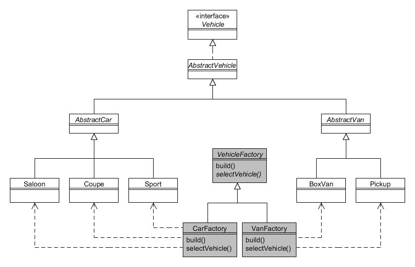

# 2. Factoría abstracta (abstract factory)

Type: Creational

Purpose: Provide an interface for creating families of related or dependent objects without specifying their concrete classes.

The Foobar Motor Company makes cars and vans, which when being built comprises (among lots of other things) a body shell, a chassis and glassware for the windows. Although both cars and vans need all of the same types of components, the specifics of each type differ depending upon whether it is being used for a car or a van.

In other words:

* A car's body shell is different from a van's body shell;
* A car's chassis is different from a van's chassis;
* A car's windows are different from a van's windows.

Therefore, when we need to build a vehicle we can think of the components as coming from different 'families'; that is, when we build a car we use one family of components and when we build a van we use a different family of components.

We can thus model the components into simple hierarchies, as illustrated in the following figure:


Figura 2.1 : Jerarquía de clases Body, Chassis y Windows

As you can see, there is an interface for Body having implementations of CarBody and VanBody. Likewise we have similar separate hierarchies for Chassis and Windows.

The code for the Body hierarchy is very simple:

```java
public interface Body {
    public String getBodyParts();
}


public class CarBody implements Body {
    public String getBodyParts() {
        return "Body shell parts for a car";
    }
}


public class VanBody implements Body {
    public String getBodyParts() {
        return "Body shell parts for a van";
    }
}
```

The code for the Chassis hierarchy is almost identical:

```java
public interface Chassis {
    public String getChassisParts();
}


public class CarChassis implements Chassis {
    public String getChassisParts() {
        return "Chassis parts for a car";
    }
}


public class VanChassis implements Chassis {
    public String getChassisParts() {
        return "Chassis parts for a van";
    }
}
```

And likewise the code for the Windows hierarchy:

```java
public interface Windows {
   public String getWindowParts();
}


public class CarWindows implements Windows {
    public String getWindowParts() {
        return "Window glassware for a car";
    }
}


public class VanWindows implements Windows {
    public String getWindowParts() {
        return "Window glassware for a van";
  }
}
```

Now we need a way of getting the correct family of parts (either for a car or for a van) but without having to explicitly instantiate the specific type in client programs each time we require them. To accomplish this, we shall define "factory" classes that will do this for us:


Figura 2.2 : Patrón de Factoría Abstracta

The AbstractVehicleFactory class is an abstract class that defines the abstract methods createBody(), createChassis() and createWindows(), returning a Body, Chassis and Windows object respectively:

```java
public abstract class AbstractVehicleFactory {
    public abstract Body createBody();
    public abstract Chassis createChassis();
    public abstract Windows createWindows();
}
```

The concrete subclass CarFactory returns the objects specific for the Car family:

```java
public class CarFactory extends AbstractVehicleFactory {
    public Body createBody() {
        return new CarBody();
    }
 
    public Chassis createChassis() {
        return new CarChassis();
    }
 
    public Windows createWindows() {
        return new CarWindows();
    }
}
```

The concrete subclass VanFactory returns the objects specific for the Van family:

```java
public class VanFactory extends AbstractVehicleFactory {
    public Body createBody() {
        return new VanBody();
    }
 
    public Chassis createChassis() {
        return new VanChassis();
    }
 
    public Windows createWindows() {
        return new VanWindows();
    }
}
```

Now it just remains for client programs to instantiate the appropriate 'factory' after which it can obtain the correct parts without having to specify whether they are for a car or a van:


Figura 2.3 : Cómo usan los clientes la Factoría Abstracta

```java
String whatToMake = "car"; // or "van"
AbstractVehicleFactory factory = null;
 
// Create the correct 'factory'...
if (whatToMake.equals("car")) {
    factory = new CarFactory();
} else {
    factory = new VanFactory();
}
 
// Create the vehicle's component parts...
// These will either be all car parts or all van parts.
Body vehicleBody = factory.createBody();
Chassis vehicleChassis = factory.createChassis();
Windows vehicleWindows = factory.createWindows();
 
// Show what we've created...
System.out.println(vehicleBody.getBodyParts());
System.out.println(vehicleChassis.getChassisParts());
System.out.println(vehicleWindows.getWindowParts());
```

Therefore your client program needs to know if it is making a car or a van, but once it has instantiated the correct factory all the methods to create the parts can be done using an identical set of method calls.

The main disadvantage of the Abstract Factory pattern arises if you need to add additional 'products'. For example, if we now need to include Lights in the family of components, we would need to amend AbstractVehicleFactory, CarFactory and VanFactory, in addition to creating a new Lights hierarchy (CarLights and VanLights).

## 3. Constructor (Builder) {#h2-5}

Type: Creational

Purpose: Separate the construction of a complex object from its representation so that the same construction process can create different representations.

The Foobar Motor Company makes cars and vans, and the construction process of each differs in detail; for example, the body shell of a van comprises a cab area and a large reinforced storage area, whereas a saloon car comprises a passenger area and a luggage area (i.e. boot). And of course there a number of complex steps that have to be undertaken regardless of what type of vehicle is being built.

The Builder pattern facilitates the construction of complex objects by separating the individual steps into separate methods in a Builder hierarchy, and then using a Director object to specify the required steps in the correct order. Finally, the finished product is retrieved from the Builder.

The following diagram shows these relationships:


Figura 3.1 : Patrón constructor

We start off with the abstract VehicleBuilder class:

```java
public abstract class VehicleBuilder {
    public void buildBody() {}
    public void buildBoot() {}
    public void buildChassis() {}
    public void buildPassengerArea() {}
    public void buildReinforcedStorageArea() {}
    public void buildWindows() {}
    public abstract Vehicle getVehicle();
}
```

Note how this class defines all possible 'build' methods for both cars and vans, and provides empty implementations for each as a default. The abstract getVehicle() method is for returning the finished vehicle.

The CarBuilder class inherits from VehicleBuilder and overrides the appropriate methods:

```java
public class CarBuilder extends VehicleBuilder {
    private AbstractCar carInProgress;
 
    public CarBuilder(AbstractCar car) {
        carInProgress = car;
    }
 
    public void buildBody() {
        // Add body to carInProgress
        System.out.println("building car body");
    }
 
    public void buildBoot() {
        // Add boot to carInProgress
        System.out.println("building car boot");
    }
 
    public void buildChassis() {
        // Add chassis to carInProgress
        System.out.println("building car chassis");
    }
 
    public void buildPassengerArea() {
        // Add passenger area to carInProgress
        System.out.println("building car passenger area");
    }
 
    public void buildWindows() {
        // Add windows to carInProgress
        System.out.println("building car windows");
    }
 
    public Vehicle getVehicle() {
        return carInProgress;
    }
}
```

Note that the buildReinforcedStorageArea() method was not overridden since it is not applicable to cars. The VanBuilder class overrides the appropriate methods to build a van:

```java
public class VanBuilder extends VehicleBuilder {
    private AbstractVan vanInProgress;
 
    public VanBuilder(AbstractVan van) {
        vanInProgress = van;
    }
 
    public void buildBody() {
        // Add body to vanInProgress
        System.out.println("building van body");
    }
 
    public void buildChassis() {
        // Add chassis to vanInProgress
        System.out.println("building van chassis");
    }
 
    public void buildReinforcedStorageArea() {
        // Add storage area to vanInProgress
        System.out.println("building van storage area");
    }
 
    public void buildWindows() {
        // Add windows to vanInProgress
        System.out.println("building van windows");
    }
 
    public Vehicle getVehicle() {
        return vanInProgress;
    }
}
```

Note that the buildBoot() and buildPassengerArea() methods were not overridden since they are not applicable to vans. The VehicleDirector abstract class requires a VehicleBuilder object passed to its build() method for implementation by subclasses:

```java
public abstract class VehicleDirector {
    public abstract Vehicle build(VehicleBuilder builder);
}
```

The CarDirector class inherits from VehicleDirector and provides the step-by-step process for building a car:

```java
public class CarDirector extends VehicleDirector {
    public Vehicle build(VehicleBuilder builder) {
        builder.buildChassis();
        builder.buildBody();
        builder.buildPassengerArea();
        builder.buildBoot();
        builder.buildWindows();
        return builder.getVehicle();
    }
}
```

The VanDirector class provides the step-by-step process for building a van:

```java
public class VanDirector extends VehicleDirector {
    public Vehicle build(VehicleBuilder builder) {
        builder.buildChassis();
        builder.buildBody();
        builder.buildReinforcedStorageArea();
        builder.buildWindows();
        return builder.getVehicle();
    }
}
```

As an example of how to use the above classes, let's assume we want to build a Saloon car:

```java
AbstractCar car = new Saloon(new StandardEngine(1300));
VehicleBuilder builder = new CarBuilder(car);
VehicleDirector director = new CarDirector();
Vehicle v = director.build(builder);
System.out.println(v);
```

You can see the required Builder object is constructed and passed to the required Director object, after which we invoke the method to build the product and then retrieve the finished article. The output should show:

```text
Building car chassis
Building car body
Building car passenger area
Building car boot
Building car windows
Saloon (StandardEngine (1300), UNPAINTED)
```

## 4. Método de factoría (Factory Method) {#h2-6}

 Type: Creational

Purpose: Define an interface for creating an object, but let subclasses decide which class to instantiate.

You will recall from the introduction the following class hierarchy for the vehicles made by the Foobar Motor Company:


Figura 4.1 : Jerarquía de la clase Vehicle

When we need to instantiate a particular type of vehicle (such as a Coupe) it is often more flexible to define a separate class whose responsibility it is to manage the instantiation. This separate class is known as a Factory.

The Factory Method pattern defines an abstract class which serves as the 'factory' and that has an abstract method within to determine what product (in our case vehicle) to instantiate. Concrete subclasses of the factory make that determination. Here is how the Factory Method pattern could be used with the Vehicle class hierarchy:



Figura 4.2 : Patrón del Método de Factoría

In the above diagram we can see that we have created an abstract VehicleFactory class which has two concrete subclasses, CarFactory and VanFactory. Let us look at how VehicleFactory is defined:

```java
public abstract class VehicleFactory {
    public enum DrivingStyle {ECONOMICAL, MIDRANGE, POWERFUL};
 
    public Vehicle build(DrivingStyle style, Vehicle.Colour colour) {
        Vehicle v = selectVehicle(style);
        v.paint(colour);
        return v;
    }
 
    // This is the "factory method"
    protected abstract Vehicle selectVehicle(DrivingStyle style);
}
```

VehicleFactory contains the public method build() that takes as arguments the driving style (economical, midrange or powerful) and the colour that the vehicle should be painted. The build() method calls the protected abstract selectVehicle() method, which is the "factory method" after which the pattern is named. The implementation of selectVehicle() is therefore delegated to the subclasses such that each subclass determines the specific type of vehicle to instantiate. The method is protected because we only want subclasses to utilise it; it is not intended to be invoked by clients.

Here is the CarFactory concrete subclass:

```java
public class CarFactory extends VehicleFactory {
    protected Vehicle selectVehicle(DrivingStyle style) {
     if (style == DrivingStyle.ECONOMICAL) {
            return new Saloon(new StandardEngine(1300));
 
        } else if (style == DrivingStyle.MIDRANGE) {
            return new Coupe(new StandardEngine(1600));
 
        } else {
            return new Sport(new TurboEngine(2000));
        }
    }
}
```

As you can see, the selectVehicle() method is implemented such that it works out from the supplied arguments exactly which type of car should be instantiated and returned.

The VanFactory is similar, using the argument to decide which van to instantiate and return:

```java
public class VanFactory extends VehicleFactory {
    protected Vehicle selectVehicle(DrivingStyle style) {
        if ((style == DrivingStyle.ECONOMICAL) ||
            (style == DrivingStyle.MIDRANGE)) {
            return new Pickup(new StandardEngine(2200));
 
        } else {
            return new BoxVan(new TurboEngine(2500));
        }
    }
}
```

Client programs instantiate the required factory and call its build() method:

```java
// I want an economical car, coloured blue...
VehicleFactory carFactory = new CarFactory();
Vehicle car = carFactory.build(VehicleFactory.DrivingStyle.ECONOMICAL, Vehicle.Colour.BLUE);
System.out.println(car);
 
// I am a "white van man"...
VehicleFactory vanFactory = new VanFactory();
Vehicle van = vanFactory.build(VehicleFactory.DrivingStyle.POWERFUL, Vehicle.Colour.WHITE);
System.out.println(van);
```

You should see the following output:

```text
Saloon (StandardEngine (1300), BLUE)
BoxVan (TurboEngine (2500), WHITE)
```

### Usando métodos de factoría estáticos {#h2-7}

A common and useful variation is to define a static factory method. Let's assume we define the following additional enum in the VehicleFactory class:

```java
public enum Category {CAR, VAN};
```

Now we can define the following static make() method also in VehicleFactory that works out which subclass to instantiate:

```java
public static Vehicle make(Category category, DrivingStyle style, Vehicle.Colour colour) {
    VehicleFactory factory = null;
 
    if (category == Category.CAR) {
        factory = new CarFactory();

    } else {
        factory = new VanFactory();
    }
 
    return factory.build(style, colour);
}
```

Using the static make() method is very straightforward:

```java
// Create a red sports car...
Vehicle sporty = VehicleFactory.make(VehicleFactory.Category.CAR, VehicleFactory.DrivingStyle.POWERFUL, Colour.RED);
System.out.println(sporty);
```

This should give the following output:

```text
Sport (TurboEngine (2000), RED)
```

## 5. Prototipo (Prototype) {#h2-8}

Type: Creational

Purpose: Specify the kinds of objects to create using a prototypical instance, and create new objects by copying the prototype.

We shall assume in this chapter that instantiating car and van objects is a time-consuming process, and we therefore need to find a way of speeding up instantiation time whenever we need a new vehicle object. Here is a reminder of the Vehicle class hierarchy:


Figura 5.1 : Jerarquía de la clase Vehicle

One approach that may improve instantiation time is to utilise Java's clone() method. We will therefore specify that the Vehicle interface extends Cloneable and define the method clone(). Code to perform the cloning will then be defined in AbstractVehicle. This chapter thus uses a modified version of the Vehicle interface and AbstractVehicle class as listed below, where the additional code is indicated in bold:

```java
public interface Vehicle extends Cloneable {
    public enum Colour {UNPAINTED, BLUE, BLACK, GREEN, RED, SILVER, WHITE, YELLOW};
     public Engine getEngine();
    public Vehicle.Colour getColour();
    public void paint(Vehicle.Colour colour);
    public Object clone();
}


public abstract class AbstractVehicle implements Vehicle {
    private Engine engine;
    private Vehicle.Colour colour;
 
    public AbstractVehicle(Engine engine) {
        this(engine, Vehicle.Colour.UNPAINTED);
    }
 
    public AbstractVehicle(Engine engine, Vehicle.Colour colour) {
        this.engine = engine;
        this.colour = colour;
         // ... followed by lots of time-consuming stuff
    }
 
    public Engine getEngine() {
        return engine;
    }
 
    public Vehicle.Colour getColour() {
        return colour;
    }
 
    public void paint(Vehicle.Colour colour) {
        this.colour = colour;
    }
 
    public Object clone() {
        Object obj = null;
        try {
            obj = super.clone();
        } catch (CloneNotSupportedException x) {
            // Should not happen...
        }
        return obj;
    }
 
    public String toString() {
        return getClass().getSimpleName() +
                " (" + engine + ", + colour + ");
    }
}
```

The overriding clone() method has been made public to more easily enable usage by other objects.

None of the car or van subclasses needs to change since they inherit from Vehicle at the root of the hierarchy.

We will now define a VehicleManager class that will create the initial vehicles from which we can obtain clones:

```java
public class VehicleManager {
    private Vehicle saloon, coupe, sport, boxVan, pickup;
 
    public VehicleManager() {
        // For simplicity all vehicles use same engine type...
        saloon = new Saloon(new StandardEngine(1300));
        coupe = new Coupe(new StandardEngine(1300));
        sport = new Sport(new StandardEngine(1300));
        boxVan = new BoxVan(new StandardEngine(1300));
        pickup = new Pickup(new StandardEngine(1300));
    }
 
    public Vehicle createSaloon() {
        return (Vehicle) saloon.clone();
    }
 
    public Vehicle createCoupe() {
        return (Vehicle) coupe.clone();
    }

public Vehicle createSport() {
        return (Vehicle) sport.clone();
    }
 
    public Vehicle createBoxVan() {
        return (Vehicle) boxVan.clone();
    }
 
    public Vehicle createPickup() {
        return (Vehicle) pickup.clone();
    }
}
```

Client programs can use VehicleManager as follows:

```java
VehicleManager manager = new VehicleManager();
Vehicle saloon1 = manager.createSaloon();
Vehicle saloon2 = manager.createSaloon();
Vehicle pickup1 = manager.createPickup();
```

A drawback of VehicleManager as coded is that it always instantiates at least one vehicle of each type as part of the construction process. If not all types of vehicles will be needed, a more efficient technique would be to lazy-load by only instantiating the first time each is needed. This is illustrated in the modified version of the class (which we will call VehicleManagerLazy) below:

```java
public class VehicleManagerLazy {
    private Vehicle saloon, coupe, sport, boxVan, pickup;
 
    public VehicleManagerLazy() {
    }
 
    public Vehicle createSaloon() {
        if (saloon == null) {
            saloon = new Saloon(new StandardEngine(1300));
            return saloon;
        } else {
            return (Vehicle) saloon.clone();
        }
    }
 
    public Vehicle createCoupe() {
        if (coupe == null) {
            coupe = new Coupe(new StandardEngine(1300));
            return coupe;
        } else {
            return (Vehicle) coupe.clone();
        }
    }
 
    public Vehicle createSport() {
        if (sport == null) {
            sport = new Sport(new StandardEngine(1300));
            return sport;
        } else {
            return (Vehicle) sport.clone();
        }
    }
 
    public Vehicle createBoxVan() {
        if (boxVan == null) {
            boxVan = new BoxVan(new StandardEngine(1300));
            return boxVan;
        } else {
            return (Vehicle) boxVan.clone();
        }
    }
 
    public Vehicle createPickup() {
        if (pickup == null) {
            pickup = new Pickup(new StandardEngine(1300));
            return pickup;
        } else {
            return (Vehicle) pickup.clone();
        }
    }
}
```

Before a clone is returned, a check is made to ensure that the 'prototype' object exists, and it will be instantiated if necessary. From then on it just clones the previously instantiated object. Client programs can use VehicleManagerLazy in the same way as before:

```java
VehicleManagerLazy manager = new VehicleManagerLazy();
 
Vehicle saloon1 = manager.createSaloon();
Vehicle saloon2 = manager.createSaloon();
Vehicle pickup1 = manager.createPickup();
```

## 6. Único (Singleton) {#h2-9}

Type: Creational

Purpose: Ensure a class allows only one object to be created, providing a single point of access to it.

The Foobar Motor Company, in common with all vehicle manufacturers, needs to stamp a unique serial number on all vehicles they produce. They want to model this requirement ensuring that there is just one easy place where the next available serial number can be obtained. If we were to have more than one object that generates the next number there is a risk that we could end up with separate numbering sequences, so we need to prevent this.

The Singleton pattern provides a way of ensuring that only one instance of a particular class can ever be created. So how can we stop other objects from just invoking new multiple times? There are several ways of accomplishing this, and the "traditional" approach that you may often encounter is to make your constructor private but provide a public static getter method that returns a static instance of the Singleton class. This is how it could look:

```java
public class SerialNumberGeneratorTraditional {
    // static members
    private static SerialNumberGeneratorTraditional instance;
    
    public synchronized static SerialNumberGeneratorTraditional getInstance() {
        if (instance == null) {
            instance = new SerialNumberGeneratorTraditional();
        }
        return instance;
    }
    
    // instance variables
    private int count;
     
    // private constructor
    private SerialNumberGeneratorTraditional() {}
    
    // instance methods
    public synchronized int getNextSerial() {
        return ++count;
    }
}
```

Note that the getInstance() method will only instantiate the object once and so the same instance will always be returned. The constructor is private to prevent client programs from calling new, thus enforcing the fact that only one object can ever be created, since they can only go through the getInstance() method. The getInstance() and getNextSerial() methods are synchronized in case they are called by separate threads. The singleton could be used thus:

```java
System.out.println("Using traditional singleton");
SerialNumberGeneratorTraditional generator = SerialNumberGeneratorTraditional.getInstance();
System.out.println("next serial: " + generator.getNextSerial());
System.out.println("next serial: " + generator.getNextSerial());
System.out.println("next serial: " + generator.getNextSerial());
```

An arguably better way of coding singletons has existed since Java 1.5 by utilising the enum type. The above class would then be:

```java
public enum SerialNumberGenerator {
    INSTANCE;
   
    private int count;
    
    public synchronized int getNextSerial() {
        return ++count;
    }
}
```

The constant name INSTANCE represents the singleton. As in the traditional approach there is an instance variable count and synchronized method getNextSerial(), but now there is no need to define any static members or worry about a constructor.

Using the enum singleton is as simple as this:

```java
System.out.println("Using enum singleton");
System.out.println("next vehicle: " + SerialNumberGenerator.INSTANCE.getNextSerial());
System.out.println("next vehicle: " + SerialNumberGenerator.INSTANCE.getNextSerial());
System.out.println("next engine: " + SerialNumberGenerator.INSTANCE.getNextSerial());
```

Sometimes you may want a specific number of different singletons that perform the same actions (a so-called Multiton, a contraction of "multiple singleton"). This is not that straightforward using the traditional approach, but when using the enum technique it is as easy as defining separate constants. For example, suppose you now need separate serial numbers for vehicles and engines where each increment independently of each other:

```java
public enum SerialNumberGenerator {
    ENGINE, VEHICLE;
   
    private int count;
    
    public synchronized int getNextSerial() {
        return ++count;
    }
}
```

The constant INSTANCE has been renamed as VEHICLE and a second constant ENGINE has been defined. You can access these as follows:

```java
System.out.println("Using enum singleton");
System.out.println("next vehicle: " + SerialNumberGenerator.VEHICLE.getNextSerial());
System.out.println("next vehicle: " + SerialNumberGenerator.VEHICLE.getNextSerial());
System.out.println("next engine: " + SerialNumberGenerator.ENGINE.getNextSerial());
System.out.println("next vehicle: " + SerialNumberGenerator.VEHICLE.getNextSerial());
System.out.println("next engine: " + SerialNumberGenerator.ENGINE.getNextSerial());
```

The output of which should be:

```text
Next vehicle: 1
Next vehicle: 2
Next engine: 1
Next vehicle: 3
Next engine: 2
```
