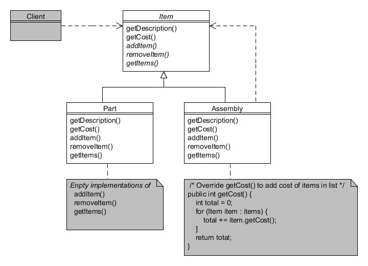
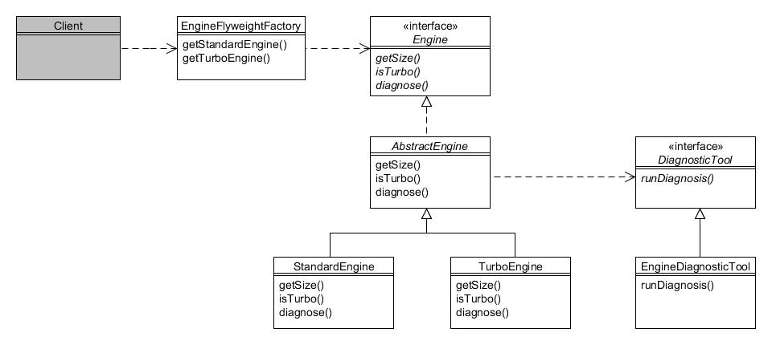

# 7. Adaptador (Adapter)

Tipo: Estructural

Objetivo: Convierta la interfaz de una clase en otra interfaz que los clientes esperan. El adaptador permite que clases trabajen juntas que de otro modo no podrían hacerlo debido a interfaces incompatibles.

Recordará de la introducción que la Compañía de Motores Foobar hace los motores para sus vehículos. Aquí hay un recordatorio de la jerarquía de Engine:


Figura 7.1 : Jerarquía de la clase Engine

Y aquí está el recordatorio del código de la clase abstracta AbstractEngine:

```java
public abstract class AbstractEngine implements Engine {
    private int size;
    private boolean turbo;

    public AbstractEngine(int size, boolean turbo) {
        this.size = size;
        this.turbo = turbo;
    }
    public int getSize() {
        return size;
    }

    public boolean isTurbo() {
        return turbo;
    }

    public String toString() {
        return getClass().getSimpleName() + " (" + size + ")");
    }
}
```

Digamos que nuestro programa cliente toma los motores almacenados en una colección y los recorre uno a la vez mostrando el tamaño y el tipo de motor:

```java
List<Engine> engines = new ArrayList<Engine>();

engines.add(new StandardEngine(1300));
engines.add(new StandardEngine(1600));
engines.add(new TurboEngine(2000));

for (Engine engine : engines) {
System.out.println(engine);
}
```

Al ejecutar el código anterior se obtendría la siguiente pantalla:

```text
StandardEngine (1300)
StandardEngine (1600)
TurboEngine (2000)
```

Para este capítulo asumiremos que además de las dos subclases concretas (StandardEngine y TurboEngine) Foobar ha decidido usar otra clase de motor llamado SuperGreenEngine el cual fabrica un manufacturador diferente. Debido a que la clase SuperGreenEngine es proporcionada por un tercero,  no implementa nuestro interfaz Engine. Además, Foobar no tiene acceso al código fuente en Java, y por tanto, no puede modificarlo, pero los siguientes detalles de la clase se conocen a partir de la documentación:

* La clase extiende `Object`
* El constructor recibe un argumento para el tamaño del motor
* Hay un método `getEngineSize()` que devuelve el tamaño del motor como un `int`;
* Estos tipos de motores nunca tienen turbocompresor
* El método `toString()` devuelve una cadena en el formato: **SUPER ENGINE nnnn** (donde nnnn es el tamaño del motor).


Podemos, por lo tanto, ver que SuperGreenEngine usa un nombre de método diferente para acceder al tamaño del motor y que no hay método relacionado para saber si está turboalimentado, y que no está dentro de la jerarquía de Engine. Tal como está, no sería posible agregar instancias de SuperGreenEngine a la colección de informes en incluso si pudiera, los nombres de los métodos son diferentes.

El patrón Adaptador proporciona un enfoque para resolver esto mediante la definición de una nueva clase que "adapta" la clase que queremos usar al formato que requieren las clases existentes . Para nuestro propósitos, por lo tanto, crearemos una clase SuperGreenEngineAdapter:


Figura 7.2 : Jerarquía de la clase Adapter

El código para el adaptador es como sigue:

```java
public class SuperGreenEngineAdapter extends AbstractEngine {
    public SuperGreenEngineAdapter(SuperGreenEngine greenEngine) {
        super(greenEngine.getEngineSize(), false);
    }
}
```

Observe lo siguiente del código de Java anterior:

* Extendemos la clase a la que nos estamos adaptando
* Aceptamos una referencia en el constructor a la clase desde la que nos estamos adaptando
* El constructor obtiene el estado necesario del objeto referenciado y lo pasa al constructor de la superclase.

Ahora estamos en condiciones de incluir los objetos SuperGreenEngine en nuestra colección de informes (el código adicional indicado en negrita):

```java
List<Engine> engines = new ArrayList<Engine>();
engines.add(new StandardEngine(1300));
engines.add(new StandardEngine(1600));
engines.add(new TurboEngine(2000));
engines.add(new StandardEngine(1600));
engines.add(new TurboEngine(2000));
```

**`// "Adaptamos" el nuevo tipo de motor...`**  
**`SuperGreenEngine greenEngine = new SuperGreenEngine(1200);`**  
**`engines.add(new SuperGreenEngineAdapter(greenEngine));`**  
**`// Sin cambios desde antes...`**  

```java
for (Engine engine : engines) {
    System.out.println(engine);
}
```

La salida ahora debería ser:

```text
StandardEngine (1300)
StandardEngine (1600)
TurboEngine (2000)
SuperGreenEngine (1200)
```

Observe cómo la salida utilizó el método toString() heredado de AbstractEngine en lugar del de SuperGreenEngine.

## Variaciones para implementar adaptadores{#h2-10}

Fuimos algo afortunados porque el diseño de las clases Engine y SuperGreenEngine facilitó que la clase adaptador hiciera el trabajo dentro de su constructor. Sin embargo, a menudo necesitamos realizar algunos pasos adicionales dentro del código de la clase de adaptador, por lo que aquí hay una fórmula general para aplicar:

_1. Extienda la clase que está adaptando (o impleméntela, si es una interfaz)_  
_2. Especifique la clase desde la que está adaptando en el constructor y almacene una referencia a ella en una variable de instancia_  
_3. Por cada método en la clase que está extendiendo (o la interfaz que está implementando), sobreescríbalo para delegar al método correspondiente de la clase desde la que está adaptando_  

Aquí hay un ejemplo genérico de la clase adaptadora:

```java
public class ObjectAdapter extends ClassAdaptingTo {
    private ClassAdaptingFrom fromObject;

    public ObjectAdapter(ClassAdaptingFrom fromObject) {
        this.fromObject = fromObject;
    }

    // Método sobreescrito
    public void methodInToClass() {
        fromObject.methodInFromClass();
    }
}
```

---

## 8. Puente (Bridge){#h2-11}

Tipo: Estructural  

Objetivo: Desacopla una abstracción de su implementación para que cada una pueda variar de forma independiente.

La Compañía de Motores Foobar manufactura motores para sus vehículos. Aquí tiene un recordatorio de la jerarquía de la clase Engine:


Figura 8.1 : Jerarquía de la clase Engine

La implementación de las clases Engine como se detallaron en la introducción, simplemente almacenan el tamaño del motor (por ejemplo, 1600cc) y si está turboalimentado. Para los propósitos de este capítulo esta clase será mejorada para permitir arrancar y detener el motor y aumentar y disminuir la potencia del motor.

La versión modificada de la interfaz Engine y la clase AbstractEngine se lista debajo con los cambios marcados en negrita:

```java
public interface Engine {
    public int getSize();
    public boolean isTurbo();
    public void start();
    public void stop();
    public void increasePower();
    public void decreasePower();
}

 

public abstract class AbstractEngine implements Engine {
    private int size;
    private boolean turbo;
    private boolean running;
    private int power;

    public AbstractEngine(int size, boolean turbo) {
        this.size = size;
        this.turbo = turbo;
        running = false;
        power = 0;
    }

    public int getSize() {
        return size;
    }

    public boolean isTurbo() {
        return turbo;
    }

    public void start() {
        running = true;
        System.out.println("El motor arrancó");
    }

    public void stop() {
        running = false;
        power = 0;
        System.out.println("Motor parado");
    }

    public void increasePower() {
        if (running && (power < 10)) {
            power++;
            System.out.println("La potencia del motor aumentó a" + power);
        }
    }

    public void decreasePower() {
        if (running && (power > 0)) {
            power--;
            System.out.println("La potencia del motor disminuyó a" + power);
        }
    }

    public String toString() {
        return getClass().getSimpleName() + " (" + size ")");
    }
}
```

Dentro de un vehículo, el conductor controla las funciones del motor indirectamente mediante varios controles manuales y de pie, como el interruptor de encendido, el pedal del acelerador y el pedal del freno. Para conservar la flexibilidad, es importante diseñar la conexión entre el motor y los controles de modo que cada uno pueda variar independientemente del otro. En otras palabras:

Se puede diseñar y conectar un nuevo motor a un vehículo sin necesidad de cambiar ningún control del conductor. Y
se pueden diseñar nuevos controles del conductor (por ejemplo, para ayudar a los conductores discapacitados) y conectarlos a un vehículo sin necesidad de cambiar los motores.

El patrón Puente resuelve este requerimiento separando la "abstracción" de la "implementación" en dos jerarquías separadas pero conectadas, de tal forma que cada una puede variar independientemente de la otra. En nuestro ejemplo, la "abstracción" son los controles del conductor y la "implementación" es el motor.

El siguiente diagrama muestra esta relación:


Figure 8.2 : Patrón puente

Como la figura de arriba muestra, hay una clase abstracta AbstractDriverControls con dos subclases concretas: StandardControls and SportControls:


La clase AbstractDriverControls requiere que se le pase un objeto Engine a su constructor y después delega al motor para cada uno de sus métodos:

```java
public abstract class AbstractDriverControls {
    private Engine engine;

    public AbstractDriverControls(Engine engine) {
        this.engine = engine;
    }

    public AbstractDriverControls(Engine engine) {
        this.engine = engine;
    }

    public void ignitionOn() {
        engine.start();
    }

    public void ignitionOff() {
        engine.stop();
    }

    public void accelerate() {
        engine.increasePower();
    }

    public void brake() {
        engine.decreasePower();
    }
}
```

Las subclases de AbstractDriverControls pueden usar los métodos de la superclase tal cual o definir funcionalidades adicionales. La clase StandardControls usa AbstractDriverControls tal cual:  

```java
public class StandardControls extends AbstractDriverControls {
    public StandardControls(Engine engine) {
    super(engine);
    }

    // Sin funciones adicionales
}
```

Mientras que la clase SportControls define un método adicional:

```java
public class SportControls extends AbstractDriverControls {
    public SportControls(Engine engine) {
        super(engine);
    }

    public void accelerateHard() {
        accelerate();
        accelerate();
    }
}
```

El punto importante a tener en cuenta de lo anterior es que el método adicional está codificado en términos de la superclase "abstracción" y no de "implementación" (motor). Entonces, en el ejemplo anterior, el método accelerateHard() invoca el método accelerate() tal como se define en AbstractDriverControls. Es este enfoque el que permite que la abstracción y la implementación varíen de forma independiente si es necesario.

De esta manera podríamos incorporar un nuevo tipo de motor sin modificar las clases de controles del conductor, siempre que el motor cumpla con el contrato de Engine. Por el contrario, podríamos desarrollar un nuevo conjunto de controles del conductor (como habilitar la activación por voz) sin tener que modificar nada en la jerarquía de Engine.


Los programas del cliente pueden usar el puente de la siguiente manera:

```java
Engine engine = new StandardEngine(1300);
StandardControls controls1 = new StandardControls(engine);
controls1.ignitionOn();
controls1.accelerate();
controls1.brake();
controls1.ignitionOff();

// Ahora usa controles deportivos
SportControls controls2 = new SportControls(engine);
controls2.ignitionOn();
controls2.accelerate();
controls2.accelerateHard();
controls2.brake();
controls2.ignitionOff();
```

---

## 9. Compuesto (Composite) {#h2-12}

Tipo: Estructural

Objetivo: Compone objetos en estructuras de árbol para representar jerarquías de parte y todo. Compuesto permite a los clientes tratar objetos individuales y composiciones de objetos de manera uniforme.

En el taller de la Compañía de Motores Foobar construyen varios artículos a partir de componentes como tuercas, pernos, paneles, etc. Cada componente individual tiene una descripción asociada y un costo unitario, y cuando los artículos se ensamblan en artículos más grandes, el costo es, por lo tanto, la suma de sus partes componentes.

El patrón Compuesto nos permite tratar tanto piezas individuales como conjuntos de piezas como si fueran iguales, lo que permite procesarlos de manera consistente, simplificando el código. La jerarquía de clases se ve así:



Figura 9.1 : Patrón compuesto

La clase abstracta Item define todos los métodos posibles tanto para las piezas como para conjuntos de piezas:

```java
public abstract class Item {
    private String description;
    private int cost;

    public Item(String description, int cost) {
        this.description = description;
        this.cost = cost;
    }

    public String getDescription() {
        return description;
    }
    public int getCost() {
        return cost;
    }

    public abstract void addItem(Item item);
    public abstract void removeItem(Item item);
    public abstract Item[] getItems();

    public String toString() {
        return description + " (cost " + getCost() + ")";
    }
}
```

La clase de arriba proporciona implementaciones predeterminadas para  getDescription() and getCost(), and defines the abstract methods addItem(), removeItem() and getItems().

Las piezas individuales se modelan utilizando la subclase Part:

```java
public class Part extends Item {
    public Part(String description, int cost) {
        super(description, cost);
    }

    // Implementación vacía para piezas unitarias...
    public void addItem(Item item) {}
    public void removeItem(Item item) {}
    public Item[] getItems() {return new Item[0];}
}
```

Como puede ver, los métodos relacionados con la gestión de conjuntos de artículos tienen implementaciones vacías ya que una 'parte' es la unidad más pequeña posible y, por lo tanto, no puede tener subpartes, a diferencia de los 'conjuntos'.

Los conjuntos de piezas se modelan utilizando la subclase Assembly:

```java
public class Assembly extends Item {
    private List<Item> items;

    public Assembly(String description) {
        super(description, 0);
        items = new ArrayList<Item>();
    }

    public void addItem(Item item) {
        items.add(item);
    }

    public void removeItem(Item item) {
        items.remove(item);
    }

    public Item[] getItems() {
        return items.toArray(new Item[items.size()]);
    }

    // También hay que sobreescribir getCost() para agregar el costo de los artículos en la lista.
    public int getCost() {
        int total = 0;
        for (Item item : items) {
            total += item.getCost();
        }
        return total;
    }
}
```

Para los conjuntos, hemos implementado métodos abstractos para agregar otros objetos Item a una colección List interna. También hemos sobreescrito el método getCost() para recorrer la colección y sumar el costo de todos los elementos contenidos en este conjunto.

Todos los tipos de objetos Item ahora se pueden usar de manera uniforme:

```java
Item nut = new Part("Tuerca", 5);
Item bolt = new Part("Tornillo", 9);
Item panel = new Part("Salpicadero", 35);

Item gizmo = new Assembly("Chisme");
gizmo.addItem(panel);
gizmo.addItem(nut);
gizmo.addItem(bolt);

Item widget = new Assembly("Artilugio");
widget.addItem(gizmo);
widget.addItem(nut);
```

En el extracto anterior, las tuercas, los pernos y los paneles se definen como partes individuales, un "Chisme" se ensambla a partir de una tuerca, un perno y un panel, y un "Artilugio" se ensambla a partir de un "Chisme" y otra tuerca. Mostrar los objetos daría como resultado este resultado:

```text
Tuerca (cost 5)
Tornillo (cost 9)
Salpicadero (cost 35)
Chisme (cost 49)
Artilugio (cost 54)
```

Se han calculado el coste total de los conjuntos sin que el programa cliente necesite saber cómo.

---

## 10. Decorador (Decorator){#h2-13}

Tipo: Estructural

Objetivo: Adjunte responsabilidades adicionales a un objeto de forma dinámica. Los decoradores proporcionan una alternativa flexible a la subclasificación para ampliar la funcionalidad.

Recordará la jerarquía de clases de Vehicle de la Compañía de Motores Foobar:


Figura 10.1 : Jerarquía de la clase Vehicle

Para los propósitos de este capítulo, agregaremos un método adicional llamado getPrice() a la interfaz Vehicle. También modificaremos el método toString() en AbstractVehicle para incluir el precio. La interfaz y la clase modificadas se muestran a continuación con los cambios marcados en negrita:

```java
public interface Vehicle {
    public enum Colour {UNPAINTED, BLUE, BLACK, GREEN, RED, SILVER, WHITE, YELLOW};
    public Engine getEngine();
    public void paint(Vehicle.Colour colour);
    public Vehicle.Colour getColour();
    public int getPrice();
}

public abstract class AbstractVehicle implements Vehicle {
    private Engine engine;
    private Vehicle.Colour colour;

    public AbstractVehicle(Engine engine) {
        this(engine, Vehicle.Colour.UNPAINTED);
    }

    public AbstractVehicle(Engine engine, Vehicle.Colour colour) {
        this.engine = engine;
        this.colour = colour;
    }

    public Engine getEngine() {
        return engine;
    }

    public Vehicle.Colour getColour() {
        return colour;
    }

    public void paint(Vehicle.Colour colour) {
        colour = colour;
    }

    public String toString() {
        return getClass().getSimpleName() + " (" + engine + ", " + colour + ", price " + getPrice() + ")";
    }
}
```

Cada una de las subclases concretas implementa el método getPrice() según corresponda. Por ejemplo, la clase Saloon ahora tiene este aspecto (los cambios están en negrita):

```java
public class Saloon extends AbstractCar {
    public Saloon(Engine engine) {
        this(engine, Vehicle.Colour.UNPAINTED)
    }

    public Saloon(Engine engine, Vehicle.Colour colour) {
        super(engine, colour);
    }

    public int getPrice() {
        return 6000;
    }
}
```

Las otras subclases se definen de manera similar y el método getPrice() devuelve:

* 6,000 para objetos Saloon;
* 7,000 para objetos Coupe;
* 8,000 para objetos Sport;
* 9,000 para objetos Pickup;
* 10,000 para objetos BoxVan.  

Cuando un cliente compra un vehículo, tiene la opción de agregar cualquier número de extras opcionales. Pueden elegir entre un sistema de aire acondicionado, llantas de aleación, asientos de cuero, pintura metalizada o una unidad de navegación por satélite. No pueden elegir ninguno o cualquier combinación de hasta los cinco.

El patrón Decorador está diseñado para facilitar la adición de estado y/o comportamiento sin tener que modificar la jerarquía de herencia de las clases a las que se agrega. Esto se logra definiendo una nueva jerarquía que a su vez extiende la raíz del árbol principal.

Esto se muestra esquemáticamente a continuación:


Figura 10.2 : Jerarquía del patrón Decorator

En el diagrama se puede ver que se ha definido una nueva clase abstracta llamada AbstractVehicleOption que hereda de AbstractVehicle. AbstractVehicleOption tiene cinco subclases concretas; uno para cada opción que se puede seleccionar.

La clase AbstractVehicleOption se ve así:

```java
public abstract class AbstractVehicleOption extends AbstractVehicle {
    protected Vehicle decoratedVehicle;

    public AbstractVehicleOption(Vehicle vehicle) {
        super(vehicle.getEngine());
        decoratedVehicle = vehicle;
    }
}
```

AbstractVehicleOption es la clase "decoradora" abstracta y requiere una referencia a la clase de Vehículo que se va a decorar.

Cada una de las subclases de opciones es sencilla. Todos sobreescriben el método getPrice() para sumar el precio de la opción al precio del objeto que se está decorando. En el caso de las clases AirConditionedVehicle y SatNavVehicle, también hemos definido un método extra:

```java
public class AirConditionedVehicle extends AbstractVehicleOption {
    public AirConditioning(Vehicle vehicle) {
        super(vehicle);
    }

    public int getPrice() {
        return decoratedVehicle.getPrice() + 600;
    }

    public void setTemperature(int value) {
       // código para configurar la temperatura...
    }
}

public class AlloyWheeledVehicle extends AbstractVehicleOption {
    public AlloyWheels(Vehicle vehicle) {
        super(vehicle);
    }

    public int getPrice() {
        return decoratedVehicle.getPrice() + 250;
    }
}

 

public class LeatherSeatedVehicle extends AbstractVehicleOption {
    public LeatherSeats(Vehicle vehicle) {
        super(vehicle);
    }

    public int getPrice() {
        return decoratedVehicle.getPrice() + 1200;
    }
}

 

public class MetallicPaintedVehicle extends AbstractVehicleOption {
    public MetallicPaint(Vehicle vehicle) {
        super(vehicle);
    }

    public int getPrice() {
        return decoratedVehicle.getPrice() + 750;
    }
}

public class SatNavVehicle extends AbstractVehicleOption {
    public SatNav(Vehicle vehicle) {
        super(vehicle);
    }

    public int getPrice() {
        return decoratedVehicle.getPrice() + 1500;
    }

    public void setDestination(String target) {
        // código para establecer el destino...
    }
}
```

Para utilizar los 'decoradores' inicialmente creamos una instancia del automóvil o camioneta que necesitamos y luego los "envolvemos" dentro del decorador o decoradores requeridos. Aquí hay un ejemplo:

```java
// Creamos un vehículo berlina de color azul...
Vehicle myCar = new Saloon(new StandardEngine(1300));
myCar.paint(Vehicle.Colour.BLUE);

// Agregarmos el aire acondicionado al coche...
myCar = new AirConditionedVehicle(myCar);

// Ahora agregamos las llantas de aleación...
myCar = new AlloyWheeledVehicle(myCar);

// Ahora agregamos los asientos de cuero...
myCar = new LeatherSeatedVehicle(myCar);

// Ahora agregamos la pintura metalizada...
myCar = new MetallicPaintedVehicle(myCar);

// Ahora agremamos la navegación por satelite...
myCar = new SatNavVehicle(myCar);
```

Si invoca System.out.println() en el objeto myCar en cada etapa, debería ver este resultado:

```text
Saloon (StandardEngine (1300), BLUE, price 6000)
AirConditionedVehicle (StandardEngine (1300), BLUE, price 6600)
AlloyWheeledVehicle (StandardEngine (1300), BLUE, price 6850)
LeatherSeatedVehicle (StandardEngine (1300), BLUE, price 8050)
MetallicPaintedVehicle (StandardEngine (1300), BLUE, price 8800)
SatNavVehicle (StandardEngine (1300), BLUE, price 10300)
```

El precio mostrado en cada etapa es el total del vehículo más las opciones seleccionadas a medida que se "suman" cada una de ellas.

El patrón Decorador es un buen ejemplo de cómo preferir la composición de objetos a la herencia. Si hubiéramos intentado utilizar la herencia para las distintas opciones de vehículos, habríamos necesitado crear muchas combinaciones diferentes de subclases para modelar cada combinación de opciones seleccionables.

Las clases decoradoras a veces se denominan clases "contenedoras", ya que sirven para "envolver" un objeto dentro de otro objeto, generalmente para agregar o modificar su funcionalidad.

---

## 11. Fachada (Facade){#h2-14}  

Tipo: Estructural

Objetivo: Proporciona una interfaz unificada para un conjunto de interfaces en un subsistema. Facade define una interfaz de nivel superior que hace que el subsistema sea más fácil de usar.

A veces es necesario realizar una serie de pasos para realizar una tarea concreta, que a menudo implica varios objetos. El patrón Fachada implica la creación de un objeto separado que simplifica la ejecución de dichos pasos.

Por ejemplo, cuando la Compañía de Motores Foobar está preparando sus vehículos para la venta, debe seguir una serie de pasos que utilizan varios objetos. En este capítulo asumiremos que la interfaz Vehicle define los siguientes métodos adicionales además de los definidos en la introducción.

```java
// Métodos extra definidos en Vehicle...

public void cleanInterior();
public void cleanExteriorBody();
public void polishWindows();
public void takeForTestDrive();
```

Los métodos anteriores se implementan en AbstractVehicle de la siguiente manera:

```java
public void cleanInterior() {
    System.out.println("Limpiar interiores");
}

public void cleanExteriorBody() {
    System.out.println("Limpiar exterior");
}

public void polishWindows() {
    System.out.println("Pulir ventanas");
}

public void takeForTestDrive() {
    System.out.println("montar para prueba de conducción");
}
```

Introduciremos dos clases simples más llamadas Registration y Documentation:

```java
public class Registration {
    private Vehicle vehicle;

    public Registration(Vehicle vehicle) {
        this.vehicle = vehicle;
    }

    public void allocateLicensePlate() {
        // Código omitido...
        System.out.println("Matrícula asignada");
    }

    public void allocateVehicleNumber() {
        // Código omitido...
        System.out.println("Número de vehículo asignado");
    }
}
 

public class Documentation {
    public static void printBrochure(Vehicle vehicle) {
        // Código omitido...
        System.out.println("Folleto impreso");
    }
}
```

Para implementar el patrón, crearemos una clase VehicleFacade que define un método para preparar el vehículo especificado utilizando las clases anteriores en nuestro nombre:


Figura 11.1 : Patrón Facade

``` java
public class VehicleFacade {
    public void prepareForSale(Vehicle vehicle) {
        Registration reg = new Registration(vehicle);
        reg.allocateVehicleNumber();
        reg.allocateLicensePlate();

        Documentation.printBrochure(vehicle);

        vehicle.cleanInterior();
        vehicle.cleanExteriorBody();
        vehicle.polishWindows();
        vehicle.takeForTestDrive();
    }
}
```

Los programas cliente entonces solo necesitan invocar el método prepareForSale() en una instancia de VehicleFacade y, por lo tanto, no necesitan saber qué se debe hacer ni qué otros objetos se necesitan. Y si se necesita algo diferente en una circunstancia especial, entonces los métodos individuales todavía están disponibles para llamar según sea necesario.

---

## 12. Flyweight{#h2-15}

Tipo: Estructural

Objetivo: Utiliza el uso compartido para admitir una gran cantidad de objetos detallados de manera eficiente.

Algunos programas necesitan crear una gran cantidad de objetos de un tipo particular, y si esos objetos tienen una gran cantidad de estado, crear instancias de muchos de ellos puede consumir memoria rápidamente. Al considerar el estado de un objeto, a menudo observamos que al menos una parte podría compartirse entre un grupo de objetos.

Para la Compañía de Motores Foobar, la jerarquía de Engine es un ejemplo de ello:


Figura 12.1 : Jerarquía de la clase Engine

Nuestra implementación simple de Engine solo define dos métodos; getSize() y isTurbo(). Supongamos que creamos instancias de dos motores de la siguiente manera:

```java
Engine engine1 = new StandardEngine(1300);
Engine engine2 = new StandardEngine(1300);
```

Lo anterior crearía dos objetos separados en la memoria, aunque su estado sea idéntico. Esto puede considerarse como su estado intrínseco; es decir, todos los motores estándar de 1300 cc almacenarán 1300 para el tamaño del motor y false para saber si está turboalimentado. Crear cientos o miles de estos sería un desperdicio de memoria, especialmente porque una clase Engine más realista requeriría muchas más variables cuyos valores también se compartirían.

Para los propósitos de este capítulo, se agregará otro método a la interfaz de Engine, llamado diagnostic(). Este nuevo método tomará un objeto DiagnosticTool como argumento, y este argumento puede considerarse como su estado extrínseco, ya que su valor en realidad no está almacenado en el objeto Engine; se usa exclusivamente para que el motor pueda usarlo para realizar una verificación de diagnóstico.

La interfaz de DiagnosticTool se ve así:

```java
public interface DiagnosticTool {
    public void runDiagnosis(Object obj);
}
```

EngineDiagnosticTool implementa lo anterior para ejecutar diagnósticos en un motor:

```java
public class EngineDiagnosticTool implements DiagnosticTool {
    public void runDiagnosis(Object obj) {
        System.out.println("Iniciando herramienta de diágnostico del motor para " + obj);
        try {
            Thread.sleep(5000);
            System.out.println("Diagnosis del motor completada");
        } catch (InterruptedException ex) {
            System.out.println("Diagnosis del motor interrumpida");
        }
    }
}
```

Para simular un proceso de larga duración, el método se detiene durante cinco segundos. Con lo anterior implementado, ahora podemos agregar un método adecuado a la interfaz Engine:

```java
public interface Engine {
    // Métodos que tienen estado intrínseco (es decir, compartido)
    public int getSize();
    public boolean isTurbo();

    // Métodos que tienen estado extrínseco (es decir, no compartido)
    public void diagnose(DiagnosticTool tool);
}
```

La implementación de este nuevo método en AbstractEngine simplemente emite una devolución de llamada a DiagnosticTool:

```java
public void diagnose(DiagnosticTool tool) {
    tool.runDiagnosis(this);
}
```

El patrón Flyweight le permite hacer referencia a una multitud de objetos del mismo tipo y que tienen el mismo estado, pero solo creando instancias de la cantidad mínima de objetos reales necesarios. Esto normalmente se hace asignando un "grupo" de objetos que se pueden compartir, y esto está determinado por una clase de "factoría de peso ligero". Los programas cliente obtienen acceso a los motores sólo a través de la factoría:



Figura 12.2 : Patrón Flyweight

La clase EngineFlyweightFactory tiene este aspecto:

```java
public class EngineFlyweightFactory {
    private Map<Integer, Engine> standardEnginePool;
    private Map<Integer, Engine> turboEnginePool;

    public EngineFlyweightFactory() {
        standardEnginePool = new HashMap<Integer, Engine>();
        turboEnginePool = new HashMap<Integer, Engine>();
    }

    public Engine getStandardEngine(int size) {
        Engine e = standardEnginePool.get(size);
        if (e == null) {
            e = new StandardEngine(size);
            standardEnginePool.put(size, e);
        }
        return e;
    }

    public Engine getTurboEngine(int size) {
        Engine e = turboEnginePool.get(size);
        if (e == null) {
            e = new TurboEngine(size);
            turboEnginePool.put(size, e);
        }
        return e;
    }
}
```

Esta clase utiliza dos mapas (uno para motores estándar y otro para motores turbo). Cada vez que se solicita un motor de un tipo y tamaño determinados, si ya se ha creado uno similar, se devuelve en lugar de crear una instancia de uno nuevo. Los programas cliente usan la fábrica de esta manera:

```java
// Se crea la fábrica de peso ligero....
EngineFlyweightFactory factory = new EngineFlyweightFactory();

// Se crea la herramienta de diagnóstico
DiagnosticTool tool = new EngineDiagnosticTool();

// Obtenemos los pesos ligeros y ejecutamos diagnósticos sobre ellos
Engine standard1 = factory.getStandardEngine(1300);
standard1.diagnose(tool);

Engine standard2 = factory.getStandardEngine(1300);
standard2.diagnose(tool);

Engine standard3 = factory.getStandardEngine(1300);
standard3.diagnose(tool);

Engine standard4 = factory.getStandardEngine(1600);
standard4.diagnose(tool);

Engine standard5 = factory.getStandardEngine(1600);
standard5.diagnose(tool);

// Se muestra que los objetos se comparten
System.out.println(standard1.hashCode());
System.out.println(standard2.hashCode());
System.out.println(standard3.hashCode());
System.out.println(standard4.hashCode());
System.out.println(standard5.hashCode());
```

En lo anterior, las variables standard1, standard2 y standard3 hacen referencia al mismo objeto Engine (ya que todos son motores estándar de 1300 cc). Asimismo, standard4 hace referencia al mismo objeto que standard5. Por supuesto, dependiendo de las circunstancias, ¡es discutible si vale la pena ejecutar el diagnóstico varias veces en los mismos objetos!.

Si es necesario almacenar los argumentos pasados al método extrínseco (DiagnosticTool en nuestro ejemplo), esto debe hacerse en el programa cliente.

---

## 13. Apoderado (Proxy){#h2-16}

Tipo: Estructural

Objetivo: Proporcione un sustituto o marcador de posición para otro objeto para controlar el acceso a él.

Algunos métodos pueden llevar mucho tiempo, como los que cargan componentes gráficos complejos o necesitan conexiones de red. En estos casos, el patrón Proxy proporciona un objeto 'independiente' hasta el momento en que se completa el recurso que consume mucho tiempo, lo que permite que se cargue el resto de la aplicación.

En el capítulo que analiza el patrón Flyweight, se mejoró la jerarquía de Engine para definir el método adicional diagnostic(). Como vio, la implementación de runDiagnosis() en EngineDiagnosticTool es lenta (lo hicimos dormir durante cinco segundos para simular esto), por lo que podríamos considerar hacer que esta ejecución se haga en un hilo separado.

Aquí hay un recordatorio de la jerarquía de Engine con el método adicional:


Figura 13.1 : Jerarquía de la clase Engine

El patrón Proxy implica la creación de una clase que implemente la misma interfaz que reemplazamos, en nuestro caso Engine. Luego, el proxy reenvía solicitudes al objeto "real" que almacena internamente. Los clientes simplemente acceden al apoderado:


Figure 13.2 : Patrón Apoderado

Aquí está el código para la clase EngineProxy:

```java
public class EngineProxy implements Engine {
    private Engine engine;

    public EngineProxy(int size, boolean turbo) {
        if (turbo) {
            engine = new TurboEngine(size);
        } else {
            engine = new StandardEngine(size);
        }
    }

    public int getSize() {
        return engine.getSize();
    }

    public boolean isTurbo() {
        return engine.isTurbo();
    }

    // Este método lleva mucho tiempo...
    public void diagnose(final DiagnosticTool tool) {
        // Ejecuta el método como un hilo separado
        Thread t = new Thread(new Runnable() {
            public void run() {
                System.out.println("(Ejecutando la herramienta como un hilo)");
                engine.diagnose(tool);
            }
        });
    t.start();
    System.out.println("El método diagnose() de EngineProxy terminó");
    }
}
```

El constructor crea un objeto StandardEngine o TurboEngine y almacena una referencia a él como una variable de instancia. Las llamadas a getSize() y isTurbo() simplemente reenvían al objeto del motor al que se hace referencia. Las llamadas a diagnostic() invocarán un hilo separado para ejecutar el diagnóstico real. Esto puede resultar útil si no puede modificar la fuente original por algún motivo.

Esto deja la pregunta de cómo se puede "forzar" a los programas cliente a utilizar la clase proxy en lugar de la clase normal. Un enfoque sería hacer que los constructores de los paquetes StandardEngine y TurboEngine sean privados (es decir, sin utilizar ningún modificador de acceso); luego, siempre que EngineProxy esté en el mismo paquete, podrá crear instancias de ellos, pero los objetos externos no. También es común tener una clase 'factoria' para simplificar la creación de instancias, por ejemplo, proporcionando un método createStandardEngine().
