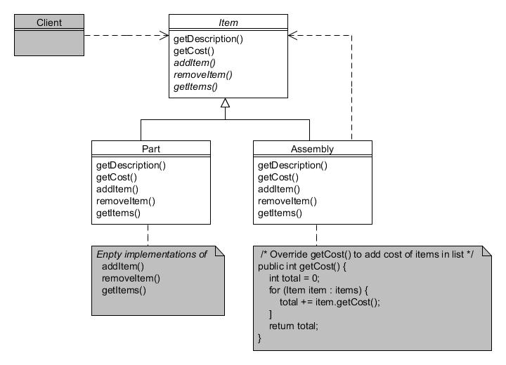

# 9. Compuesto (Composite)

Tipo: Estructural

Objetivo: Compone objetos en estructuras de árbol para representar jerarquías de parte y todo. Compuesto permite a los clientes tratar objetos individuales y composiciones de objetos de manera uniforme.

En el taller de la Compañía de Motores Foobar construyen varios artículos a partir de componentes como tuercas, pernos, paneles, etc. Cada componente individual tiene una descripción asociada y un costo unitario, y cuando los artículos se ensamblan en artículos más grandes, el costo es, por lo tanto, la suma de sus partes componentes.

El patrón Compuesto nos permite tratar tanto piezas individuales como conjuntos de piezas como si fueran iguales, lo que permite procesarlos de manera consistente, simplificando el código. La jerarquía de clases se ve así:



Figura 9.1 : Patrón compuesto

La clase abstracta Item define todos los métodos posibles tanto para las piezas como para conjuntos de piezas:

```java
public abstract class Item {
    private String description;
    private int cost;

    public Item(String description, int cost) {
        this.description = description;
        this.cost = cost;
    }

    public String getDescription() {
        return description;
    }
    public int getCost() {
        return cost;
    }

    public abstract void addItem(Item item);
    public abstract void removeItem(Item item);
    public abstract Item[] getItems();

    public String toString() {
        return description + " (cost " + getCost() + ")";
    }
}
```

La clase de arriba proporciona implementaciones predeterminadas para  getDescription() and getCost(), and defines the abstract methods addItem(), removeItem() and getItems().

Las piezas individuales se modelan utilizando la subclase Part:

```java
public class Part extends Item {
    public Part(String description, int cost) {
        super(description, cost);
    }

    // Implementación vacía para piezas unitarias...
    public void addItem(Item item) {}
    public void removeItem(Item item) {}
    public Item[] getItems() {return new Item[0];}
}
```

Como puede ver, los métodos relacionados con la gestión de conjuntos de artículos tienen implementaciones vacías ya que una 'parte' es la unidad más pequeña posible y, por lo tanto, no puede tener subpartes, a diferencia de los 'conjuntos'.

Los conjuntos de piezas se modelan utilizando la subclase Assembly:

```java
public class Assembly extends Item {
    private List<Item> items;

    public Assembly(String description) {
        super(description, 0);
        items = new ArrayList<Item>();
    }

    public void addItem(Item item) {
        items.add(item);
    }

    public void removeItem(Item item) {
        items.remove(item);
    }

    public Item[] getItems() {
        return items.toArray(new Item[items.size()]);
    }

    // También hay que sobreescribir getCost() para agregar el costo de los artículos en la lista.
    public int getCost() {
        int total = 0;
        for (Item item : items) {
            total += item.getCost();
        }
        return total;
    }
}
```

Para los conjuntos, hemos implementado métodos abstractos para agregar otros objetos Item a una colección List interna. También hemos sobreescrito el método getCost() para recorrer la colección y sumar el costo de todos los elementos contenidos en este conjunto.

Todos los tipos de objetos Item ahora se pueden usar de manera uniforme:

```java
Item nut = new Part("Tuerca", 5);
Item bolt = new Part("Tornillo", 9);
Item panel = new Part("Salpicadero", 35);

Item gizmo = new Assembly("Chisme");
gizmo.addItem(panel);
gizmo.addItem(nut);
gizmo.addItem(bolt);

Item widget = new Assembly("Artilugio");
widget.addItem(gizmo);
widget.addItem(nut);
```

En el extracto anterior, las tuercas, los pernos y los paneles se definen como partes individuales, un "Chisme" se ensambla a partir de una tuerca, un perno y un panel, y un "Artilugio" se ensambla a partir de un "Chisme" y otra tuerca. Mostrar los objetos daría como resultado este resultado:

```text
Tuerca (cost 5)
Tornillo (cost 9)
Salpicadero (cost 35)
Chisme (cost 49)
Artilugio (cost 54)
```

Se han calculado el coste total de los conjuntos sin que el programa cliente necesite saber cómo.
