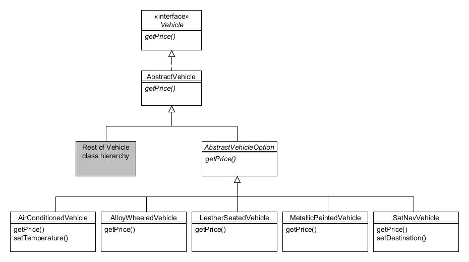

# 10. Decorador (Decorator)

Tipo: Estructural

Objetivo: Adjunte responsabilidades adicionales a un objeto de forma dinámica. Los decoradores proporcionan una alternativa flexible a la subclasificación para ampliar la funcionalidad.

Recordará la jerarquía de clases de Vehicle de la Compañía de Motores Foobar:


Figura 10.1 : Jerarquía de la clase Vehicle

Para los propósitos de este capítulo, agregaremos un método adicional llamado getPrice() a la interfaz Vehicle. También modificaremos el método toString() en AbstractVehicle para incluir el precio. La interfaz y la clase modificadas se muestran a continuación con los cambios marcados en negrita:

```java
public interface Vehicle {
    public enum Colour {UNPAINTED, BLUE, BLACK, GREEN, RED, SILVER, WHITE, YELLOW};
    public Engine getEngine();
    public void paint(Vehicle.Colour colour);
    public Vehicle.Colour getColour();
    public int getPrice();
}

public abstract class AbstractVehicle implements Vehicle {
    private Engine engine;
    private Vehicle.Colour colour;

    public AbstractVehicle(Engine engine) {
        this(engine, Vehicle.Colour.UNPAINTED);
    }

    public AbstractVehicle(Engine engine, Vehicle.Colour colour) {
        this.engine = engine;
        this.colour = colour;
    }

    public Engine getEngine() {
        return engine;
    }

    public Vehicle.Colour getColour() {
        return colour;
    }

    public void paint(Vehicle.Colour colour) {
        colour = colour;
    }

    public String toString() {
        return getClass().getSimpleName() + " (" + engine + ", " + colour + ", price " + getPrice() + ")";
    }
}
```

Cada una de las subclases concretas implementa el método getPrice() según corresponda. Por ejemplo, la clase Saloon ahora tiene este aspecto (los cambios están en negrita):

```java
public class Saloon extends AbstractCar {
    public Saloon(Engine engine) {
        this(engine, Vehicle.Colour.UNPAINTED)
    }

    public Saloon(Engine engine, Vehicle.Colour colour) {
        super(engine, colour);
    }

    public int getPrice() {
        return 6000;
    }
}
```

Las otras subclases se definen de manera similar y el método getPrice() devuelve:

* 6,000 para objetos Saloon;
* 7,000 para objetos Coupe;
* 8,000 para objetos Sport;
* 9,000 para objetos Pickup;
* 10,000 para objetos BoxVan.  

Cuando un cliente compra un vehículo, tiene la opción de agregar cualquier número de extras opcionales. Pueden elegir entre un sistema de aire acondicionado, llantas de aleación, asientos de cuero, pintura metalizada o una unidad de navegación por satélite. No pueden elegir ninguno o cualquier combinación de hasta los cinco.

El patrón Decorador está diseñado para facilitar la adición de estado y/o comportamiento sin tener que modificar la jerarquía de herencia de las clases a las que se agrega. Esto se logra definiendo una nueva jerarquía que a su vez extiende la raíz del árbol principal.

Esto se muestra esquemáticamente a continuación:



Figura 10.2 : Jerarquía del patrón Decorator

En el diagrama se puede ver que se ha definido una nueva clase abstracta llamada AbstractVehicleOption que hereda de AbstractVehicle. AbstractVehicleOption tiene cinco subclases concretas; uno para cada opción que se puede seleccionar.

La clase AbstractVehicleOption se ve así:

```java
public abstract class AbstractVehicleOption extends AbstractVehicle {
    protected Vehicle decoratedVehicle;

    public AbstractVehicleOption(Vehicle vehicle) {
        super(vehicle.getEngine());
        decoratedVehicle = vehicle;
    }
}
```

AbstractVehicleOption es la clase "decoradora" abstracta y requiere una referencia a la clase de Vehículo que se va a decorar.

Cada una de las subclases de opciones es sencilla. Todos sobreescriben el método getPrice() para sumar el precio de la opción al precio del objeto que se está decorando. En el caso de las clases AirConditionedVehicle y SatNavVehicle, también hemos definido un método extra:

```java
public class AirConditionedVehicle extends AbstractVehicleOption {
    public AirConditioning(Vehicle vehicle) {
        super(vehicle);
    }

    public int getPrice() {
        return decoratedVehicle.getPrice() + 600;
    }

    public void setTemperature(int value) {
       // código para configurar la temperatura...
    }
}

public class AlloyWheeledVehicle extends AbstractVehicleOption {
    public AlloyWheels(Vehicle vehicle) {
        super(vehicle);
    }

    public int getPrice() {
        return decoratedVehicle.getPrice() + 250;
    }
}

 

public class LeatherSeatedVehicle extends AbstractVehicleOption {
    public LeatherSeats(Vehicle vehicle) {
        super(vehicle);
    }

    public int getPrice() {
        return decoratedVehicle.getPrice() + 1200;
    }
}

 

public class MetallicPaintedVehicle extends AbstractVehicleOption {
    public MetallicPaint(Vehicle vehicle) {
        super(vehicle);
    }

    public int getPrice() {
        return decoratedVehicle.getPrice() + 750;
    }
}

public class SatNavVehicle extends AbstractVehicleOption {
    public SatNav(Vehicle vehicle) {
        super(vehicle);
    }

    public int getPrice() {
        return decoratedVehicle.getPrice() + 1500;
    }

    public void setDestination(String target) {
        // código para establecer el destino...
    }
}
```

Para utilizar los 'decoradores' inicialmente creamos una instancia del automóvil o camioneta que necesitamos y luego los "envolvemos" dentro del decorador o decoradores requeridos. Aquí hay un ejemplo:

```java
// Creamos un vehículo berlina de color azul...
Vehicle myCar = new Saloon(new StandardEngine(1300));
myCar.paint(Vehicle.Colour.BLUE);

// Agregarmos el aire acondicionado al coche...
myCar = new AirConditionedVehicle(myCar);

// Ahora agregamos las llantas de aleación...
myCar = new AlloyWheeledVehicle(myCar);

// Ahora agregamos los asientos de cuero...
myCar = new LeatherSeatedVehicle(myCar);

// Ahora agregamos la pintura metalizada...
myCar = new MetallicPaintedVehicle(myCar);

// Ahora agremamos la navegación por satelite...
myCar = new SatNavVehicle(myCar);
```

Si invoca System.out.println() en el objeto myCar en cada etapa, debería ver este resultado:

```text
Saloon (StandardEngine (1300), BLUE, price 6000)
AirConditionedVehicle (StandardEngine (1300), BLUE, price 6600)
AlloyWheeledVehicle (StandardEngine (1300), BLUE, price 6850)
LeatherSeatedVehicle (StandardEngine (1300), BLUE, price 8050)
MetallicPaintedVehicle (StandardEngine (1300), BLUE, price 8800)
SatNavVehicle (StandardEngine (1300), BLUE, price 10300)
```

El precio mostrado en cada etapa es el total del vehículo más las opciones seleccionadas a medida que se "suman" cada una de ellas.

El patrón Decorador es un buen ejemplo de cómo preferir la composición de objetos a la herencia. Si hubiéramos intentado utilizar la herencia para las distintas opciones de vehículos, habríamos necesitado crear muchas combinaciones diferentes de subclases para modelar cada combinación de opciones seleccionables.

Las clases decoradoras a veces se denominan clases "contenedoras", ya que sirven para "envolver" un objeto dentro de otro objeto, generalmente para agregar o modificar su funcionalidad.
