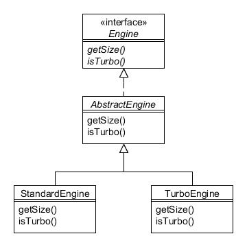
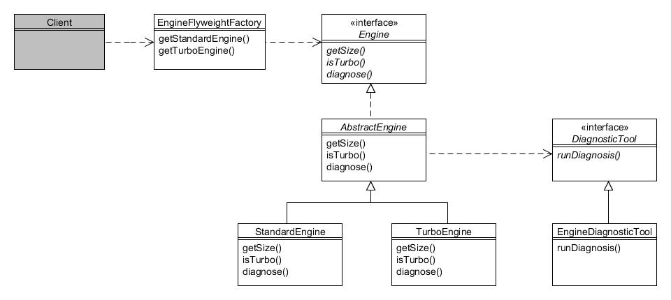

# 12. Flyweight

Tipo: Estructural

Objetivo: Utiliza el uso compartido para admitir una gran cantidad de objetos detallados de manera eficiente.

Algunos programas necesitan crear una gran cantidad de objetos de un tipo particular, y si esos objetos tienen una gran cantidad de estado, crear instancias de muchos de ellos puede consumir memoria rápidamente. Al considerar el estado de un objeto, a menudo observamos que al menos una parte podría compartirse entre un grupo de objetos.

Para la Compañía de Motores Foobar, la jerarquía de Engine es un ejemplo de ello:



Figura 12.1 : Jerarquía de la clase Engine

Nuestra implementación simple de Engine solo define dos métodos; getSize() y isTurbo(). Supongamos que creamos instancias de dos motores de la siguiente manera:

```java
Engine engine1 = new StandardEngine(1300);
Engine engine2 = new StandardEngine(1300);
```

Lo anterior crearía dos objetos separados en la memoria, aunque su estado sea idéntico. Esto puede considerarse como su estado intrínseco; es decir, todos los motores estándar de 1300 cc almacenarán 1300 para el tamaño del motor y false para saber si está turboalimentado. Crear cientos o miles de estos sería un desperdicio de memoria, especialmente porque una clase Engine más realista requeriría muchas más variables cuyos valores también se compartirían.

Para los propósitos de este capítulo, se agregará otro método a la interfaz de Engine, llamado diagnostic(). Este nuevo método tomará un objeto DiagnosticTool como argumento, y este argumento puede considerarse como su estado extrínseco, ya que su valor en realidad no está almacenado en el objeto Engine; se usa exclusivamente para que el motor pueda usarlo para realizar una verificación de diagnóstico.

La interfaz de DiagnosticTool se ve así:

```java
public interface DiagnosticTool {
    public void runDiagnosis(Object obj);
}
```

EngineDiagnosticTool implementa lo anterior para ejecutar diagnósticos en un motor:

```java
public class EngineDiagnosticTool implements DiagnosticTool {
    public void runDiagnosis(Object obj) {
        System.out.println("Iniciando herramienta de diágnostico del motor para " + obj);
        try {
            Thread.sleep(5000);
            System.out.println("Diagnosis del motor completada");
        } catch (InterruptedException ex) {
            System.out.println("Diagnosis del motor interrumpida");
        }
    }
}
```

Para simular un proceso de larga duración, el método se detiene durante cinco segundos. Con lo anterior implementado, ahora podemos agregar un método adecuado a la interfaz Engine:

```java
public interface Engine {
    // Métodos que tienen estado intrínseco (es decir, compartido)
    public int getSize();
    public boolean isTurbo();

    // Métodos que tienen estado extrínseco (es decir, no compartido)
    public void diagnose(DiagnosticTool tool);
}
```

La implementación de este nuevo método en AbstractEngine simplemente emite una devolución de llamada a DiagnosticTool:

```java
public void diagnose(DiagnosticTool tool) {
    tool.runDiagnosis(this);
}
```

El patrón Flyweight le permite hacer referencia a una multitud de objetos del mismo tipo y que tienen el mismo estado, pero solo creando instancias de la cantidad mínima de objetos reales necesarios. Esto normalmente se hace asignando un "grupo" de objetos que se pueden compartir, y esto está determinado por una clase de "factoría de peso ligero". Los programas cliente obtienen acceso a los motores sólo a través de la factoría:



Figura 12.2 : Patrón Flyweight

La clase EngineFlyweightFactory tiene este aspecto:

```java
public class EngineFlyweightFactory {
    private Map<Integer, Engine> standardEnginePool;
    private Map<Integer, Engine> turboEnginePool;

    public EngineFlyweightFactory() {
        standardEnginePool = new HashMap<Integer, Engine>();
        turboEnginePool = new HashMap<Integer, Engine>();
    }

    public Engine getStandardEngine(int size) {
        Engine e = standardEnginePool.get(size);
        if (e == null) {
            e = new StandardEngine(size);
            standardEnginePool.put(size, e);
        }
        return e;
    }

    public Engine getTurboEngine(int size) {
        Engine e = turboEnginePool.get(size);
        if (e == null) {
            e = new TurboEngine(size);
            turboEnginePool.put(size, e);
        }
        return e;
    }
}
```

Esta clase utiliza dos mapas (uno para motores estándar y otro para motores turbo). Cada vez que se solicita un motor de un tipo y tamaño determinados, si ya se ha creado uno similar, se devuelve en lugar de crear una instancia de uno nuevo. Los programas cliente usan la fábrica de esta manera:

```java
// Se crea la fábrica de peso ligero....
EngineFlyweightFactory factory = new EngineFlyweightFactory();

// Se crea la herramienta de diagnóstico
DiagnosticTool tool = new EngineDiagnosticTool();

// Obtenemos los pesos ligeros y ejecutamos diagnósticos sobre ellos
Engine standard1 = factory.getStandardEngine(1300);
standard1.diagnose(tool);

Engine standard2 = factory.getStandardEngine(1300);
standard2.diagnose(tool);

Engine standard3 = factory.getStandardEngine(1300);
standard3.diagnose(tool);

Engine standard4 = factory.getStandardEngine(1600);
standard4.diagnose(tool);

Engine standard5 = factory.getStandardEngine(1600);
standard5.diagnose(tool);

// Se muestra que los objetos se comparten
System.out.println(standard1.hashCode());
System.out.println(standard2.hashCode());
System.out.println(standard3.hashCode());
System.out.println(standard4.hashCode());
System.out.println(standard5.hashCode());
```

En lo anterior, las variables standard1, standard2 y standard3 hacen referencia al mismo objeto Engine (ya que todos son motores estándar de 1300 cc). Asimismo, standard4 hace referencia al mismo objeto que standard5. Por supuesto, dependiendo de las circunstancias, ¡es discutible si vale la pena ejecutar el diagnóstico varias veces en los mismos objetos!.

Si es necesario almacenar los argumentos pasados al método extrínseco (DiagnosticTool en nuestro ejemplo), esto debe hacerse en el programa cliente.
