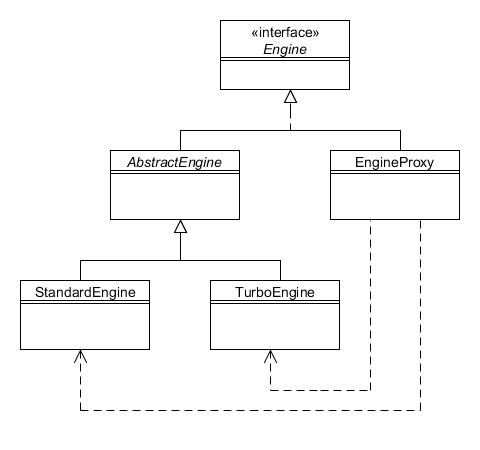

# 13. Apoderado (Proxy)

Tipo: Estructural

Objetivo: Proporcione un sustituto o marcador de posición para otro objeto para controlar el acceso a él.

Algunos métodos pueden llevar mucho tiempo, como los que cargan componentes gráficos complejos o necesitan conexiones de red. En estos casos, el patrón Proxy proporciona un objeto 'independiente' hasta el momento en que se completa el recurso que consume mucho tiempo, lo que permite que se cargue el resto de la aplicación.

En el capítulo que analiza el patrón Flyweight, se mejoró la jerarquía de Engine para definir el método adicional diagnostic(). Como vio, la implementación de runDiagnosis() en EngineDiagnosticTool es lenta (lo hicimos dormir durante cinco segundos para simular esto), por lo que podríamos considerar hacer que esta ejecución se haga en un hilo separado.

Aquí hay un recordatorio de la jerarquía de Engine con el método adicional:


Figura 13.1 : Jerarquía de la clase Engine

El patrón Proxy implica la creación de una clase que implemente la misma interfaz que reemplazamos, en nuestro caso Engine. Luego, el proxy reenvía solicitudes al objeto "real" que almacena internamente. Los clientes simplemente acceden al apoderado:



Figure 13.2 : Patrón Apoderado

Aquí está el código para la clase EngineProxy:

```java
public class EngineProxy implements Engine {
    private Engine engine;

    public EngineProxy(int size, boolean turbo) {
        if (turbo) {
            engine = new TurboEngine(size);
        } else {
            engine = new StandardEngine(size);
        }
    }

    public int getSize() {
        return engine.getSize();
    }

    public boolean isTurbo() {
        return engine.isTurbo();
    }

    // Este método lleva mucho tiempo...
    public void diagnose(final DiagnosticTool tool) {
        // Ejecuta el método como un hilo separado
        Thread t = new Thread(new Runnable() {
            public void run() {
                System.out.println("(Ejecutando la herramienta como un hilo)");
                engine.diagnose(tool);
            }
        });
    t.start();
    System.out.println("El método diagnose() de EngineProxy terminó");
    }
}
```

El constructor crea un objeto StandardEngine o TurboEngine y almacena una referencia a él como una variable de instancia. Las llamadas a getSize() y isTurbo() simplemente reenvían al objeto del motor al que se hace referencia. Las llamadas a diagnostic() invocarán un hilo separado para ejecutar el diagnóstico real. Esto puede resultar útil si no puede modificar la fuente original por algún motivo.

Esto deja la pregunta de cómo se puede "forzar" a los programas cliente a utilizar la clase proxy en lugar de la clase normal. Un enfoque sería hacer que los constructores de los paquetes StandardEngine y TurboEngine sean privados (es decir, sin utilizar ningún modificador de acceso); luego, siempre que EngineProxy esté en el mismo paquete, podrá crear instancias de ellos, pero los objetos externos no. También es común tener una clase 'factoria' para simplificar la creación de instancias, por ejemplo, proporcionando un método createStandardEngine().
