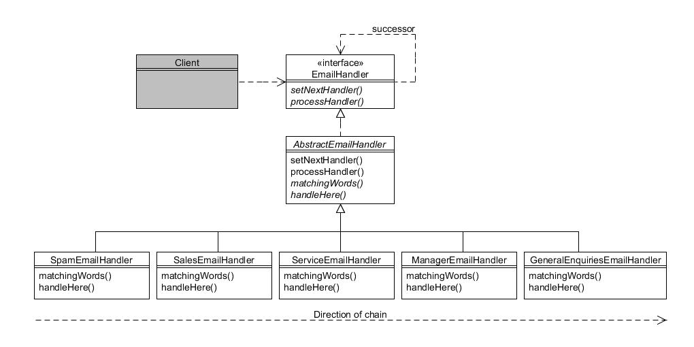

# 14. Cadena de Responsabilidad (Chain of Responsability)

Tipo: Conductual

Objetivo: Evita acoplar el remitente de una solicitud con su receptor dando a más de un objeto la oportunidad de manejar la solicitud. Encadena los objetos receptores y pasa la solicitud a lo largo de la cadena hasta que un objeto la maneje.

La Compañía de Motores Foobar recibe muchos correos electrónicos cada dia, incluyendo peticiones de servicio, consultas de ventas, quejas, y por supuesto el inevitable correo basura. Más que emplear a alguien que específicamente ordene cada correo electrónico para determinar a qué departamente debería ser reenviado, nuestra tarea es intentar automatizar esto analizando el texto de cada correo electrónico y haciendo una "mejor suposición".

En nuestro ejemplo simplificado, buscaremos el texto del correo electrónico una cantidad de palabras clave y dependiendo de lo que encontremos, procesaremos en consencuencia. Estas son las palabras que buscaremos y cómo deben manejarse:

* _Si el correo electrónico contiene **"viagra"**, **"píldoras"** o **"medicinas"** entonces será redirigido a un manejador de correo basura_
* _Si el correo electrónico contiene **"comprar"**, o **"compra"** entonces será redirigido al departamento de ventas_
* _Si el correo electrónico contiene **"servicio"**, o **"reparar"** entonces será redirigido al departamento de servicio_
* _Si el correo electrónico contiene **"queja"**, o **"malo"** entonces será redirigido al gerente_
* _Si el correo electrónico no contiene ninguna de las palabras de arriba entonces deberá ser redirigido al departamento de consultas generales_.

Observe que solo un objeto necesita manejar la petición, por lo que si un correo electrónico particular contiene **"compra"** y **"reparar"** solo será redirigido al departamento de ventas. La  secuencia en la cual se comprueban las palabras clave es la que parezca más sensata para la aplicación. Así que aquí estamos intentando filtrar el correo basura antes de que llegue a cualquier otro departamento.

Ahora sería posible, por supuesto, tener sólo una serie de sentencias `if...else...` al comprobar las palabras clave, pero eso no estaría muy orientado a objetos. En cambio, el patrón _Cadena de responsabilidad_ nos permite definir objetos 'controladores' separados que se ajustan a una interfaz `EmailHandler`. Esto nos permite mantener a cada manejador independiente y débilmente acoplado.

El diagrama siguiente muestra el patrón:



Figura 14.1 : Patrón cadena de responsabilidad

`EmailHandler` es la interfaz en lo alto de la jerarquía:

```java
public interface EmailHandler {
    public void setNextHandler(EmailHandler handler);
    public void processHandler(String email);
}
```

El método `setNextHandler()` toma otro objeto EmailHandler como su argumento que representa el controlador a llamar si el objeto actual es incapaz de controlar el correo electrónico.

El método `processHandler()` toma el texto del correo electrónico como su argumento y determina si es capaz de manejarlo (por ejemplo, si contiene una de las palabras clave que nos interesan). Si el objeto activo puede manejar el correo electrónico lo hace; de lo contrario, simplemente lo reenvía al siguiente en la cadena.

La clase `AbstractEmailHandler` implementa la interfaz `EmailHandler` para proporcionar una funcionalidad útil predeterminada:

```java
public abstract class AbstractEmailHandler implements EmailHandler {
    private EmailHandler nextHandler;

    public void setNextHandler(EmailHandler handler) {
    nextHandler = handler;
    }

    public void processHandler(String email) {
        boolean wordFound = false;

        // Si no hay palabras con las que comparar, entonces este objeto puede manejar
        if (matchingWords().length == 0) {
            wordFound = true;
        } else {
            // Busca cualquiera de las palabras coincidentes.
            for (String word : matchingWords()) {
                if (email.indexOf(word) >= 0) {
                    wordFound = true;
                    break;
                }
            }
        }

        // ¿Podemos manejar el correo electrónico en este objeto?
        if (wordFound) {
            handleHere(email);
        } else {
            // Incapaz de manejarlo aquí, así que lo reenviamos al siguiente en la cadena
            nextHandler.processHandler(email);
        }
    }

    protected abstract String[] matchingWords();
    protected abstract void handleHere(String email);
}
```

El método `setNextHandler()` simplemente almacena el argumento en una variable de instancia; el proceso de toma de decisiones se realiza en `ProcessHandler()`. Esto se ha escrito para utilizar dos métodos auxiliares `protegidos` que deben implementarse mediante subclases concretas:

* `matchingWords()` devolverá una matriz de objetos String en los que este controlador está interesado
* `handleHere()` solo se llama si este objeto realmente puede manejar el correo electrónico y contiene el código necesario.

Las subclases concretas son sencillas:

```java
public class SpamEmailHandler extends AbstractEmailHandler {
    protected String[] matchingWords() {
        return new String[]{"viagra", "píldoras", "medicinas"};
    }

    protected void handleHere(String email) {
        System.out.println("Esto es correo basura.");
    }
}

 

public class SalesEmailHandler extends AbstractEmailHandler {
    protected String[] matchingWords() {
        return new String[]{"comprar", "compra"};
    }

    protected void handleHere(String email) {
        System.out.println("Correo electrónico gestionado por el departamento de ventas.");
    }
}

 

public class ServiceEmailHandler extends AbstractEmailHandler {
    protected String[] matchingWords() {
        return new String[]{"servicio", "reparar"};
    }

    protected void handleHere(String email) {
        System.out.println("Correo electrónico gestionado por el departamento de servicio.");
    }
}

 

public class ManagerEmailHandler extends AbstractEmailHandler {
    protected String[] matchingWords() {
        return new String[]{"queja", "malo"};
    }

    protected void handleHere(String email) {
        System.out.println("Correo electrónico gestionado por el gerente.");
    }
}

 

public class GeneralEnquiriesEmailHandler extends AbstractEmailHandler {
    protected String[] matchingWords() {
        return new String[0]; // match anything
    }

    protected void handleHere(String email) {
        System.out.println("Correo electrónico atendido por consultas generales..");
    }
}
```

Ahora necesitamos definir la secuencia en la que se llaman los controladores. Para este ejemplo, se agregó el siguiente método `estático` a `AbstractEmailHandler`:

```java
public static void handle(String email) {
    // Crea los objetos del controlador....
    EmailHandler spam = new SpamEmailHandler();

    mailHandler sales = new SalesEmailHandler();
    EmailHandler service = new ServiceEmailHandler();
    EmailHandler manager = new ManagerEmailHandler();
    EmailHandler general = new GeneralEnquiriesEmailHandler();

    // Los encadenamos juntos...
    spam.setNextHandler(sales);
    sales.setNextHandler(service);
    service.setNextHandler(manager);
    manager.setNextHandler(general);

    // Iniciamos el proceso...
    spam.processHandler(email);
}
```

Enviar un mensaje a través de los controladores ahora es tan simple como esto:

```java
String email = "Necesito reparar mi auto.";
AbstractEmailHandler.handle(email);
```

Esto debería producir el siguiente resultado:

```text
Correo electrónico gestionado por el departamento de servicio.
```
