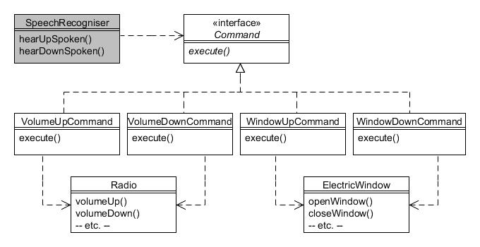

# 15. Comando (Command)

Tipo: Conductual

Objetivo: Encapsula una petición como un objeto, de este modo le permite parametrizar a los clientes con peticiones diferentes, poner en cola o registrar peticiones, y soportar operaciones que se pueden deshacer.

Cada uno de los vehículos fabricados por la Compañía de Motores Foobar tiene una radio instalada; esto se modela por la siguiente clase Radio:

```java
public class Radio {
    public static final int MIN_VOLUME = 0;
    public static final int MAX_VOLUME = 10;
    public static final int DEFAULT_VOLUME = 5;

    private boolean on;
    private int volume;

    public Radio() {
        on = false;
        volume = DEFAULT_VOLUME;
    }

    public boolean isOn() {
        return on;
    }

    public int getVolume() {
        return volume;
    }

    public void on() {
        on = true;
        System.out.println("Radio encendida, nivel de volumen " + getVolume());
    }

    public void off() {
        on = false;
        System.out.println("Radio ahora apagada");
    }

    public void volumeUp() {
        if (isOn()) {
            if (getVolume() < MAX_VOLUME) {
                volume++;
                System.out.println("Volumen subido al nivel " + getVolume());
            }
        }
    }

    public void volumeDown() {
        if (isOn()) {
            if (getVolume() > MIN_VOLUME) {
                volume--;
                System.out.println("Volumen bajado al nivel " + getVolume());
            }
        }
    }
}
```

Como puede ver, la clase habilita que la radio sea encendida y apagadas, y siempre que esté encendida permitirá subir o bajar el volumen un nivel a la vez, dentro del rango de 1 a 10.

Algunos de los vehículos tiene también ventanillas operadas eléctricamente con botones simples para subir y bajar, como lo modela la siguiente clase ElectricWindow.

```java
public class ElectricWindow {
    private boolean open;

    public ElectricWindow() {
        open = false;
        System.out.println("La ventanilla está cerrada");
    }

    public boolean isOpen() {
        return open;
    }

    public boolean isClosed() {
        return (! open);
    }

    public void openWindow() {
        if (isClosed()) {
            open = true;
            System.out.println("La ventanilla ahora está abierta");
        }
    }

    public void closeWindow() {
        if (isOpen()) {
            open = false;
            System.out.println("La ventanilla ahora está cerrada");
        }
    }
}
```

Cada uno de los dispositivos (la radio y la ventanilla eléctrica) tiene controles separados, típicamente botones, para gestionar su estado. Pero suponga que la Compañía de Motores Foobar ahora desea introducir el reconocimiento de voz a sus vehículos de tope de gama y hacer que funcionen de la siguiente manera:

* _Si el sistema de reconocimiento de voz está en modo "radio", si escucha la palabra "arriba" o "abajo", ajusta el volumen de la radio; o_
* _Si el sistema de reconocimiento de voz está en modo "ventana", si escucha la palabra "arriba" o "abajo", cierra o abre la ventana de la puerta del conductor._

Por lo tanto, necesitamos que el sistema de reconocimiento de voz pueda manejar objetos Radio o ElectricWindow, que por supuesto se encuentran en jerarquías completamente separadas. Es posible que también queramos que maneje otros dispositivos en el futuro, como la velocidad del vehículo o la caja de cambios (por ejemplo, al escuchar "arriba", aumentaría la velocidad en 1 mph o cambiaría a la siguiente marcha más alta). Para un buen diseño orientado a objetos necesitamos aislar el reconocimiento de voz de los dispositivos que controla, para que pueda manejar cualquier dispositivo sin saber directamente cuáles son.

Los patrones Command nos permiten desacoplar un objeto que realiza una solicitud del objeto que recibe la solicitud y realiza la acción, mediante un objeto "intermediario" conocido como "objeto de comando".

En su forma más simple, esto requiere que creemos una interfaz (que llamaremos Command) con un método:

```java
public interface Command {
    public void execute();
}
```

Ahora necesitamos crear clases de implementación para cada acción que deseamos realizar. Por ejemplo, para subir el volumen de la radio podemos crear una clase VolumeUpCommand:

```java
public class VolumeUpCommand implements Command {
    private Radio radio;

    public VolumeUpCommand(Radio radio) {
        this.radio = radio;
    }

    public void execute() {
        radio.volumeUp();
    }
}
```

La clase simplemente toma una referencia a un objeto Radio en su constructor e invoca su método volumeUp() cada vez que se llama a execute().

También necesitamos crear una clase VolumeDownCommand para cuando se quiera reducir el volumen:

```java
public class VolumeDownCommand implements Command {
    private Radio radio;

    public VolumeDownCommand(Radio radio) {
        this.radio = radio;
    }

    public void execute() {
        radio.volumeDown();
    }
}
```

Controlar el movimiento hacia arriba y hacia abajo de una ventana eléctrica es igual de fácil: esta vez creamos clases que implementan Command pasando una referencia a un objeto ElectricWindow:

```java
public class WindowUpCommand implements Command {
    private ElectricWindow window;

    public WindowUpCommand(ElectricWindow window) {
        this.window = window;
    }

    public void execute() {
        window.closeWindow();
    }
}

 

public class WindowDownCommand implements Command {
    private ElectricWindow window;

    public WindowDownCommand(ElectricWindow window) {
        this.window = window;
    }

    public void execute() {
        window.openWindow();
    }
}
```

Ahora definiremos una clase SpeechRecogniser que sólo conoce los objetos Command; No sabe nada de radios ni de elevalunas eléctricos.

```java
public class SpeechRecogniser {
    private Command upCommand, downCommand;

    public void setCommands(Command upCommand, Command downCommand) {
        this.upCommand = upCommand;
        this.downCommand = downCommand;
    }

    public void hearUpSpoken() {
        upCommand.execute();
    }

    public void hearDownSpoken() {
        downCommand.execute();
    }
}
```

Podemos visualizar lo que hemos creado esquemáticamente de la siguiente manera:



Figura 15.1 : Patrón Comando

Los programas cliente ahora pueden crear instancias de Radio y ElectricWindow, junto con sus respectivas instancias de Command. Luego, las instancias de comando se pasan al objeto SpeechRecogniser para que sepa qué hacer.

Primero crearemos una Radio y una ElectricWindow y sus respectivos comandos:

```java
// Crear una radio y sus objetos de comando arriba/abajo
Radio radio = new Radio();
radio.on();
Command volumeUpCommand = new VolumeUpCommand(radio);
Command volumeDownCommand = new VolumeDownCommand(radio);

// Crear una ventana eléctrica y sus objetos de comando subir/bajar
ElectricWindow window = new ElectricWindow();
Command windowUpCommand = new WindowUpCommand(window);
Command windowDownCommand = new WindowDownCommand(window);
```

Ahora cree un único objeto SpeechRecogniser y configúrelo para controlar la radio:

```java
// Crear un objeto de reconocimiento de voz
SpeechRecogniser speechRecogniser = new SpeechRecogniser();

// Controla la radio
speechRecogniser.setCommands(volumeUpCommand, volumeDownCommand);
System.out.println("Reconocimiento de voz controlando la radio");
speechRecogniser.hearUpSpoken();
speechRecogniser.hearUpSpoken();
speechRecogniser.hearUpSpoken();
speechRecogniser.hearDownSpoken();
```

Ahora configure el mismo objeto SpeechRecogniser para controlar la ventana:

```java
// Controla el elevalunas electrico
speechRecogniser.setCommands(windowUpCommand, windowDownCommand);
System.out.println("El reconocimiento de voz ahora controlará la ventana");
speechRecogniser.hearDownSpoken();
speechRecogniser.hearUpSpoken();
```

Si ejecuta todas las declaraciones anteriores, debería ver un resultado similar a este:

```text
Radio encendida, nivel de volumen 5
La ventanilla está cerrada
Reconocimiento de voz controlando la radio
Volumen subido al nivel  6
Volumen subido al nivel  7
Volumen subido al nivel  8
Volumen bajado al nivel  7
El reconocimiento de voz ahora controlará la ventana
La ventanilla ahora está abierta
La ventanilla ahora está cerrada
```

## Usos típicos del patrón de comando{#h2-7}

Uno de los usos más frecuentes del patrón _Command_ es en los kits de herramientas de la interfaz de usuario. Estos proporcionan componentes prediseñados, como botones gráficos y elementos de menú, que no pueden saber qué se debe hacer al hacer clic, porque eso siempre es específico de su aplicación. En las bibliotecas de Java, esto se implementa a través del método `actionPerformed()` de la interfaz `Action`. Las aplicaciones gráficas a menudo definen tanto un elemento de la barra de menú como un ícono de la barra de herramientas que realizan la misma acción (por ejemplo, el elemento de menú **Archivo | Abrir** y un ícono **'Abrir'** en una barra de herramientas), donde un único objeto de comando maneja la acción que se realiza cuando está seleccionado.

Otro aspecto común de las aplicaciones gráficas es la provisión de un mecanismo de "deshacer". El patrón _Command_ también se utiliza para lograr esto; Usando el ejemplo de este capítulo, agregaríamos un método a la interfaz de `Command` como este:

```java
public interface Command {
    public void execute();
    public void undo();
}
```

Luego, las clases de implementación proporcionan el código para el método adicional para revertir la última acción, como en este ejemplo para la clase `VolumeUpCommand`:

```java
public class VolumeUpCommand implements Command {
    private Radio radio;

    public VolumeUpCommand(Radio r) {
        radio = r;
    }

    public void execute() {
        radio.volumeUp();
    }

    public void undo() {
        radio.volumeDown();
    }
}
```

La mayoría de las aplicaciones serían un poco más complicadas que el ejemplo anterior, ya que necesitaría almacenar el estado del objeto antes de ejecutar el código en el método `execute()`, lo que le permitirá restaurar ese estado cuando se llame a `undo()`.
