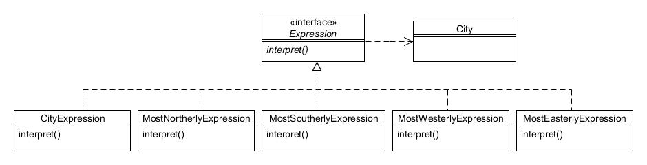

# 16. Intérprete (Interpreter)

Tipo: Conductual

Objetivo: Dado un idioma, defina una representación para su gramática junto con un intérprete que use la representación para interpretar oraciones en el idioma.

Los sistemas de navegación por satélite instalados en algunos de los vehículos de la Compañía de Motores Foobar tienen una característica especial que permite al usuario ingresar varias ciudades y calcular la más al norte, sur, oeste o este, dependiendo de qué cadena de comando se ingrese. Un comando de muestra podría verse así:

```text
london edinburgh manchester southerly
```

Lo anterior daría como resultado que "Londres" fuera devuelta, siendo la más al sur de las tres ciudades ingresadas. Incluso puedes ingresar la cadena de comando como esta:

```text
london edinburgh manchester southerly aberdeen westerly
```

Esto determinaría primero que Londres era el más meridional y luego usaría ese resultado (Londres) y lo compararía con Aberdeen para indicar cuál de esos dos es el más occidental. Se puede ingresar cualquier número de ciudades antes de cada uno de los comandos direccionales de "norte", "sur", "oeste" y "este".

Puede pensar que la cadena de comando anterior, que consta de nombres de ciudades y palabras clave direccionales, forma un "lenguaje" simple que debe ser interpretado por el software de navegación por satélite. El patrón _Interpreter_ es un enfoque que ayuda a descifrar este tipo de lenguajes relativamente simples.

Antes de mirar el patrón en sí, crearemos una clase llamada `City` que modela los puntos de interés esenciales para nuestro ejemplo, que es solo el nombre de la ciudad y su latitud y longitud:

```java
public class City {
    private String name;
    private double latitude, longitude;

    public City(String name, double latitude, double longitude) {
        this.name = name;
        this.latitude = latitude;
        this.longitude = longitude;
    }

    public String getName() {
        return name;
    }

    public double getLatitude() {
        return latitude;
    }

    public double getLongitude() {
        return longitude;
    }

    public boolean equals(Object otherObject) {
        if (this == otherObject) return true;
        if (! (otherObject instanceof City)) return false;
        City otherCity = (City) otherObject;
        return getName().equals(otherCity.getName());
    }

    public int hashCode() {
        return getName().hashCode();
    }

    public String toString() {
        return getName();
    }
}
```

Notará que, por simplicidad, la latitud y la longitud se almacenan como dobles. Tenga en cuenta también que para la latitud los valores positivos representan el Norte y los valores negativos representan el Sur. De manera similar, una longitud positiva representa el Este y los valores negativos el Oeste. El ejemplo de este capítulo sólo incluye un pequeño número de ciudades del Reino Unido, todas ellas en latitud norte y longitud oeste, aunque cualquier ciudad debería funcionar si deseas utilizar la tuya propia.

Las clases para interpretar el idioma se estructuran de la siguiente manera:



Figura 16.1 : Patrón Intérprete

El patrón _Interpreter_ se parece al patrón _Composite_ en que comprende una interfaz (o clase abstracta) con dos tipos de subclases concretas; un tipo que representa los elementos individuales y el otro tipo que representa elementos repetidos. Creamos una subclase para manejar cada tipo de elemento en el lenguaje.

La interfaz `Expression` es muy simple, simplemente declara un método `interpret()` que devuelve un objeto `City`:

```java
public interface Expression {
    public City interpret();
}
```

La primera subclase concreta que veremos es `CityExpression`, de la cual se creará una instancia para cada nombre de ciudad que reconozca en la cadena de comando. Todo lo que esta clase necesita hacer es almacenar una referencia a un objeto `City` y devolverla cuando se invoca `interpret()`:

```java
public class CityExpression implements Expression {
    private City city;

    public CityExpression(City city) {
        this.city = city;
    }

    public City interpret() {
        return city;
    }
}
```

Las clases para manejar cada uno de los comandos (por ejemplo, "norte") son un poco más complicadas:

```java
public class MostNortherlyExpression implements Expression {
    private List<Expression> expressions;

    public MostNortherlyExpression(List<Expression> expressions) {
        this.expressions = expressions;
    }

    public City interpret() {
        City resultingCity = new City("En ningún lugar", -999.9, -999.9);
        for (Expression currentExpression : expressions) {
            City currentCity = currentExpression.interpret();
            if (currentCity.getLatitude() > resultingCity.getLatitude()) {
                resultingCity = currentCity;
            }
        }
        return resultingCity;
    }
}
```

La lista de objetos `Expression` pasados al constructor será del tipo `CityExpression`. El método `interpret()` recorre cada uno de estos para determinar cuál está más al norte, comparando sus valores de latitud.

La clase MostSoutherlyExpression es muy similar, simplemente cambia la comparación:

```java
public class MostSoutherlyExpression implements Expression {
    private List<Expression> expressions;

    public MostSoutherlyExpression(List<Expression> expressions) {
        this.expressions = expressions;
    }

    public City interpret() {
        City resultingCity = new City("En ningún lugar", 999.9, 999.9);
        for (Expression currentExpression : expressions) {
            City currentCity = currentExpression.interpret();
            if (currentCity.getLatitude() < resultingCity.getLatitude()) {
                resultingCity = currentCity;
            }
        }
        return resultingCity;
    }
}
```

Del mismo modo, las clases `MostWesterlyExpression` y `MostEasterlyExpression` calculan y devuelven la `City` apropiada:

```java
public class MostWesterlyExpression implements Expression {
    private List<Expression> expressions;

    public MostWesterlyExpression(List<Expression> expressions) {
        this.expressions = expressions;
    }

    public City interpret() {
        City resultingCity = new City("En ningún lugar", 999.9, 999.9);
        for (Expression currentExpression : expressions) {
            City currentCity = currentExpression.interpret();
            if (currentCity.getLongitude() < resultingCity.getLongitude()) {
                resultingCity = currentCity;
            }
        }
        return resultingCity;
    }
}

 

public class MostEasterlyExpression implements Expression {
    private List<Expression> expressions;

    public MostEasterlyExpression(List<Expression> expressions) {
        this.expressions = expressions;
    }

    public City interpret() {
        City resultingCity = new City("En ningún lugar", -999.9, -999.9);
        for (Expression currentExpression : expressions) {
            City currentCity = currentExpression.interpret();
            if (currentCity.getLongitude() < resultingCity.getLongitude()) {
                resultingCity = currentCity;
            }
        }
        return resultingCity;
    }
}
```

Si bien el patrón _Interpreter_ en sí mismo no cubre el análisis de una expresión, en la práctica necesitamos definir una clase para recorrer la cadena de comando (como "london edinburgh manchester southerly") y crear las clases `Expression` apropiadas a medida que avanzamos. Estas clases `Expression` se colocan en un "árbol de sintaxis" que normalmente se implementa mediante una pila LIFO. Por lo tanto, definiremos una clase `DirectionalEvaluator` para realizar este análisis y configuraremos una pequeña muestra de ciudades del Reino Unido:

```java
public class DirectionalEvaluator {
    private Map<String, City> cities;

    public DirectionalEvaluator() {
        cities = new HashMap<String, City>();

        cities.put("aberdeen", new City("Aberdeen", 57.15, -2.15));
        cities.put("belfast", new City("Belfast", 54.62, -5.93));
        cities.put("birmingham", new City("Birmingham", 52.42, -1.92));
        cities.put("dublin", new City("Dublin", 53.33, -6.25));
        cities.put("edinburgh", new City("Edinburgh", 55.92, -3.02));
        cities.put("glasgow", new City("Glasgow", 55.83, -4.25));
        cities.put("london", new City("London", 51.53, -0.08));
        cities.put("liverpool", new City("Liverpool", 53.42, -3.0));
        cities.put("manchester", new City("Manchester", 53.5, -2.25));
        cities.put("southampton", new City("Southampton", 50.9, -1.38));
    }

    public City evaluate(String route) {
        // Definimos un árbol de sintaxis
        Stack<Expression> expressionStack = new Stack<Expression>();

        // Analizar cada token en la cadena de ruta
        for (String token : route.split(" ")) {
            // ¿Token es una ciudad reconocida?
            if (cities.containsKey(token)) {
                City city = cities.get(token);
                expressionStack.push(new CityExpression(city));

            // ¿Se encuentra el token más al norte?
            } else if (token.equals("al norte")) {
                expressionStack.push(new MostNortherlyExpression(loadExpressions(expressionStack)));

            // ¿Se encuentra el token más al sur?
            } else if (token.equals("al sur")) {
                expressionStack.push(new MostSoutherlyExpression(loadExpressions(expressionStack)));

            // ¿Se encuentra el token más hacia el oeste?
            } else if (token.equals("al oeste")) {
                expressionStack.push(new MostWesterlyExpression(loadExpressions(expressionStack)));

            // ¿Se encuentra el token más hacia el este?
            } else if (token.equals("al este")) {
                expressionStack.push(new MostEasterlyExpression(loadExpressions(expressionStack)));
            }
        }

    // Valor resultante
    return expressionStack.pop().interpret();
    }

    private List<Expression> loadExpressions(Stack<Expression> expressionStack) {
        List<Expression> expressions = new ArrayList<Expression>();
        while(! expressionStack.empty()) {
            expressions.add(expressionStack.pop());
        }
        return expressions;
    }
}
```

Dentro del método `evaluate()`, cuando el analizador detecta un comando direccional (como "al norte") elimina las ciudades de la pila y las pasa junto con el comando de regreso a la pila.

Tenga en cuenta que el uso anterior de declaraciones `if...else...` se ha utilizado simplemente para que el capítulo se concentre en el patrón _Intérprete_. Un mejor enfoque sería utilizar un patrón separado para manejar cada token, como el definido en _Cadena de responsabilidad_.

Ahora todo lo que queda es que nuestros programas cliente utilicen `DirectionalEvaluator` pasando el comando para interpretar:


```java
// Crea el evaluador
DirectionalEvaluator evaluator = new DirectionalEvaluator();

// Esto debería mostrar "London"...
System.out.println(evaluator.evaluate("london edinburgh manchester southerly"));

// Esto debería generar "Aberdeen"...
System.out.println(evaluator.evaluate("london edinburgh manchester southerly aberdeen westerly"));
```
