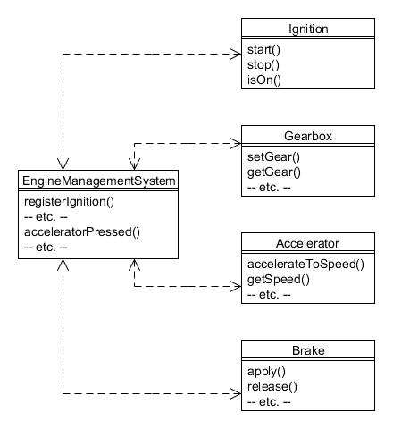

# 18. Mediador (Mediator)

Tipo: Conductual

Objetivo: Define un objeto que encapsula cómo interactúa un conjunto de objetos. Mediator promueve un acoplamiento flexible al evitar que los objetos se refieran entre sí explícitamente y le permite variar su interacción de forma independiente.

La Compañía de Motores Foobar está mirando al futuro cuando los vehículos puedan conducirse solos. Esto, por supuesto, esto implicaría que los 
diversos componentes (encendido, caja de cambios, acelerador y frenos, etc.) se controlaran juntos e interactuaran de varias formas. Por ejemplo:

* _Hasta que no se pone el contacto, la caja de cambios, el acelerador y los frenos no funcionan (asumiremos que el freno de mano está puesto)_
* _Al acelerar se deben desactivar los frenos_
* _Al frenar se debe desactivar el acelerador_
* _Se debe engranar la marcha adecuada dependiendo de la velocidad del vehículo_

¡Y todo esto debería ocurrir automáticamente para que el conductor puede simplemente disfrutar de la vista! (asumiremos que el vehículo puede detectar su posición de forma que evite choques, etc.)

Crearemos naturalmente las clases Java para modelar los componentes individuales, así que habrá una clase `Ignition` (Encendido), una clase `Gearbox` (Caja de cambios), una clase `Accelerator` (Acelerador) y una clase `Brake` (Freno). Pero también podemos ver que hay unas interacciones complejas entre ellos, y, sin embargo, uno de nuestros principios básicos del diseño orientado a objetos es mantener las clases debilmente acopladas.

El patrón _Mediator_ ayuda a resolver esto a través de la definción de una clase separada (el mediador) que conoce las clases componente individuales y asume la responsabilidad de gestionar su interacción. Cada una de las clases componentes también conoce la clase mediador, pero este es el único acoplamiento que tienen. Para nuestro ejemplo, llamaremos a la clase mediadora `EngineManagementSystem` (Sistema de Gestión del Motor).


Podemos ver las conexiones esquemáticamente a continuación:



Figura 18.1 : Patrón Mediador

La comunicación bidreccional se consigue a través de cada uno de los constructores de las clases componente, en el sentido de que cada uno acepta una referencia al objeto mediador (poara poeder enviarle mensajes) y se registra con el mediador (para que puedan recibir mensajes de él). Pero cada clase componente no tiene conocimiento de ninguna otra clase de componente; solo conocen al mediador.

Podemos ver esto mirando la clase `Ignition`:

```java
public class Ignition {
    private EngineManagementSystem mediator;
    private boolean on;

    // El constructor acepta al mediador como un argumento
    public Ignition(EngineManagementSystem mediator) {
        this.mediator = mediator;
        on = false;
        // Se registra de vuelta con el mediador...
        mediator.registerIgnition(this);
    }

    public void start() {
        on = true;
        mediator.ignitionTurnedOn();
        System.out.println("Ignition turned on");
    }

    public void stop() {
        on = false;
        mediator.ignitionTurnedOff();
        System.out.println("Ignition turned off");
    }

    public boolean isOn() {
        return on;
    }
}
```

Observe como el constructor establece la comunicación bidireccional, y después, cómo los métodos que realizan los eventos notifican al mediador esos eventos.

La clase `Gearbox` aplica los mismos principios:

```java
public class Gearbox {
    public enum Gear {NEUTRAL, FIRST, SECOND, THIRD, FOURTH, FIFTH, REVERSE};

    private EngineManagementSystem mediator;
    private boolean enabled;
    private Gear currentGear;

    public Gearbox(EngineManagementSystem mediator) {
        this.mediator = mediator;
        enabled = false;
        currentGear = Gear.NEUTRAL;
        mediator.registerGearbox(this);
    }

    public void enable() {
        enabled = true;
        mediator.gearboxEnabled();
        System.out.println("Caja de cambios habilitada");
    }

    public void disable() {
        enabled = false;
        mediator.gearboxDisabled();
        System.out.println("Caja de cambios desactivada");
    }

    public boolean isEnabled() {
        return enabled;
    }

    public void setGear(Gear g) {
        if ((isEnabled()) && (getGear() != g)) {
            currentGear = g;
            mediator.gearChanged();
            System.out.println("Ahora en la marcha " + getGear());
        }
    }

    public Gear getGear() {
        return currentGear;
    }
}
```

Las clases `Accelerator` y `Brake` siguen un proceso similar:

```java
public class Accelerator {
    private EngineManagementSystem mediator;
    private boolean enabled;
    private int speed;

    public Accelerator(EngineManagementSystem mediator) {
        this.mediator = mediator;
        enabled = false;
        speed = 0;
        mediator.registerAccelerator(this);
    }

    public void enable() {
        enabled = true;
        mediator.acceleratorEnabled();
        System.out.println("Acelerador habilitado");
    }

    public void disable() {
        enabled = false;
        mediator.acceleratorDisabled();
        System.out.println("Acelerador desactivado");
    }

    public boolean isEnabled() {
        return enabled;
    }

    public void accelerateToSpeed(int speed) {
        if (isEnabled()) {
            this.speed = speed;
            mediator.acceleratorPressed();
            System.out.println("La velocidad ahora es de  " + getSpeed());
        }
    }

    public int getSpeed() {
        return speed;
    }
}

public class Brake {
    private EngineManagementSystem mediator;
    private boolean enabled;
    private boolean applied;

    public Brake(EngineManagementSystem mediator) {
        this.mediator = mediator;
        enabled = false;
        applied = false;
        mediator.registerBrake(this);
    }

    public void enable() {
        enabled = true;
        mediator.brakeEnabled();
        System.out.println("Frenos habilitados");
    }

    public void disable() {
        enabled = false;
        mediator.brakeDisabled();
        System.out.println("Frenos desactivados");
    }

    public boolean isEnabled() {
        return enabled;
    }

    public void apply() {
        if (isEnabled()) {
            applied = true;
            mediator.brakePressed();
            System.out.println("Ahora frenando");
        }
    }

    public void release() {
        if (isEnabled()) {
            applied = false;
        }
    }
}
```

Entonces ahora necesitamos que la clase `EngineManagementSystem` sirva como el mediador. Este mantendrá una referencia a cada una de las clases componente con método que habilitan sus registros con el mediador. También tiene métodos para manejar la interacción entre los diversos componentes cuando ocurren eventos particulares:

```java
public class EngineManagementSystem {
    private Ignition ignition;
    private Gearbox gearbox;
    private Accelerator accelerator;
    private Brake brake;

    private int currentSpeed;

    public EngineManagementSystem() {
        currentSpeed = 0;
    }


    // Métodos que habilitan el registro con este mediador...
    public void registerIgnition(Ignition ignition) {
        this.ignition = ignition;
    }

    public void registerGearbox(Gearbox gearbox) {
        this.gearbox = gearbox;
    }

    public void registerAccelerator(Accelerator accelerator) {
        this.accelerator = accelerator;
    }

    public void registerBrake(Brake brake) {
        this.brake = brake;
    }

    // Métodos que manejan las interacciones entre objetos...
    public void ignitionTurnedOn() {
        gearbox.enable();
        accelerator.enable();
        brake.enable();
    }

    public void ignitionTurnedOff() {
        gearbox.disable();
        accelerator.disable();
        brake.disable();
    }

    public void gearboxEnabled() {
        System.out.println("EMS ahora controla la caja de cambios");
    }

    public void gearboxDisabled() {
        System.out.println("El EMS ya no controla la caja de cambios");
    }

    public void gearChanged() {
        System.out.println("EMS desactiva revoluciones al cambiar de marcha");
    }

    public void acceleratorEnabled() {
        System.out.println("EMS ahora controla el acelerador");
    }

    public void acceleratorDisabled() {
        System.out.println("EMS ya no controla el acelerador");
    }
    public void acceleratorPressed() {
        brake.disable();
        while (currentSpeed < accelerator.getSpeed()) {
            currentSpeed ++;
            System.out.println("Velocidad actual " + currentSpeed);

            // Ajusta la marcha según la velocidad...
            if (currentSpeed <= 10) {
                gearbox.setGear(Gearbox.Gear.FIRST);
            } else if (currentSpeed <= 20) {
                gearbox.setGear(Gearbox.Gear.SECOND);
            } else if (currentSpeed <= 30) {
                gearbox.setGear(Gearbox.Gear.THIRD);
            } else if (currentSpeed <= 50) {
                gearbox.setGear(Gearbox.Gear.FOURTH);
            } else {
                gearbox.setGear(Gearbox.Gear.FIFTH);
            }
        }
        brake.enable();
    }

    public void brakeEnabled() {
        System.out.println("EMS ahora controla los frenos");
    }

    public void brakeDisabled() {
        System.out.println("El EMS ya no controla los frenos.");
    }

    public void brakePressed() {
        accelerator.disable();
        currentSpeed = 0;
    }

    public void brakeReleased() {
        gearbox.setGear(Gearbox.Gear.FIRST);
        accelerator.enable();
    }
}
```

## Usos comunes{#h2-9}

Un uso común del patrón _Mediator_ es gestionar la interacción de los componentes gráficos en un diálogo. Esto envuelve frecuentemente controlar cuando se deben habilitar o desactivar los botones, campos de texto, etc., o para pasar datos entre los componentes.

Tenga en cuenta que es posible reducir aún más el acoplamiento usando el patrón _Observer_ en lugar de _Mediator_. Esto significaría que las clases componentes (por ejemplo `Ignition`, etc.) no necesitarían mantener una referencia al mediador sino que activarían eventos. La clase `EngineManagementSystem` sería entonces un observador de las clases de componentes y aún podría invocar mensajes sobre ellas.
