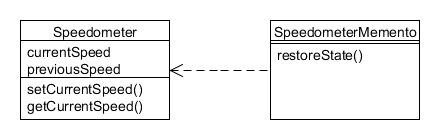

# 19. Recuerdo (Memento)

Type: Behavioural

Purpose: Without violating encapsulation, capture and externalise an object's internal state so that it can be restored to this state later.

The Foobar Motor Company's vehicles naturally have a speedometer mounted on the dashboard, which not only records the current speed but also the previous speed. There is now a requirement for the state to be stored externally at periodic intervals (so that it could, for example, be integrated into a tachograph for goods vehicles).

However, one of the instance variables in the Speedometer class does not have a getter method, but to adhere to encapsulation and data-hiding principles it is correctly declared to be private. We also want to adhere to the principle that a class should not have multiple responsibilities, so don't want to also have to build in a state save & restore mechanism into the class. So how can we capture the state of the object?

This chapter will present two different approaches, each having its advantages and disadvantages. In both cases, we make use of a separate class that performs the state saving and restoration, which we shall call SpeedometerMemento. This class takes a reference to the Speedometer object that needs to be externalised:



Figura 19.1 : Patrón Recuerdo

## Enfoque 1: utilizar la visibilidad privada del paquete{#h2-10}

When the access modifier is omitted from class members it takes on 'package-private' visibility. This means it is only accessible to other classes in the same package, so is thus slightly more open than private visibility but not as much as protected (subclasses in different packages will be unable to access). Therefore we can place the Speedometer class into a package where we limit what other classes exist there, which in our case will just be SpeedometerMemento.

Here is the very simple Speedometer class:

```java
package mementosubpackage;

public class Speedometer {
    // Normal private visibility but has accessor method...
    private int currentSpeed;
 
    // package-private visibility and no accessor method...
    int previousSpeed;
    public Speedometer() {
        currentSpeed = 0;
        previousSpeed = 0;
    }
 
    public void setCurrentSpeed(int speed) {
        previousSpeed = currentSpeed;
        currentSpeed = speed;
    }
 
    public int getCurrentSpeed() {
        return currentSpeed;
    }
}
```

The SpeedometerMemento class exists in the same package. It saves the state of the passed in Speedometer object in the constructor and defines a method to restore that state:

```java
package mementosubpackage;

public class SpeedometerMemento {
    private Speedometer speedometer;
    private int copyOfCurrentSpeed;
    private int copyOfPreviousSpeed;
 
    public SpeedometerMemento(Speedometer speedometer) {
        this.speedometer = speedometer;
        copyOfCurrentSpeed = speedometer.getCurrentSpeed();
        copyOfPreviousSpeed = speedometer.previousSpeed;
    }
 
    public void restoreState() {
        speedometer.setCurrentSpeed(copyOfCurrentSpeed);
        speedometer.previousSpeed = copyOfPreviousSpeed;
    }
}
```

Note that the accessor method getCurrentSpeed() was used for the currentSpeed instance variable but the previousSpeed variable had to be accessed directly, which is possible because the memento exists in the same package.

We can test the memento with this code:

```java
Speedometer speedo = new Speedometer();

speedo.setCurrentSpeed(50);
speedo.setCurrentSpeed(100);
System.out.println("Current speed: " + speedo.getCurrentSpeed());
System.out.println("Previous speed: " + speedo.previousSpeed);

// Save the state of 'speedo'...
SpeedometerMemento memento = new SpeedometerMemento(speedo);

// Change the state of 'speedo'...
speedo.setCurrentSpeed(80);
System.out.println("After setting to 80...");
System.out.println("Current speed: " + speedo.getCurrentSpeed());
System.out.println("Previous speed: " + speedo.previousSpeed);

// Restore the state of 'speedo'...
System.out.println("Now restoring state...");
memento.restoreState();
System.out.println("Current speed: " + speedo.getCurrentSpeed());
System.out.println("Previous speed: " + speedo.previousSpeed);
```

Running the above results in the following output:

```text
Current speed: 100
Previous speed: 50

After setting to 80...
Current speed: 80
Previous speed: 100

Now restoring state...
Current speed: 100
Previous speed: 50
```

The main disadvantage of this approach is that you either have to put the pair of classes in their own special package or accept that other classes in the package they are in will have direct access to the instance variables.

## Enfoque 2: serialización de objetos{#h2-11}

This approach allows you to make all the instance variables private, thus regaining full encapsulation. The Speedometer class has been modified for this and now includes a getPreviousSpeed() method, though this is purely to help us test the memento; it's not required by this approach. The class has also been changed to implement the Serializable interface (changes marked in bold):

```java
public class Speedometer implements Serializable {
    private int currentSpeed;
    private int previousSpeed;
 
    public Speedometer() {
        currentSpeed = 0;
        previousSpeed = 0;
    }
 
    public void setCurrentSpeed(int speed) {
        previousSpeed = currentSpeed;
        currentSpeed = speed;
    }
 
    public int getCurrentSpeed() {
        return currentSpeed;
    }
 
    // Only defined to help testing...
    public int getPreviousSpeed() {
        return previousSpeed;
    }
}
```

The SpeedometerMemento class now uses object serialisation for the state saving and restoration:

```java
public class SpeedometerMemento {
    public SpeedometerMemento(Speedometer speedometer) throws IOException {
        // Serialize...
        File speedometerFile = new File("speedometer.ser");
        oos = new ObjectOutputStream(new BufferedOutputStream(new FileOutputStream(speedometerFile)));
        oos.writeObject(speedometer);
        oos.close();
    }
 
    public Speedometer restoreState() throws IOException, ClassNotFoundException {
        // Deserialize...
        File speedometerFile = new File("speedometer.ser");
        ois = new ObjectInputStream(new BufferedInputStream(new FileInputStream(speedometerFile)));
        Speedometer speedo = (Speedometer) ois.readObject();
        ois.close();
        return speedo;
    }
}
```

We can check that this achieves the same as the first approach, the only difference being that the restoreState() method now returns the restored object reference:

```java
Speedometer speedo = new Speedometer();

speedo.setCurrentSpeed(50);
speedo.setCurrentSpeed(100);
System.out.println("Current speed: " + speedo.getCurrentSpeed());
System.out.println("Previous speed: " + speedo.previousSpeed);

// Save the state of 'speedo'...
SpeedometerMemento memento = new SpeedometerMemento(speedo);

// Change the state of 'speedo'...
speedo.setCurrentSpeed(80);
System.out.println("After setting to 80...");
System.out.println("Current speed: " + speedo.getCurrentSpeed());
System.out.println("Previous speed: " + speedo.previousSpeed);

// Restore the state of 'speedo'...
System.out.println("Now restoring state...");
speedo = memento.restoreState();
System.out.println("Current speed: " + speedo.getCurrentSpeed());
System.out.println("Previous speed: " + speedo.previousSpeed);
```

Running the above should result in the same output as shown for the first approach. The main disadvantage of this approach is that writing to and reading from a disk file is much slower. Note also that while we have been able to make all fields private again, it might still be possible for someone who gained access to the serialized file to use a hex editor to read or change the data.
