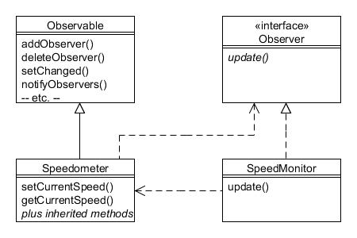

# 20. Observador (Observer)

Tipo: Conductual

Objetivo: Define una dependencia de uno a muchos entre objetos para que cuando un objeto cambie su estado, todos sus dependientes sean notificados y actualizados automáticamente.

La Compañía de Motores Foobar ha decidido que debe sonar una alerta al conductor cada vez que se supere una determinada velocidad. También prevén que es posible que deban suceder otras cosas dependiendo de la velocidad actual (como que una caja de cambios automática seleccione la marcha adecuada para adaptarse a la velocidad). Pero se dan cuenta de la necesidad de mantener los objetos débilmente acoplados, por lo que, naturalmente, no desean que la clase Speedometer tenga ningún conocimiento directo de los monitores de velocidad o las cajas de cambios automáticas (o cualquier otra clase futura que pueda estar interesada en la velocidad a la que viaja un vehículo). 

El patrón Observador permite establecer un acoplamiento flexible entre un 'sujeto' (el objeto que es de interés; Speedometer en nuestro ejemplo) y sus 'observadores' (cualquier otra clase que deba mantenerse informada cuando suceden cosas interesantes).

Debido a que esta es una necesidad muy común en los sistemas orientados a objetos, las bibliotecas de Java ya contienen mecanismos que permiten implementar el patrón. Uno de ellos es utilizar la clase Observable y la interfaz Observer:



Figura 20.1 : Patrón Observador

El 'sujeto' (Speedometer) puede tener múltiples observadores (que de hecho pueden ser cualquier clase que implemente la interfaz Observer, no solo objetos SpeedMonitor).

La clase Speedometer se ve así:

```java
public class Speedometer extends Observable {
    private int currentSpeed;
 
    public Speedometer() {
        speed = 0;
    }
 
    public void setCurrentSpeed(int speed) {
        currentSpeed = speed;
 
        // Avisa a todos los observadores para que sepan que la velocidad ha cambiado...
        setChanged();
        notifyObservers();
    }
 
    public int getCurrentSpeed() {
        return currentSpeed;
    }
}
```

La clase Speedometer extiende java.util.Observable y, por tanto, hereda para nuestra comodidad sus métodos relacionados con el registro y notificación de los observadores. Para nuestro ejemplo, cada vez que la velocidad cambia, invocamos los métodos heredados setChanged() y notifyObservers() que se encargan de las notificaciones por nosotros.

La clase SpeedMonitor implementa la interfaz java.util.Observer y tiene el código apropiado para su método requerido update():

```java
public class SpeedMonitor implements Observer {
    public static final int SPEED_TO_ALERT = 70;
 
    public void update(Observable obs, Object obj) {
        Speedometer speedo = (Speedometer) obs;
        if (speedo.getCurrentSpeed() > SPEED_TO_ALERT) {
            System.out.println("** ALERTA ** ¡Conduce demasiado rápido! (" + speedo.getCurrentSpeed() + ")");
        } else {
            System.out.println("... agradable y estable ... (" + speedo.getCurrentSpeed() + ")");
        }
    }
}
```

Los programas cliente simplemente pasan una referencia de SpeedMonitor a una instancia de Speedometer:

```java
// Crea un monitor...
SpeedMonitor monitor = new SpeedMonitor();

// Crea un velocímetro y registra el monitor en él...
Speedometer speedo = new Speedometer();
speedo.addObserver(monitor);

// Conducir a diferentes velocidades...
speedo.setCurrentSpeed(50);
speedo.setCurrentSpeed(70);
speedo.setCurrentSpeed(40);
speedo.setCurrentSpeed(100);
speedo.setCurrentSpeed(69);
```

La ejecución de lo anterior dará como resultado el siguiente resultado:

```text
... agradable y estable ... (50)
... agradable y estable ... (70)
... agradable y estable ... (40)
** ALERTA ** ¡Conduce demasiado rápido! (100)
... agradable y estable ... (69)
```

El verdadero poder detrás del patrón Observer es que cualquier tipo de clase ahora puede convertirse en un monitor siempre que implementen la interfaz Observer y sin necesidad de realizar ningún cambio en el Speedometer. Creemos una simulación de una caja de cambios automática:

```java
public class AutomaticGearbox implements Observer {
    public void update(Observable obs, Object obj) {
        Speedometer speedo = (Speedometer) obs;
 
        if (speedo.getCurrentSpeed() <= 10) {
            System.out.println("Ahora en primera marcha");
       
        } else if (speedo.getCurrentSpeed() <= 20) {
            System.out.println("Ahora en segunda marcha");
       
        } else if (speedo.getCurrentSpeed() <= 30) {
            System.out.println("Ahora en tercera marcha");
       
        } else {
            System.out.println("Ahora en cuarta marcha");
        }
    }
}
```

Nuestro programa cliente ahora puede agregarlo como observador adicional y también recibir notificaciones de cambios de velocidad:

```java
speedo.addObserver(new AutomaticGearbox());
```

## Un enfoque alternativo utilizando eventos y oyentes{#h2-12}

El código heredado que hace que las clases Observables funcionen tiene una desventaja obvia; Si su clase temática ya extiende otra clase, entonces no puede extenderla también, ya que Java solo admite herencia única (de clases). Sin embargo, proporcionar su propia implementación es bastante sencillo y aquí utilizaremos un enfoque alternativo proporcionado por las bibliotecas de Java utilizando 'eventos' y 'oyentes'.

Lo primero que haremos es separar los eventos que pueden ocurrir en una clase llamada SpeedometerEvent que extiende java.util.EventObject:

```java
public class SpeedometerEvent extends EventObject {
    private int speed;
 
    public SpeedometerEvent(Object source, int speed) {
        super(source);
        this.speed = speed;
    }
 
    public int getSpeed() {
        return speed;
    }
}
```

El único evento de interés es cuando cambia la velocidad. La clase EventObject heredada proporciona un método getSource() para que los oyentes puedan identificar el objeto exacto que dio origen al evento, si necesitan conocerlo por algún motivo.

De la mano de SpeedometerEvent hay una interfaz que definiremos llamada SpeedometerListener, que extiende la interfaz java.util.EventListener:

```java
public interface SpeedometerListener extends EventListener {
    public void speedChanged(SpeedometerEvent event);
}
```

Todas las clases que implementen SpeedometerListener deberán proporcionar el código apropiado para el método speedChanged(). Pueden obtener cualquier dato requerido a través de la referencia SpeedometerEvent pasada en el argumento. Tenga en cuenta que nuestro ejemplo simple solo define un método, pero es común tener varios métodos, cada uno de los cuales notifica un estado diferente que ha cambiado.

La clase Speedometer ahora se modificará para ya no extender java.util.Observable y, en su lugar, manejar el registro y la notificación del oyente internamente:

```java
public class Speedometer {
    private int currentSpeed;
    private List<SpeedometerListener> listeners;
 
    public Speedometer() {
        currentSpeed= 0;
        listeners = new ArrayList<SpeedometerListener>();
    }
 
    public void setCurrentSpeed(int speed) {
        currentSpeed = speed;
 
        // Avisamos a todos los observadores para que sepan que la velocidad ha cambiado...
        fireSpeedChanged();
    }
 
    public int getCurrentSpeed() {
        return currentSpeed;
    }
 
    public void addSpeedometerListener(SpeedometerListener obj) {
        listeners.add(obj);
    }
 
    public void removeSpeedometerListener(SpeedometerListener obj) {
        listeners.remove(obj);
    }
 
    protected void fireSpeedChanged() {
        SpeedometerEvent speedEvent = new SpeedometerEvent(this, getCurrentSpeed());
 
        for (SpeedometerListener eachListener : listeners) {
            eachListener.speedChanged(speedEvent);
        }
    }
}
```

Tenga en cuenta el uso de ArrayList para mantener la lista de oyentes, junto con métodos para agregarlos y eliminarlos y recorrerlos cuando sea necesario enviar un SpeedometerEvent.

La clase SpeedMonitor es nuestro oyente y ahora necesita implementar la interfaz SpeedometerListener en lugar de java.util.Observable:

```java
public class SpeedMonitor implements SpeedometerListener {
    public static final int SPEED_TO_ALERT = 70;
 
    public void speedChanged(SpeedometerEvent event) {
        if (event.getSpeed() > SPEED_TO_ALERT) {
            System.out.println("** ALERTA ** ¡Conduce demasiado rápido! (" + event.getSpeed() + ")");
        } else {
            System.out.println("... agradable y estable ... (" + event.getSpeed() + ")");
        }
    }
}
```

Nuestro programa cliente es casi idéntico al anterior, el único cambio es un nombre de método diferente al registrar el oyente:

```java
// Crea un oyente
SpeedMonitor monitor = new SpeedMonitor();

// Crea un Speedometer y registre el monitor en él...
Speedometer speedo = new Speedometer();

speedo.addSpeedometerListener(monitor);

// Conduce a diferentes velocidades...
speedo.setCurrentSpeed(50);
speedo.setCurrentSpeed(70);
speedo.setCurrentSpeed(40);
speedo.setCurrentSpeed(100);
speedo.setCurrentSpeed(69);
```

Si sus clases son JavaBeans, las bibliotecas de Java también proporcionan una clase PropertyChangeEvent y una interfaz PropertyChangeListener que siguen un enfoque similar.
