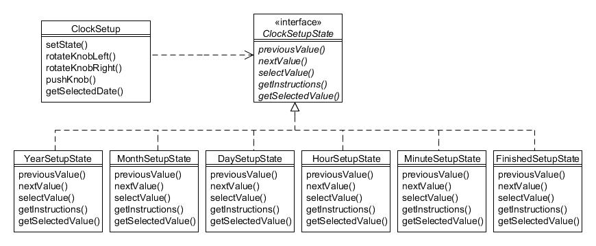

# 21. Estado (State)

Tipo: conductual

Propósito: Permite que un objeto altere su comportamiento cuando cambia su estado interno. El objeto parecerá cambiar de clase.

Cada vehículo de la Compañía de Motores Foobar tiene instalado un reloj digital que muestra la fecha y hora actuales. Estos valores deberán restablecerse de vez en cuando (por ejemplo, después de un cambio de batería) y esto se logra mediante una perilla particular en el tablero. Cuando se presiona inicialmente la perilla, se puede configurar el valor del "año". Al girar el mando hacia la izquierda (es decir, en el sentido contrario a las agujas del reloj), se muestra el año anterior, mientras que al girarlo hacia la derecha se avanza un año. Cuando se presiona nuevamente la perilla, el valor del año se "establece" y el proceso de configuración permite automáticamente establecer el valor del mes, también haciendo los movimientos apropiados hacia la izquierda o hacia la derecha con la perilla.

Este proceso continúa para el día del mes, la hora y el minuto. A continuación se resume el flujo de eventos:

* _Cuando se presiona la perilla por primera vez, el reloj entra en modo de "configuración" para configurar el año;_
* _Si se gira la perilla hacia la izquierda, se deduce 1 del valor del año;_
* _Si se gira la perilla hacia la derecha, se suma 1 al valor del año;_
* _Cuando se presiona la perilla, el año se configura y el reloj entra en modo de "configuración" para configurar el mes;_
* _Si se gira la perilla hacia la izquierda, se deduce 1 del valor del mes;_
* _Si se gira la perilla hacia la derecha, se suma 1 al valor del mes;_
* _Cuando se presiona la perilla, el mes se configura y el reloj entra en modo de "configuración" para configurar el día;_
* _Si se gira la perilla hacia la izquierda, se deduce 1 del valor del día;_
* _Si se gira la perilla hacia la derecha, se suma 1 al valor del día;_
* _Cuando se presiona la perilla, el día se configura y el reloj entra en modo de "configuración" para configurar la hora;_
* _Si se gira la perilla hacia la izquierda, se deduce 1 del valor de la hora;_
* _Si se gira la perilla hacia la derecha, se suma 1 al valor de la hora;_
* _Cuando se presiona la perilla, la hora se configura y el reloj entra en modo de "configuración" para configurar los minutos;_
* _Si se gira la perilla hacia la izquierda, se deduce 1 del valor de los minutos;_
* _Si se gira la perilla hacia la derecha, se suma 1 al valor de los minutos;_
* _Cuando se presiona la perilla, los minutos se configuran y el reloj pasa al modo de "configuración terminada";_
* _Si se presiona nuevamente la perilla, se muestran la fecha y hora completas seleccionadas._

De los pasos anteriores queda claro que se configuran diferentes partes de la fecha y la hora cuando se gira o presiona la perilla, y que hay transiciones entre esas partes. Un enfoque ingenuo al codificar una clase para lograr esto sería tener una variable 'modo' y luego una serie de declaraciones if...else... en cada método, que podrían verse así:

```java
// *** ¡NO HAGA ESTO! ***
public void rotateKnobLeft() {
    if (mode == YEAR_MODE) {
        year--;
    else if (mode == MONTH_MODE) {
        month--;

    else if (mode == DAY_MODE) {
        day--;
    else if (mode == HOUR_MODE) {
        hour--;
    else if (mode == MINUTE_MODE) {
        minute--;

    }

}
```

El problema con código como el anterior es que las condiciones if...else... tendrían que repetirse en cada método de acción (es decir, rotarKnobRight(), pushKnob(), etc.). Además de hacer que el código parezca difícil de manejar, también resulta difícil de mantener, como si, por ejemplo, ahora necesitáramos registrar segundos, tendríamos que cambiar varias partes de la clase.

El patrón State permite establecer una jerarquía que permite transiciones de estado como las que requiere nuestro ejemplo de configuración del reloj. Crearemos una clase ClockSetup que inicia los estados a través de la interfaz ClockSetupState, que tiene una clase de implementación para cada estado individual:




Figura 21.1 : Patrón Estado

La interfaz ClockSetupState define métodos para manejar cambios en el estado, además de métodos que pueden proporcionar instrucciones al usuario y devolver el valor seleccionado real:

```java
public interface ClockSetupState {
    public void previousValue();
    public void nextValue();
    public void selectValue();
 
    public String getInstructions();
    public int getSelectedValue();
}
```

Si observa primero YearSetupState, notará que toma una referencia a un objeto ClockSetup en el constructor (que se conoce en el lenguaje de los patrones de diseño como su 'contexto') y administra la configuración del año. Observe en particular en el método selectValue() cómo pasa internamente a un estado diferente:

```java
public class YearSetupState implements ClockSetupState {
    private ClockSetup clockSetup;
    private int year;
 
    public YearSetupState(ClockSetup clockSetup) {
        this.clockSetup = clockSetup;
        year = Calendar.getInstance().get(Calendar.YEAR);
    }
 
    public void previousValue() {
        year--;
    }
 
    public void nextValue() {
        year++;
    }
 
    public void selectValue() {
        System.out.println("Año establecido en " + year);
        clockSetup.setState(clockSetup.getMonthSetupState());
    }
 
    public String getInstructions() {
        return "Por favor establezca el año...";
    }
 
    public int getSelectedValue() {
        return year;
    }
}
```

Las otras clases de estado de fecha y hora siguen un proceso similar y cada una pasa al siguiente estado apropiado cuando es necesario:

```java
public class MonthSetupState implements ClockSetupState {
    private ClockSetup clockSetup;
    private int month;
 
    public MonthSetupState(ClockSetup clockSetup) {
        this.clockSetup = clockSetup;
        month = Calendar.getInstance().get(Calendar.MONTH);
    }
 
    public void previousValue() {
        if (month > 0) {
            month--;
        }
    }
 
    public void nextValue() {
        if (month < 11) {
            month++;
        }
    }
 
    public void selectValue() {
        System.out.println("Mes establecido en " + month);
        clockSetup.setState(clockSetup.getDaySetupState());
    }
 
    public String getInstructions() {
        return "Por favor establezca el mes...";
    }
 
    public int getSelectedValue() {
        return month;
    }
}

public class DaySetupState implements ClockSetupState {
    private ClockSetup clockSetup;
    private int day;
 
    public DaySetupState(ClockSetup clockSetup) {
        this.clockSetup = clockSetup;
        day = Calendar.getInstance().get(Calendar.DAY_OF_MONTH);
    }
 
    public void previousValue() {
        if (day > 1) {
            day--;
        }
    }
 
    public void nextValue() {
        if (day < Calendar.getInstance().getActualMaximum(Calendar.DAY_OF_MONTH) {
            day++;
        }
    }
 
    public void selectValue() {
        System.out.println("Día establecido en " + day);
        clockSetup.setState(clockSetup.getHourSetupState());
    }
 
    public String getInstructions() {
        return "Por favor establezca el día...";
    }
 
    public int getSelectedValue() {
        return day;
    }
}


public class HourSetupState implements ClockSetupState {
    private ClockSetup clockSetup;
    private int hour;
 
    public HourSetupState(ClockSetup clockSetup) {
        this.clockSetup = clockSetup;
        hour = Calendar.getInstance().get(Calendar.HOUR);
    }
 
    public void previousValue() {
        if (hour > 0) {
            hour--;
        }
    }
 
    public void nextValue() {
        if (hour < 23) {
            hour++;
        }
    }
 
    public void selectValue() {
        System.out.println("Hora establecida en " + hour);
        clockSetup.setState(clockSetup.getMinuteSetupState());
    }

    public String getInstructions() {
        return "Por favor establezca la hora...";
    }
 
    public int getSelectedValue() {
        return hour;
    }
}


public class MinuteSetupState implements ClockSetupState {
    private ClockSetup clockSetup;
    private int minute;
 
    public MinuteSetupState(ClockSetup clockSetup) {
        this.clockSetup = clockSetup;
        minute = Calendar.getInstance().get(Calendar.MINUTE);
    }
 
    public void previousValue() {
        if (minute > 0) {
            minute--;
        }
    }
 
    public void nextValue() {
        if (minute < 59) {
            minute++;
        }
    }
 
    public void selectValue() {
        System.out.println("Minuto establecido en " + minute);
        clockSetup.setState(clockSetup.getFinishedSetupState());
    }
 
    public String getInstructions() {
        return "Por favor establezca el minuto...";
    }
 
    public int getSelectedValue() {
        return minute;
    }
}
```

Esto simplemente deja la clase FinishedSetupState que no necesita realizar la transición a un estado diferente:

```java
public class FinishedSetupState implements ClockSetupState {
    private ClockSetup clockSetup;
 
    public FinishedSetupState(ClockSetup clockSetup) {
        this.clockSetup = clockSetup;
    }
 
    public void previousValue() {
        System.out.println("Ignorado...");
    }
 
    public void nextValue() {
        System.out.println("Ignorado...");

    }
 
    public void selectValue() {
        Calendar selectedDate = clockSetup.getSelectedDate();
        System.out.println("Fecha fijada en: " + selectedDate.getTime());
    }
 
    public String getInstructions() {
        return "Presione la perilla para ver la fecha seleccionada...";
    }
 
    public int getSelectedValue() {
        throw new UnsupportedOperationException("Configuración del reloj finalizada");
    }
}
```

Como se mencionó, la clase de 'contexto' es ClockSetup, que contiene referencias a cada estado y reenvía al estado actual:

```java
public class ClockSetup {
    // Los distintos estados en los que puede estar la configuración...
    private ClockSetupState yearState;
    private ClockSetupState monthState;
    private ClockSetupState dayState;
    private ClockSetupState hourState;
    private ClockSetupState minuteState;
    private ClockSetupState finishedState;
 
    // El estado actual en el que nos encontramos...
    private ClockSetupState currentState;
  
    public ClockSetup() {
        yearState = new YearSetupState(this);
        monthState = new MonthSetupState(this);
        dayState = new DaySetupState(this);
        hourState = new HourSetupState(this);
        minuteState = new MinuteSetupState(this);
        finishedState = new FinishedSetupState(this);
 
        // El estado inicial es establecer el año.
        setState(yearState);
    }
 
    public void setState(ClockSetupState state) {
        currentState = state;
        System.out.println(currentState.getInstructions());
    }
 
    public void rotateKnobLeft() {
        currentState.previousValue();
    }
 
    public void rotateKnobRight() {
        currentState.nextValue();
    }
 
    public void pushKnob() {
        currentState.selectValue();
    }
 
    public ClockSetupState getYearSetupState() {
        return yearState;
    }
 
    public ClockSetupState getMonthSetupState() {
        return monthState;
    }
 
    public ClockSetupState getDaySetupState() {
        return dayState;
    }
 
    public ClockSetupState getHourSetupState() {
        return hourState;
    }
 
    public ClockSetupState getMinuteSetupState() {
        return minuteState;
    }
 
    public ClockSetupState getFinishedSetupState() {
        return finishedState;
    }
 
    public Calendar getSelectedDate() {
        return new GregorianCalendar(yearState.getSelectedValue(), monthState.getSelectedValue(), dayState.getSelectedValue(), hourState.getSelectedValue(), minuteState.getSelectedValue());
}
```

Podemos simular acciones de ejemplo de un usuario como esta:

```java
ClockSetup clockSetup = new ClockSetup();

// La configuración comienza en estado 'año'
clockSetup.rotateKnobRight();
clockSetup.pushKnob(); // 1 año después

// La configuración ahora debería estar en estado "mes"
clockSetup.rotateKnobRight();
clockSetup.rotateKnobRight();
clockSetup.pushKnob(); // 2 meses después

// La configuración ahora debería estar en estado "día"
clockSetup.rotateKnobRight();
clockSetup.rotateKnobRight();
clockSetup.rotateKnobRight();
clockSetup.pushKnob(); // 3 diás después

// La configuración ahora debería estar en estado de "hora"
clockSetup.rotateKnobLeft();
clockSetup.rotateKnobLeft();
clockSetup.pushKnob(); // 2 horas atrás

// La configuración ahora debería estar en estado "minuto"
clockSetup.rotateKnobRight();
clockSetup.pushKnob(); // 1 minuto después

// La configuración ahora debería estar en estado "finalizado"
clockSetup.pushKnob(); // para mostrar la fecha seleccionada
```

La ejecución de lo anterior debería dar como resultado el siguiente resultado relativo a la fecha y hora actual de su sistema, con los ajustes anteriores realizados.

```text
Por favor establezca el año...
Año fijado en 2013
Por favor establezca el mes...
Mes fijado en 10
Por favor fija el día...
Día fijado en 25
Por favor establezca la hora...
Hora establecida en 0
Por favor, establezca el minuto...
Minuto fijado en 4
Presione la perilla para ver la fecha seleccionada...
Fecha establecida en: lun 25 nov 04:17:00 GMT 2013
```
