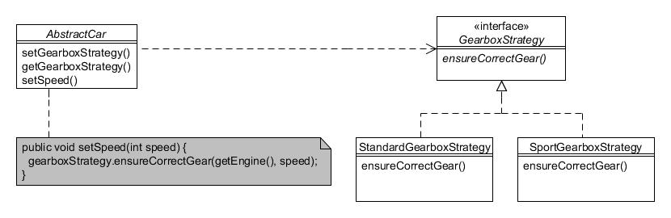

# 22. Estrategia (Strategy)

Type: Behavioural

Purpose: Define a family of algorithms, encapsulate each one, and make them interchangeable. Strategy lets the algorithm vary independently from clients that use it.

The Foobar Motor Company wishes to implement a new type of automatic gearbox for their cars that will be able to be switched between its standard mode and a special 'sport' mode. The different modes will base the decision of which gear should be selected depending upon the speed of travel, size of the engine and whether it is turbocharged. And it's quite possible they will want other modes in the future, such as for off-road driving.

Just as with the discussion in the chapter for the State pattern, it would be inflexible to use a series of if...else... statements to control the different gearbox modes directly inside our vehicle classes. Instead, we shall encapsulate the concept that varies and define a separate hierarchy so that each different gearbox mode is a separate class, each in effect being a different 'strategy' that gets applied. This approach allows the actual strategy being used to be isolated from the vehicle. In our example, we shall only apply this to the cars:



Figure 22.1 : Patrón Estrategia

The GearboxStrategy interface defines the method to control the gear:

```java
public interface GearboxStrategy {
    public void ensureCorrectGear(Engine engine, int speed);
}
```

There are two implementing classes; StandardGearboxStrategy and SportGearboxStrategy:

```java
public class StandardGearboxStrategy implements GearboxStrategy {
    public void ensureCorrectGear(Engine engine, int speed) {
        int engineSize = engine.getSize();
        boolean turbo = engine.isTurbo();
 
        //  Some complicated code to determine correct gear
        //  setting based on engineSize, turbo & speed, etc.
        //  ... omitted ...
         System.out.println("Working out correct gear at " + speed + "mph for a STANDARD gearbox");
    }
}


public class SportGearboxStrategy implements GearboxStrategy {
    public void ensureCorrectGear(Engine engine, int speed) {
        int engineSize = engine.getSize();
        boolean turbo = engine.isTurbo();
 
        //  Some complicated code to determine correct gear
        //  setting based on engineSize, turbo & speed, etc.
        //  ... omitted ...
        System.out.println("Working out correct gear at " + speed + "mph for a SPORT gearbox");
    }
}
```

Our AbstractCar class is defined to hold a reference to the interface type (i.e. GearboxStrategy) and provide accessor methods so different strategies can be switched. There is also a setSpeed() method that delegates to whatever strategy is in effect. The pertinent code is marked in bold:

```java
public abstract class AbstractCar extends AbstractVehicle {
    private GearboxStrategy gearboxStrategy;
 
    public AbstractCar(Engine engine) {
        this(engine, Vehicle.Colour.UNPAINTED);
    }
 
    public AbstractCar(Engine engine) {
        super(engine);
 
        //  Starts in standard gearbox mode (more economical)
        gearboxStrategy = new StandardGearboxStrategy();
    }
 
    // Allow the gearbox strategy to be changed...
    public void setGearboxStrategy(GearboxStrategy gs) {
        gearboxStrategy = gs;
    }
 
    public GearboxStrategy getGearboxStrategy() {
        return getGearboxStrategy();
    }
 
    public void setSpeed(int speed) {
        // Delegate to strategy in effect...
        gearboxStrategy.ensureCorrectGear(getEngine(), speed);
    }
}
```

Client programs just set the required strategy:

```java
AbstractCar myCar = new Sport(new StandardEngine(2000));
myCar.setSpeed(20);
myCar.setSpeed(40);

System.out.println("Switching on sports mode gearbox...");
myCar.setGearboxStrategy(new SportGearboxStrategy());
myCar.setSpeed(20);
myCar.setSpeed(40);
```

This should result in the following output:

```text
Working out correct gear at 20mph for a STANDARD gearbox
Working out correct gear at 40mph for a STANDARD gearbox
Switching on sports mode gearbox...
Working out correct gear at 20mph for a SPORT gearbox
Working out correct gear at 40mph for a SPORT gearbox
```
