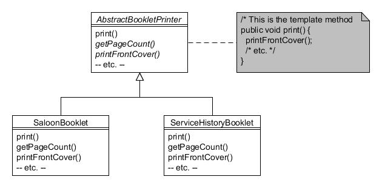

# 23. Método de plantilla (Template Method)

Type: Behavioural

Purpose: Define the skeleton of an algorithm in a method, deferring some steps to subclasses. Template Method lets subclasses redefine certain steps of an algorithm without changing the algorithm's structure.

Each vehicle made by the Foobar Motor Company needs a small number of printed booklets to be produced and provided to the buyer, such as an Owner's Manual and a Service History booklet. The way booklets are produced always follows the same set of steps, but each different type of booklet might need to do each of the individual steps in a slightly different way.

The Template Method pattern enables the definition of one or more abstract methods that are called through a 'template method'. The simple hierarchy is as follows:



Figura 23.1 : Patrón Método de Plantilla

The AbstractBookletPrinter class defines several protected abstract methods and one public final 'template method' that makes use of the abstract methods (the method is made final to prevent it from being overridden):

```java
public abstract class AbstractBookletPrinter {
    protected abstract int getPageCount();
    protected abstract void printFrontCover();
    protected abstract void printTableOfContents();
    protected abstract void printPage(int pageNumber);
    protected abstract void printIndex();
    protected abstract void printBackCover();
    // This is the 'template method'
    public final void print() {
        printFrontCover();
        printTableOfContents();
        for (int i = 1; i <= getPageCount(); i++) {
            printPage(i);
        }
        printIndex();
        printBackCover();
    }
}
```

Each concrete subclass now only needs to provide the implementing code for each abstract method, for example the SaloonBooklet class below:

```java
public class SaloonBooklet extends AbstractBookletPrinter {
    protected int getPageCount() {
        return 100;
    }
 
    protected void printFrontCover() {
        System.out.println("Printing front cover for Saloon car booklet");
    }
 
    protected void printTableOfContents() {
        System.out.println("Printing table of contents for Saloon car booklet");
    }
 
    protected void printPage(int pageNumber) {
        System.out.println("Printing page " + pageNumber + " for Saloon car booklet");
    }
 
    protected void printIndex() {
        System.out.println("Printing index for Saloon car booklet");
    }
 
    protected void printBackCover() {
        System.out.println("Printing back cover for Saloon car booklet");
    }
}
```

The ServiceHistoryBooklet is very similar:

```java
public class ServiceHistoryBooklet extends AbstractBookletPrinter {
    protected int getPageCount() {
        return 12;
    }
 
    protected void printFrontCover() {
        System.out.println("Printing front cover for service history booklet");
    }
 
    protected void printTableOfContents() {
        System.out.println("Printing table of contents for service history booklet");
    }
 
    protected void printPage(int pageNumber) {
        System.out.println("Printing page " + pageNumber + " for service history booklet");
    }
 
    protected void printIndex() {
        System.out.println("Printing index for service history booklet");
    }
 
    protected void printBackCover() {
        System.out.println("Printing back cover for service history booklet");
    }
}
```

While it is not essential from the point of view of the pattern for the abstract methods to be protected, it is often the case that this is the most appropriate access level to assign since they are only intended for over-riding and not for direct invocation by client objects.

Also note that it's perfectly acceptable for some of the methods called from the 'template method' to not be abstract but have a default implementation provided. But when at least one abstract method is being called, it qualifies as the Template Method pattern.

Client programs merely need to instantiate the required concrete class and invoke the print() method:

```java
System.out.println("About to print a booklet for Saloon cars");
AbstractBookletPrinter saloonBooklet = new SaloonBooklet();
saloonBooklet.print();

System.out.println("About to print a service history booklet");
AbstractBookletPrinter serviceBooklet = new ServiceHistoryBooklet();
serviceBooklet.print();
```
