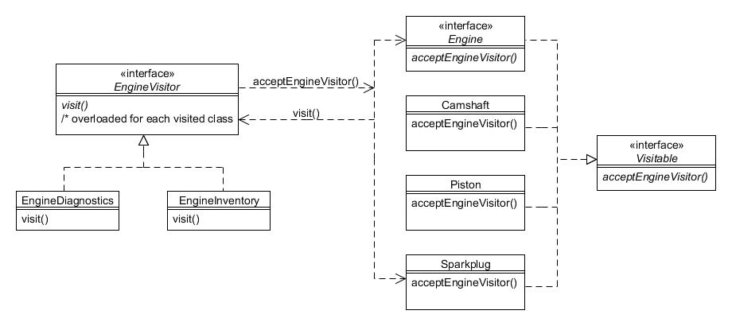

# 24. Visitante (Visitor)

Type: Behavioural

Purpose: Represent a method to be performed on the elements of an object structure. Visitor lets you define a new method without changing the classes of the elements on which it operates.

Sometimes a class hierarchy and its code become substantive, and yet it is known that future requirements will be inevitable. An example for the Foobar Motor Company is the Engine hierarchy which looks like this:


Figure 24.1 : Jerarquía de la clase Engine

In reality, the code within the AbstractEngine class is likely to be composed of a multitude of individual components, such as a camshaft, piston, some spark plugs, etc. If we need to add some functionality that traverses these components then the natural way is to just add a method to AbstractEngine. But maybe we know there are potentially many such new requirements and we would rather not have to keep adding methods directly into the hierarchy?

The Visitor pattern enables us to define just one additional method to add into the class hierarchy in such a way that lots of different types of new functionality can be added without any further changes. This is accomplished by means of a technique known as "double-despatch", whereby the invoked method issues a call-back to the invoking object.

The technique requires first the definition of an interface we shall call EngineVisitor:

```java
public interface EngineVisitor {
    public void visit(Camshaft camshaft);
    public void visit(Engine engine);
    public void visit(Piston piston);
    public void visit(SparkPlug sparkPlug);
}
```

We will also define an interface called Visitable with an acceptEngineVisitor() method:

```java
public interface Visitable {
    public void acceptEngineVisitor(EngineVisitor visitor);
}
```

The Engine interface you have met in previous chapters (although we will modify it slightly for this chapter). The Camshaft, Piston and SparkPlug classes are each very simple, as follows:

```java
public class Camshaft implements Visitable {
    public void acceptEngineVisitor(EngineVisitor visitor) {
        visitor.visit(this);
    }
}


public class Piston implements Visitable {
    public void acceptEngineVisitor(EngineVisitor visitor) {
        visitor.visit(this);
    }
}


public class SparkPlug implements Visitable {
    public void acceptEngineVisitor(EngineVisitor visitor) {
        visitor.visit(this);
    }
}
```

As you can see, each of these classes defines a method called acceptEngineVisitor() that takes a reference to an EngineVisitor object as its argument. All the method does is invoke the visit() method of the passed-in EngineVisitor, passing back the object instance.

Our modified Engine interface also now defines the acceptEngineVisitor() method:

```java
public interface Engine extends Visitable {
    public int getSize();
    public boolean isTurbo();
}
```

The AbstractEngine class therefore needs to implement this new method, which in this case traverses the individual components (camshaft, piston, spark plugs) invoking acceptEngineVisitor() on each:

```java
public abstract class AbstractEngine implements Engine {
    private int size;
    private boolean turbo;
 
    private Camshaft camshaft;
    private Piston piston;
    private SparkPlug[] sparkPlugs;
 
    public AbstractEngine(int size, boolean turbo) {
        this.size = size;
        this.turbo = turbo;
 
        // Create a camshaft, piston and 4 spark plugs...
        camshaft = new Camshaft();
        piston = new Piston();
        sparkPlugs = new SparkPlug[]{new SparkPlug(), new SparkPlug(), new SparkPlug(), new SparkPlug()};
    }
 
    public int getSize() {
        return size;
    }
 
    public boolean isTurbo() {
        return turbo;
    }
 
    public void acceptEngineVisitor(EngineVisitor visitor) {
        // Visit each component first...
        camshaft.acceptEngineVisitor(visitor);
        piston.acceptEngineVisitor(visitor);
        for (SparkPlug eachSparkPlug : sparkPlugs) {
            eachSparkPlug.acceptEngineVisitor(visitor);
        }
 
        // Now visit the receiver...
        visitor.visit(this);
    }
 
    public String toString() {
        return getClass().getSimpleName() + " (" + size + ")");
    }
}
```

Now we shall create an actual implementation of EngineVisitor so you can see how we can easily add additional functionality to engines without any further changes to any engine hierarchy class. The first thing we shall do is to define some clever electronic gizmo that can be attached to an engine that will automatically check each component and diagnose any faults. We therefore define the EngineDiagnostics class:

```java
public class EngineDiagnostics implements EngineVisitor {
    public void visit(Camshaft camshaft) {
        System.out.println("Diagnosing the camshaft");
    }
 
    public void visit(Engine engine) {
        System.out.println("Diagnosing the unit engine");
    }
 
    public void visit(Piston piston) {
        System.out.println("Diagnosing the piston");
    }
    
    public void visit(SparkPlug sparkPlug) {
        System.out.println("Diagnosing a single spark plug");
    }
}
```

We also want to print an inventory of how many of each type of component there is within an engine, so we also have an EngineInventory class:

```java
public class EngineInventory implements EngineVisitor {
    private int camshaftCount;
    private int pistonCount;
    private int sparkPlugCount;
 
    public EngineInventory() {
        camshaftCount = 0;
        pistonCount = 0;
        sparkPlugCount = 0;
    }
 
    public void visit(Camshaft p) {
        camshaftCount++;
    }
 
    public void visit(Engine e) {
        System.out.println("The engine has: " + camshaftCount + " camshaft(s), " + pistonCount + " piston(s), and " + sparkPlugCount + " spark plug(s)");
    }
 
    public void visit(Piston p) {
        pistonCount++;
    }
 
    public void visit(SparkPlug sp) {
        sparkPlugCount++;
    }
}
```

The following diagram summarises how all of these classes interact:



Figura 24.2 : Patrón Visitante

Client programs now only need to invoke the acceptEngineVisitor() method on an instance of Engine, passing in the appropriate EngineVisitor object:

```java
// Create an engine...
Engine engine = new StandardEngine(1300);

// Run diagnostics on the engine...
engine.acceptEngineVisitor(new EngineDiagnostics());
```

The above will result in the following output:

```text
Diagnosing the camshaft
Diagnosing the piston
Diagnosing a single spark plug
Diagnosing a single spark plug
Diagnosing a single spark plug
Diagnosing a single spark plug
Diagnosing the unit engine
```

And to obtain the inventory (using the same Engine instance):

```java
// Run inventory on the engine...
engine.acceptEngineVisitor(new EngineInventory());
```

The output should show:

```text
The engine has: 1 camshaft(s), 1 piston(s), and 4 spark plug(s)
```
