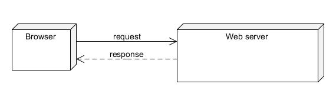
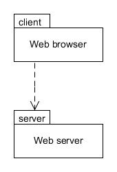
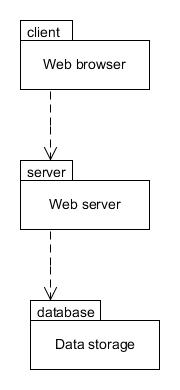

# Parte V. Otros patrones útiles

## 25. Objeto nulo{#h2-34}

As any Java programmer soon discovers, software testing often throws up NullPointerException messages. Sometimes, the only way around this is to specifically test for null before performing an operation, which puts an extra onus on the programmer.

Suppose a vehicle's instrument panel contains three slots for warning lights (such as for low oil level or low brake fluid level). A particular vehicle might only use these two lights, with the third slot empty, represented by null within Java. Looping through the slots would require a specific test to prevent a NullPointerException being thrown:

```java
OilLevelLight &  BrakeFluidLight are each types of WarningLight
WarningLight[] lights = new WarningLight[3];
lights[0] = new OilLevelLight();
lights[1] = new BrakeFluidLight();
lights[2] = null; //  empty slot

for (WarningLight currentLight : lights) {
    if (currentLight != null) {
        currentLight.turnOn();
        currentLight.turnOff();
        System.out.println(currentLight.isOn());
    }
}
```

An approach that can help prevent the need to test for null is to create a 'null object' class as part of the class hierarchy. This class will implement the same interface but perform no actual function, as illustrated in the following figure:


Figura 25.1 : Patrón de Objeto Nulo

The WarningLight interface defines the methods turnOn(), turnOff() and isOn():

```java
public interface WarningLight {
    public void turnOn();
    public void turnOff();
    public boolean isOn();
}
```

The OilLightLevel and BrakeFluidLevel classes each implement the WarningLight interface and provide the appropriate code to switch the light on or off:

```java
public class OilLevelLight implements WarningLight {
    private boolean on;
 
    public void turnOn() {
        on = true;
    System.out.println("Oil level light ON");
    }
 
    public void turnOff() {
        on = false;
        System.out.println("Oil level light OFF");
    }
   
    public boolean isOn() {
        return on;
    }
}


public class BrakeFluidLight implements WarningLight {
    private boolean on;
 
    public void turnOn() {
        on = true;
        System.out.println("Brake fluid light ON");
    }
 
    public void turnOff() {
        on = false;
        System.out.println("Brake fluid light OFF");
    }
   
    public boolean isOn() {
        return on;
    }
}
```

For the Null Object pattern we also create a NullObjectLight class that implements the WarningLight interface but performs no actual processing:

```java
public class NullObjectLight implements WarningLight {
    public void turnOn() {
        // Do nothing...
    }
 
    public void turnOff() {
        // Do nothing...
    }
   
    public boolean isOn() {
        return false;
    }
}
```

Now our client code can be simplified since we no longer need to test if a slot is null, provided we make use of the null object:

```java
WarningLight[] lights = new WarningLight[3];
lights[0] = new OilLevelLight();
lights[1] = new BrakeFluidLight();
lights[2] = new NullObjectLight(); // empty slot

// No need to test for null...
for (WarningLight currentLight : lights) {
    currentLight.turnOn();
    currentLight.turnOff();
    System.out.println(currentLight.isOn());
}
```

Note that for Null Object getter methods you will need to return whatever seems sensible as a default; hence above the isOn() method returns false since it represents a non-extentent light.

---

## 26. Factoría simple{#h2-35}  

In the main section of this book we looked at both the Factory Method pattern and the Abstract Factory pattern. The Simple Factory pattern is a commonly used simplified means of delegating the instantiation of objects to a specific class (the 'factory').

We shall assume here that the Foobar Motor Company manufactures two types of gearbox; an automatic gearbox and a manual gearbox. Client programs might need to create one or the other based upon a condition, as illustrated by the following code fragment (assuming the classes are defined within a class hierarchy):

```java
Gearbox selectedGearbox = null;
if (typeWanted = "automatic") {
     selectedGearbox = new AutomaticGearbox();
} else if (typeWanted = "manual") {
     selectedGearbox = new ManualGearbox();

}


// Do something with selectedGearbox...
```

While the above code will of course work, what happens if more than one client program needs to perform a similar selection? We would have to repeat the if...else... statements in each client program, and if a new type of gearbox is subsequently manufactured we would have to track down every place the if...else... block is used.

Remembering the principle of encapsulating the concept that varies, we can instead delegate the selection and instantiation process to a specific class, known as the 'factory', just for that purpose. Client programs then only make use of the create() method of the factory, as illustrated in the diagram below:


Figura 26.1 : Patrón de Factoría Simple

The abstract Gearbox class in our simple example merely defines a no-argument constructor:

```java
public abstract class Gearbox {
    public Gearbox() {}
}
```

The AutomaticGearbox and ManualGearbox classes each extend Gearbox for their respective types:

```java
public class AutomaticGearbox extends Gearbox {
    public AutomaticGearbox() {
        System.out.println("New automatic gearbox created");
    }
}


public class ManualGearbox extends Gearbox {
    public ManualGearbox() {
        System.out.println("New manual gearbox created");
    }
}
```

We now need to create our GearboxFactory class that is capable of instantiating the appropriate Gearbox:

```java
public class GearboxFactory {
    public enum Type {AUTOMATIC, MANUAL};
 
    public static Gearbox create(Type type) {
        if (type == Type.AUTOMATIC) {
            return new AutomaticGearbox();
 
        } else {
            return new ManualGearbox();
        }
    }
}
```

The create() method takes care of the selection and instantiation, and thus isolates each client program from repeating code. We have made the method static purely for convenience; it is not a requirement of the pattern.

Client programs now obtain the type of gearbox by means of the factory:

```java
// Create an automatic gearbox
Gearbox auto = GearboxFactory.create(GearboxFactory.Type.AUTOMATIC);

// Create a manual gearbox
Gearbox manual = GearboxFactory.create(GearboxFactory.Type.MANUAL);
```

---

## 27. Modelo Vista Controlador{#h2-36}  

The Foobar Motor Company's satellite-navigation system includes a visual display of the current location, the direction of travel and an indication of the current speed. There is also an input device; controls where you set the destination, etc. A fully fledged simulation is far beyond the scope of this book, so instead we will use a very simplified interface that merely lets you set the direction of travel (North, South, West and East) and the current speed (up to 30mph), without regard to any roads, etc..

The user interface will look like this:


Figura 27.1 : Interfaz de usuario de navegación por satélite

As you can see from the above, there are buttons to change direction and a slider to adjust the speed. The 'Feedback' section at the bottom of the screen automatically adjusts itself to your selections. Note that each time you click one of the direction buttons that button is disabled, and the previously selected button is re-enabled. The program initially starts by pointing North but with a speed of zero.

This is a straightforward program that would be entirely possible to code within a single class. But as graphical applications become more complex, it greatly simplifies development and maintenance if you separate the major parts of the program.

The Model View Controller pattern (often abbreviated to MVC) is a way of achieving a looser coupling between the constituent parts, and is a tried-and-tested approach to graphical applications. There are typically three parts at play in GUI applications:

1. The "Model". This is the 'data' (i.e. state) and associated application or 'business' logic. In our example, this comprises the values of the current direction of travel and the current speed together with methods to update and return them.

2. The "View". This is the graphical display, as shown in Figura 27.1, automatically updating itself as necessary whenever the Model changes its state in some way.

3. The "Controller". This is the part that responds to all user input (button clicks, moving the slider, etc.) and liaises with both the Model and the View.

Each of the above three parts will be in a separate class, which can be visualised as follows:


Figura 27.2 : Patrón Modelo Vista Controlador

These classes interrelate in the following way:

* _SatNavModel_ contains methods to set and get both the direction and speed. It is 'observable' (see Chapter 20) and will notify interested observers whenever either the direction or the speed has changed, but has no direct knowledge of any other class;
* _SatNavView_ defines the graphical frame and user-interface display. It holds a reference to SatNavModel so it can listen to state changes in the Model and query its state as needed to keep the display up-to-date automatically;
* _SatNavController_ holds a reference to both SatNavModel and SatNavView. It handles button clicks and movement of the speed slider, updating the Model and liaising with the View as needed.

Just as with the other patterns described in this book, there are variations in how MVC can be structured, and the above might be described as the 'classical' approach. Java components (including the Swing components) often use a modified version of MVC in which the View and Controller are combined into a single class, but for the purposes of this book we will use the full three-class separation to present the pattern.

We shall start with the Model, which in our case is the class SatNavModel. This has been implemented so that it could easily become a JavaBean, although that is not a requirement of MVC. The important point is that it has direct knowledge of neither the View nor the Controller, and could therefore be plugged into all sorts of other applications without any changes being required.

```java
public class SatNavModel implements Serializable {
    // Used when notifying listeners so they know what has changed
    public static final String DIRECTION_CHANGE = "direction";
    public static final String SPEED_CHANGE = "speed";
 
    // The directions we can travel
    public enum Direction {NORTH, SOUTH, EAST, WEST};
 
    // The current direction and speed
    private Direction currentDirection;
    private int currentSpeed;
 
    // This class is observable
    private PropertyChangeSupport changeSupport;
 
 
    public SatNavModel() {
        currentDirection = Direction.NORTH;
        currentSpeed = 0;
        changeSupport = new PropertyChangeSupport(this);
    }
 
    public void setDirection(Direction newDirection) {
        if (newDirection != currentDirection) {
            Direction previousDirection = currentDirection;
            currentDirection = newDirection;
            changeSupport.firePropertyChange(DIRECTION_CHANGE, previousDirection, currentDirection);
         }
    }
 
    public Direction getDirection() {
        return currentDirection;
    }
 
    public void setSpeed(int newSpeed) {
        if (newSpeed != currentSpeed) {
            int previousSpeed = currentSpeed;
            currentSpeed = newSpeed;
            changeSupport.firePropertyChange(SPEED_CHANGE, previousSpeed, currentSpeed);
         }
    }
 
    public int getSpeed() {
        return currentSpeed;
    }
 
    public void addPropertyChangeListener(PropertyChangeListener pcl) {
        changeSupport.addPropertyChangeListener(pcl);
    }
 
    public void removePropertyChangeListener(PropertyChangeListener pcl) {
        changeSupport.removePropertyChangeListener(pcl);
    }
}
```

As you can see, the only link with other classes is through its observers (we are using the PropertyChangeSupport class in the java.beans package to facilitate this). Each time the direction or speed is modified its observers (also known as listeners) are notified.

The graphical display is performed by the SatNavView class using standard Swing components. It takes a reference to the SatNavModel in its constructor, to register itself as an observer of the model (so it needs to implement the PropertyChangeListener interface). Whenever it detects a model change the propertyChange() method is called, enabling the View to update its display accordingly. There are also methods to allow the UI controls to be observed (by, for example, the Controller).

```java
public class SatNavView implements PropertyChangeListener {
    // The view needs a reference to the model
    private SatNavModel model;
 
    // The view uses a JFrame
    private JFrame viewingFrame;
 
    // UI controls to change direction and speed
    private JButton northButton, southButton, westButton, eastButton;
    private JSlider speedSlider;
 
    // UI feedback to show current direction and speed
    private String directionString, speedString;
    private JLabel feedbackLabel;
 
 
    public SatNavView(SatNavModel model) {
        this.model = model;
       
        // The view listens for changes to the model
        model.addPropertyChangeListener(this);
 
        // Initialise the UI
        viewingFrame = new JFrame("Satellite Navigation");
        viewingFrame.setDefaultCloseOperation(JFrame.EXIT_ON_CLOSE);
 
        northButton = new JButton("North");
        disableNorthButton(); // Default direction
 
        southButton = new JButton("South");
        westButton = new JButton("West");
        eastButton = new JButton("East");
 
        speedSlider = new JSlider(JSlider.VERTICAL, 0, 30, 0);
        speedSlider.setMajorTickSpacing(10);
        speedSlider.setMinorTickSpacing(1);
        speedSlider.setPaintTicks(true);
        speedSlider.setPaintLabels(true);
 
        directionString = "You are pointing " + model.getDirection();
        speedString = "but not yet moving. Use buttons & slider.";
        feedbackLabel = new JLabel(directionString + ", " + speedString);
 
        // Layout the direction buttons
        JPanel directionPanel = new JPanel(new GridLayout(3, 3));
        directionPanel.setBorder(new TitledBorder("Direction"));
        directionPanel.add(new JLabel(""));
        directionPanel.add(northButton);
        directionPanel.add(new JLabel(""));
        directionPanel.add(westButton);
        directionPanel.add(new JLabel(""));
        directionPanel.add(eastButton);
        directionPanel.add(new JLabel(""));
        directionPanel.add(southButton);
        directionPanel.add(new JLabel(""));
        // Layout the slider
        JPanel speedPanel = new JPanel();
        speedPanel.setBorder(new TitledBorder("Speed"));
        speedPanel.add(speedSlider);
 
        // Layout the feedback
        JPanel feedbackPanel = new JPanel();
        feedbackPanel.setBorder(new TitledBorder("Feedback"));
        feedbackPanel.add(feedbackLabel);
 
        // Position the panels onto the frame
        JPanel framePanel = new JPanel(new BorderLayout());
        framePanel.add(directionPanel, BorderLayout.CENTER);
        framePanel.add(speedPanel, BorderLayout.EAST);
        framePanel.add(feedbackPanel, BorderLayout.SOUTH);
 
        viewingFrame.add(framePanel);
    }
 
    public void show() {
        // Show the view sized and centered
        viewingFrame.pack();
        viewingFrame.setLocationRelativeTo(null);
        viewingFrame.setVisible(true);
    }
 
    // The controller will register as a listener using these methods
    public void addNorthButtonListener(ActionListener al) {
        northButton.addActionListener(al);
    }
 
    public void addSouthButtonListener(ActionListener al) {
        southButton.addActionListener(al);
    }
 
    public void addWestButtonListener(ActionListener al) {
        westButton.addActionListener(al);
    }
 
    public void addEastButtonListener(ActionListener al) {
        eastButton.addActionListener(al);
    }
 
    public void addSliderListener(ChangeListener cl) {
        speedSlider.addChangeListener(cl);
    }
 
    // The controller will call these methods to enable UI controls
    public void enableNorthButton() {
        northButton.setEnabled(true);
    }
 
    public void disableNorthButton() {
        northButton.setEnabled(false);
    }
 
    public void enableSouthButton() {
        southButton.setEnabled(true);
    }
 
    public void disableSouthButton() {
        southButton.setEnabled(false);
     }
 
    public void enableWestButton() {
        westButton.setEnabled(true);
    }
 
    public void disableWestButton() {
        westButton.setEnabled(false);
    }
 
    public void enableEastButton() {
        eastButton.setEnabled(true);
    }
 
    public void disableEastButton() {
        eastButton.setEnabled(false);
    }
 
    // Called by the model when its state changes
    public void propertyChange(PropertyChangeEvent pce) {
        if (model.getSpeed() == 0) {
            directionString = "You are pointing " + model.getDirection();
            speedString = "but are not currently moving.";
 
        } else if (pce.getPropertyName().equals(SatNavModel.DIRECTION_CHANGE)) {
            SatNavModel.Direction newDirection = (SatNavModel.Direction) pce.getNewValue();
            directionString = "Now travelling " + newDirection;
            speedString = "travelling at " + model.getSpeed();
 
        } else if (pce.getPropertyName().equals(SatNavModel.SPEED_CHANGE)) {
            int oldSpeed = (Integer) pce.getOldValue();
            int newSpeed = (Integer) pce.getNewValue();
            if (oldSpeed < newSpeed) {
                speedString = "and you have sped up to " + model.getSpeed();
 
            } else {
                speedString = "and you have slowed down to " + model.getSpeed();
            }
        }
 
        feedbackLabel.setText(directionString + ", " + speedString);
    }
}
```

The SatNavController class is responsible for handling the user input, which in this case can be either clicking one of the direction buttons or moving the speed slider. In response to the user input the Model state needs to be updated, and there is therefore a reference to both SatNavView and SatNavModel in the constructor. The class sets itself up to listen out for user input and reacts accordingly:

```java
public class SatNavController {
    // Need a reference to both the model and the view
    private SatNavModel model;
    private SatNavView view;
 
    public SatNavController(SatNavModel model, SatNavView view) {
        this.model = model;
        this.view = view;
 
        // The controller needs to listen to the view
        view.addNorthButtonListener(new NorthButtonListener());
        view.addSouthButtonListener(new SouthButtonListener());
         view.addWestButtonListener(new WestButtonListener());
        view.addEastButtonListener(new EastButtonListener());
        view.addSliderListener(new SliderListener());
    }
 
 
    // Inner classes which serve as view listeners
    private class NorthButtonListener implements ActionListener {
        public void actionPerformed(ActionEvent event) {
            view.disableNorthButton();
            view.enableSouthButton();
            view.enableWestButton();
            view.enableEastButton();
            model.setDirection(SatNavModel.Direction.NORTH);
        }
    }
 
    private class SouthButtonListener implements ActionListener {
        public void actionPerformed(ActionEvent event) {
            view.enableNorthButton();
            view.disableSouthButton();
            view.enableWestButton();
            view.enableEastButton();
            model.setDirection(SatNavModel.Direction.SOUTH);
        }
    }
 
    private class WestButtonListener implements ActionListener {
        public void actionPerformed(ActionEvent event) {
            view.enableNorthButton();
            view.enableSouthButton();
            view.disableWestButton();
            view.enableEastButton();
            model.setDirection(SatNavModel.Direction.WEST);
        }
    }
 
    private class EastButtonListener implements ActionListener {
        public void actionPerformed(ActionEvent event) {
            view.enableNorthButton();
            view.enableSouthButton();
            view.enableWestButton();
            view.disableEastButton();
            model.setDirection(SatNavModel.Direction.EAST);
        }
    }
 
    private class SliderListener implements ChangeListener {
        public void stateChanged(ChangeEvent event) {
            JSlider slider = (JSlider) event.getSource();
            model.setSpeed(slider.getValue());
        }
    }
}
```

Running the application is now as simple as instantiating the above classes and invoking the show() command defined in the View:

```java
// Create the MVC classes
SatNavModel model = new SatNavModel();
SatNavView view = new SatNavView(model);
SatNavController controller = new SatNavController(model, view);
// Show the view
view.show();
```

---

## 28. Capas{#h2-37}  

As applications grow larger they can become unwieldy to manage, with lots of interconnections leading to increased coupling. The Layers pattern addresses this by partitioning an application into two or more layers in a hierarchy, where each layer communicates only with the layer immediately below it. This approach helps to modularise applications and can help lower the coupling between classes.

---

### Arquitectura cliente-servidor (2 niveles){#h2-38}  

A simple example of the Layers pattern would be the client-server model, where a "client" (such as a web browser) communicates with a "server" (such as a web server) in order to view a web page:



Figura 28.1 : Arquitectura cliente-servidor

In Figura 28.1 you can see a browser sending a request to a web server which returns a response (such as a web page). If you imagine the client and server each being in their own package, then another way of viewing the above would be as follows:



Figura 28.2 : Enlace del paquete cliente-servidor

From Figura 28.2 you can infer that an object in the client package holds a reference to an object in the server package, such that the client can invoke a method on the server which may return a value in response.

Note that the client-server architecture is also known as a 2-tier architecture. The terms layer and tier are often used interchangeably, but "layer" more accurately refers to a logical partitioning and "tier" to a physical partitioning when each tier is potentially located on a different piece of hardware.

---

### Arquitectura de tres niveles{#h2-39}

A common extension of the client-server architecture is where access to a data store is required, and therefore a third layer (or tier) is added to make a 3-tier architecture:


Figura 28.3 : Arquitectura de tres niveles

Figura 28.3 shows the browser sending a request to a server, and the server in turn sending a request to a database to obtain the requested information. This is then returned to the server which in turn returns it to the browser. Viewing the above as packages gives the following structure:



Figura 28.4 : Enlaces de paquetes de 3 niveles

From figura 28.4 you can infer that an object in the client package holds a reference to an object in the server package, just as in the 2-tier model. In addition, an object in the server package holds a reference to an object in the database package. However, the client has no direct access to the database; it has to communicate via the server layer in the middle.

You are not limited to 3 tiers, of course. As applications grow in complexity additional layers may help to partition systems even further. This leads to the term n-tier, where n is the number of tiers.

Although the examples above have shown the common usages that typically utilise separate hardware, there is no reason why you cannot apply the structure of the Layers pattern in your own self-contained applications. Another pattern you have already seen which can usefully be used in conjunction with Layers is the Facade pattern, where each layer defines a facade object that the layer above communicates with. This approach can help hide the complexity of each layer behind the facade.

The next chapter provides a worked example that makes use of the Layers and Facade patterns, along with several other patterns that are commonly found in applications.
