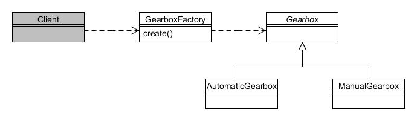

# 26. Factoría simple

En la sección principal de este libro vimos tanto el patrón de Método de Factoría como el patrón de Factoría Abstracta. El patrón de Factoría Simple es utilizado comúnmente para delegar la creación de instancias de objetos a una clase específica (la 'factoría').

Asumiremos aquí que la Compañía Foobar Motor manufactura dos tipos de cajas de cambios; una caja de cambios automática y una caja de cambios manual. Los programas cliente podrían necesitar crear una u otroa dependiendo de una condición, como ilustra el siguiente fragmento de código (asumiendo que las clases están definidas dentro de una jerarquía de clases):

```java
Gearbox selectedGearbox = null;
if (typeWanted = "automatic") {
     selectedGearbox = new AutomaticGearbox();
} else if (typeWanted = "manual") {
     selectedGearbox = new ManualGearbox();

}


// Hacer algo con selectedGearbox...
```

Mientras el código de arriba por supuesto que funcionará, ¿qué ocurre si mas de un programa cliente necesita realizar una selección similar? Tendríamos que repetir las sentencias if...else... en cada programa cliente, y si posteriormente se fabrica un nuevo tipo de caja de cambios, tendríamos que rastrear cada lugar en el que se utiliza el bloque if...else...

Recordando el principio de encapsular el concepto que varía, podemos delegar el proceso de selección y creación de instancias a una clase específica, conocida como 'factoría', solo para ese propósito. Los programas cliente entonces solo hacen uso del método create() de la factoría, como se ilustra en el siguiente diagrama:



Figura 26.1 : Patrón de Factoría Simple

La clase abstracta Gearbox en nuestro ejemplo simple meramente define un constructor sin argumentos:

```java
public abstract class Gearbox {
    public Gearbox() {}
}
```

Ambas clases AutomaticGearbox y ManualGearbox extienden Gearbox para sus tipos respectivos:

```java
public class AutomaticGearbox extends Gearbox {
    public AutomaticGearbox() {
        System.out.println("Nueva caja de cambios automática creada");
    }
}


public class ManualGearbox extends Gearbox {
    public ManualGearbox() {
        System.out.println("Nueva caja de cambios manual creada");
    }
}
```

Ahora necesitamos crear nuestra clase GearboxFactory que es capaz de instanciar la Gearbox apropiada:

```java
public class GearboxFactory {
    public enum Type {AUTOMATIC, MANUAL};
 
    public static Gearbox create(Type type) {
        if (type == Type.AUTOMATIC) {
            return new AutomaticGearbox();
 
        } else {
            return new ManualGearbox();
        }
    }
}
```

El método create() se encarga de la selección y creación de instancias y, por lo tanto, aísla cada programa cliente del código repetido. Hemos hecho el método estático simplemente por conveniencia; no es un requisito del patrón.

Los programas cliente ahora obtienen el tipo de caja de cambios mediante la factoría:

```java
// Crea una caja de cambios automática
Gearbox auto = GearboxFactory.create(GearboxFactory.Type.AUTOMATIC);

// Crea una caja de cambios manual
Gearbox manual = GearboxFactory.create(GearboxFactory.Type.MANUAL);
```
