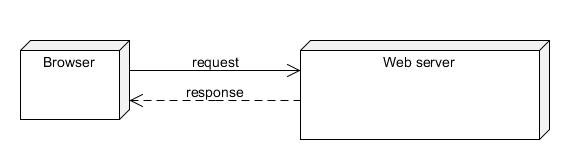
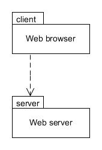
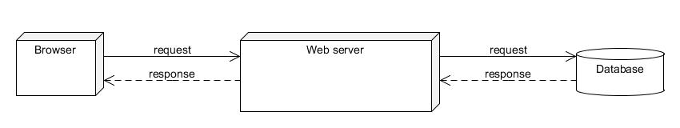
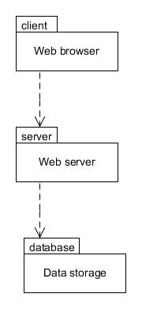

# 28. Capas  

As applications grow larger they can become unwieldy to manage, with lots of interconnections leading to increased coupling. The Layers pattern addresses this by partitioning an application into two or more layers in a hierarchy, where each layer communicates only with the layer immediately below it. This approach helps to modularise applications and can help lower the coupling between classes.

---

## Arquitectura cliente-servidor (2 niveles){#h2-13}  

A simple example of the Layers pattern would be the client-server model, where a "client" (such as a web browser) communicates with a "server" (such as a web server) in order to view a web page:

Figura 28.1 : Arquitectura cliente-servidor

In Figura 28.1 you can see a browser sending a request to a web server which returns a response (such as a web page). If you imagine the client and server each being in their own package, then another way of viewing the above would be as follows:

Figura 28.2 : Enlace del paquete cliente-servidor

From Figura 28.2 you can infer that an object in the client package holds a reference to an object in the server package, such that the client can invoke a method on the server which may return a value in response.

Note that the client-server architecture is also known as a 2-tier architecture. The terms layer and tier are often used interchangeably, but "layer" more accurately refers to a logical partitioning and "tier" to a physical partitioning when each tier is potentially located on a different piece of hardware.

---

## Arquitectura de tres niveles{#h2-14}

A common extension of the client-server architecture is where access to a data store is required, and therefore a third layer (or tier) is added to make a 3-tier architecture:

Figura 28.3 : Arquitectura de tres niveles

Figura 28.3 shows the browser sending a request to a server, and the server in turn sending a request to a database to obtain the requested information. This is then returned to the server which in turn returns it to the browser. Viewing the above as packages gives the following structure:

Figura 28.4 : Enlaces de paquetes de 3 niveles

From figura 28.4 you can infer that an object in the client package holds a reference to an object in the server package, just as in the 2-tier model. In addition, an object in the server package holds a reference to an object in the database package. However, the client has no direct access to the database; it has to communicate via the server layer in the middle.

You are not limited to 3 tiers, of course. As applications grow in complexity additional layers may help to partition systems even further. This leads to the term n-tier, where n is the number of tiers.

Although the examples above have shown the common usages that typically utilise separate hardware, there is no reason why you cannot apply the structure of the Layers pattern in your own self-contained applications. Another pattern you have already seen which can usefully be used in conjunction with Layers is the Facade pattern, where each layer defines a facade object that the layer above communicates with. This approach can help hide the complexity of each layer behind the facade.

The next chapter provides a worked example that makes use of the Layers and Facade patterns, along with several other patterns that are commonly found in applications.
