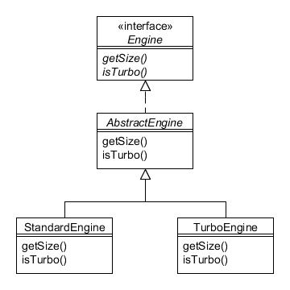

# Parte VI. Patrones de diseño en la práctica

## 29. Ejemplo de aplicación de 3 niveles{#h2-40}

This chapter develops a small, sample 3-tier graphical application that makes use of a selection of commonly used design patterns. The application displays a list of engines that have come off the Foobar Motor Company production line (this means that the list may show the same engine type and size more than once), and provides facilities to build new engines and to save & restore the data to persistent storage. Please note that this is not intended to be production level software; the code has been greatly simplified in order to concentrate on the patterns involved.

The finished application will look as follows:


Figura 29.1 : Marco Gestión motores

Each time the Build Engine button is clicked a dialogue will appear enabling you to create a new engine of your chosen type and size to be added to the list:


Figura 29.2 : Diálogo Construir motor

The Save button will store the listed data to a file on your disk and the Restore button will replace the listed data with the values of the most recent save.

The application will be designed using a 3-tier architecture using the Layers pattern comprising a user interface layer, a business model layer, and a database layer. The classes for each layer will be stored in packages named ui, business and db respectively, such that each layer communicates only with the layer one level below it, as shown in the following figura:


Figura 29.3 : Patrón de capas de 3 niveles como paquetes.

---

### El nivel de la base de datos{#h2-41}

Starting with the db package, we will refer to an object as an Entity. Since it is common for database tables to have a primary key we will define the class EntityKeyGenerator using the Singleton pattern enum technique as described in Chapter 6:

```java
package db;

public enum EntityKeyGenerator {
    ENGINE;     
     private int nextKey;

    synchronized int getNextKey() {
        return ++nextKey;
    }
}
```

To generate the next unique key for any Engine entity just needs a call to:

```java
EntityKeyGenerator.ENGINE.getNextKey();
```

You could enhance the above to allow a separate series of numbers for vehicle entities just be defining an extra enum constant for VEHICLE inside EntityKeyGenerator above, but this is not needed for our simple example.

We will now define a simple EntityTable class that can store a Map of objects keyed by a sequential numeric id:

```java
package db;

import java.io.*;
import java.util.*;

public class EntityTable implements Serializable {
    private EntityKeyGenerator keyGenerator;
    private Map<Integer, Object> entities;
    private Collection<EntityListener> listeners;
   
    EntityTable(EntityKeyGenerator keyGenerator) {
        this.keyGenerator = keyGenerator;
        entities = new HashMap<Integer, Object>();
        listeners = new ArrayList<EntityListener>();
    }
   
    Object getByKey(Integer key) {
        return entities.get(key);
    }
   
    Collection<Object> getAll() {
        return entities.values();
    }
   
    Integer addEntity(Object value) {
        Integer key = keyGenerator.getNextKey();
        entities.put(key, value);
        fireEntityAdded(key, value);
        return key;
    }
   
    void restore(EntityTable restoredTable) {
        entities.clear();
        entities.putAll(restoredTable.entities);
        fireEntityRestored();
    }
   
    void addEntityListener(EntityListener listener) {
    listeners.add(listener);
    }
   
    void removeEntityListener(EntityListener listener) {
        listeners.remove(listener);
    }
   
    void fireEntityAdded(Integer key, Object value) {
        EntityEvent event = new EntityEvent(key, value);
        for (EntityListener listener : listeners) {
            listener.entityAdded(event);
        }
    }
   
    void fireEntityRestored() {
        EntityEvent event = new EntityEvent();
        for (EntityListener listener : listeners) {
            listener.entityRestored(event);
        }
    }
}
```

 Note the following:

* The constructor requires an EntityKeyGenerator object which it can use to generate the next key for this particular entity type;
* The entities are stored in a Map keyed by an Integer (to represent the primary key) and where the value will be an Object. This allows the class to store any object type and therefore promotes loose-coupling;
* Methods are provided to return all entities or just one if the key is provided;
* The addEntity() method generates the next primary key which it returns, after adding the entity to the Map;
* The restore() method replaces the data with that provided in the argument;
* Methods are provided to add and remove EntityListener objects. This will enable other classes to be notified whenever a new entity is added to the database (or the data is restored), and is an example of the Observer pattern in action.

The EntityEvent class and EntityListener interface provide the notification mechanism as used by the EntityTable above. The EntityEvent class stores a reference to the key and value of the entity object:

```java
package db;

import java.util.*;

public class EntityEvent extends EventObject {
    private Object value;
   
    EntityEvent() {
        String getFileSuffix() {
        return ".ser";
    }
 
    void save(EntityTable table) throws IOException {
        File file = new File(getFileName(table) + getFileSuffix());
        FileOutputStream fos = new FileOutputStream(file);
        BufferedOutputStream bos = new BufferedOutputStream(fos);
        ObjectOutputStream oos = new ObjectOutputStream(bos);
        oos.writeObject(table);
        oos.close();
    }
 
    EntityTable restore(EntityTable table) throws IOException {
        File file = new File(getFileName(table) + getFileSuffix());
        FileInputStream fis = new FileInputStream(file);
        BufferedInputStream bis = new BufferedInputStream(fis);
        ObjectInputStream ois = new ObjectInputStream(bis);
        try {
            table = (EntityTable) ois.readObject();
        } catch (ClassNotFoundException ex) {
            throw new IOException(ex);
        }
        ois.close();
        return table;
    }
}
```

Note in the save() and restore() methods the way InputStream and OutputStream objects are wrapped together. For example, inside save(), a FileOutputStream is wrapped inside a BufferedOutputStream which is in turn wrapped inside an ObjectOutputStream. This is an example of these Java supplied classes following the Decorator pattern, where each OutputStream object provides additional functionality.

The EntityCSVStrategy class likewise could be coded to use a CSV formatted file, although the code is omitted here:

```java
package db;

import java.io.*;

public class EntityCSVStrategy extends AbstractEntityPersistenceStrategy {
    String getFileSuffix() {
        return ".csv";
    }
 
    void save(EntityTable table) throws IOException {
        // code to save table data in CSV format (omitted)
    }
 
    EntityTable restore(EntityTable table) throws IOException {
        // code to restore table data from CSV format (omitted)
        return table;
    }
}
```

In order to simplify the job of any package that needs to make use of the database (which will be the business package in our case) there will be only a single point of access to all database functionality. This will provide a high-level view of the database which hides the internal structure and so also promotes loose-coupling. The Facade pattern used in conjunction with the Singleton pattern provides a means of defining a single point of access, as shown in the DatabaseFacade enum below:

```java
package db;

import java.io.*;

public enum DatabaseFacade {
    INSTANCE;

    private EntityTable engines;
    private AbstractEntityPersistenceStrategy persistenceStrategy;

    DatabaseFacade() {
        engines = new EntityTable(EntityKeyGenerator.ENGINE);

        // Set which persistence strategy to use
        // (maybe get from configuration settings somewhere)
        persistenceStrategy = new EntitySerializationStrategy();
    }

    public Object[] getAllEngines() {
        return engines.getAll().toArray();
    }

    public Object getEngine(Integer key) {
        return engines.getByKey(key);
    }

    public Integer addEngine(Object engine) {
        return engines.addEntity(engine);
    }

    public void addEngineListener(EntityListener listener) {
        engines.addEntityListener(listener);
    }

    public void removeEngineListener(EntityListener listener) {
        engines.removeEntityListener(listener);
    }

    public void saveEngines() throws IOException {
        persistenceStrategy.save(engines);
    }

    public void restoreEngines() throws IOException {
        EntityTable restoredEngines = persistenceStrategy.restore(engines);
        engines.restore(restoredEngines);
    }
}
```

Note the following:

* The class is a Singleton, since the calling package should only use one Facade object;
* The class holds the EntityTable object to store the engines and methods to get all or one of them, as well as adding a new engine. If your system also managed vehicles then there would be equivalent variables and methods for this, too;
* The serialization persistence strategy is assumed, but you can see how easy it would be to use alternative strategies;
* Methods to add and remove listeners and to save and restore the data are delegated to the appropriate objects;
* You may have noticed that the constructor and methods within EntityTable and the persistence classes used package-private access. This is a means by which you can help enforce that external packages only go through the facade object methods, which are public.

The package diagram can now be shown with the classes of the db package included:


Figura 29.4 : Paquete de base de datos con clase Facade

Note how the business tier communicates only through the DatabaseFacade object. This has the effect of hiding the db package's complexity behind the facade.

---

### El nivel empresarial o de negocio{#h2-42}

Moving on to the business package, this will consist primarily of the Engine hierarchy as used throughout this book:



Figura 29.5 : Jerarquía de Engine

In order to facilitate Engine objects being serialised, its definition needs to be changed to extend the Serializable interface:

```java
package business;

import java.io.*;
public interface Engine extends Serializable {
    public int getSize();
    public boolean isTurbo();
}
```

The other classes are unchanged, except that they of course now reside in a package called business.

Because there are two types of engine that can exist (standard and turbo), it will be useful to create a Factory class that creates objects of the correct type depending upon the supplied arguments. To this end, define a new class EngineFactory in the business package:

```java
package business;
public class EngineFactory {
    public enum Type {STANDARD, TURBO};
   
    static Engine create(EngineFactory.Type type, int size) {
        if (type == Type.STANDARD) {
            return new StandardEngine(size);
        } else {
            return new TurboEngine(size);
        }
    }
   
    static Engine create(int size, boolean turbo) {
        return EngineFactory.create(turbo ? Type.TURBO : Type.STANDARD, size);
    }
    
    private EngineFactory() {}
}
```

Note how the create() method is static and is overloaded so that client objects can either supply the enum Type value or a boolean.

Just as was done for the db package, the business package will have its own facade object, in this case the BusinessFacade singleton:

```java
package business;

import db.*;
import java.io.*;
public enum BusinessFacade {
    INSTANCE;
   
    public Object[] getEngineTypes() {
        return EngineFactory.Type.values();
    }

    public Object[] getAllEngines() {
        return DatabaseFacade.INSTANCE.getAllEngines();
    }

    public Object addEngine(int size, Object type) {
        Engine engine = EngineFactory.create(size, type == EngineFactory.Type.TURBO);
        DatabaseFacade.INSTANCE.addEngine(engine);
        return engine;
    }

    public void saveEngines() throws IOException {
        DatabaseFacade.INSTANCE.saveEngines();
    }

    public void restoreEngines() throws IOException {
        DatabaseFacade.INSTANCE.restoreEngines();
    }

    public void addEngineListener(EntityListener listener) {
        DatabaseFacade.INSTANCE.addEngineListener(listener);
    }

    public void removeEngineListener(EntityListener listener) {
        DatabaseFacade.INSTANCE.removeEngineListener(listener);
    }
}
```

Note the following:

* The methods delegate to the appropriate DatabaseFacade methods;
* The getEngineTypes(), getAllEngines() and addEngine() methods have a return type of Object rather than of Engine. This means that the business package will be loosely-coupled with the ui package so that the latter does not depend upon the former's implementation details. The user interface can make use of the toString() method of the Object class to obtain the information to show in its list.

The package diagram can now be shown with the classes of the business package included:


Figura 29.6 : Paquete Business con clase Fachada

Note how the ui tier communicates only through the BusinessFacade object. This has the effect of hiding the business package's complexity behind the facade.

---

### El nivel de interfaz de usuario{#h2-43}

The ui package includes a ManageEnginesPanel class which shows a scrollable list of engines and some buttons:

```java
package ui;

import business.*;
import db.*;
import java.awt.*;
import java.awt.event.*;
import java.io.*;
import java.util.*;
import javax.swing.*;

public class ManageEnginesPanel extends JPanel implements EntityListener {
    private Frame owner;
    private EngineListModel enginesModel;
   
    ManageEnginesPanel(final Frame owner) {
        super(new BorderLayout());
        this.owner = owner;
       
        // Scrollable list of engines
        enginesModel = new EngineListModel();
        add(new JScrollPane(new JList(enginesModel)), BorderLayout.CENTER);
       
        // Buttons to add and save
        JPanel buttonPanel = new JPanel(new FlowLayout());
       
        JButton buildEngineButton = new JButton("Build Engine");
        buildEngineButton.addActionListener(new ActionListener() {
            public void actionPerformed(ActionEvent event) {
                new BuildEngineDialog(owner).show();
            }
        });
        buttonPanel.add(buildEngineButton);
 
        JButton saveButton = new JButton("Save");
        saveButton.addActionListener(new ActionListener() {
            public void actionPerformed(ActionEvent event) {
                try {
                    BusinessFacade.INSTANCE.saveEngines();
                } catch (IOException ex) {
                    JOptionPane.showMessageDialog(ListEnginesPanel.this, ex, "Error", JOptionPane.ERROR_MESSAGE);
                }
            }
        });
        buttonPanel.add(saveButton);
 
        JButton restoreButton = new JButton("Restore");
        restoreButton.addActionListener(new ActionListener() {
            public void actionPerformed(ActionEvent event) {
                try {
                     BusinessFacade.INSTANCE.restoreEngines();
                } catch (IOException ex) {
                    JOptionPane.showMessageDialog(ListEnginesPanel.this, ex, "Error", JOptionPane.ERROR_MESSAGE);
                }
            }
        });
        buttonPanel.add(restoreButton);
       
        add(buttonPanel, BorderLayout.SOUTH);
    }
 
    public void entityAdded(EntityEvent event) {
        enginesModel.engineAdded(event.getValue());
    }
 
    public void entityRestored(EntityEvent event) {
        enginesModel.loadEngines();
    }
   
   
    // Inner class: ListModel for engines
    private class EngineListModel extends DefaultListModel {
        private java.util.List<Object> engines;
       
        EngineListModel() {
            engines = new ArrayList<Object>();
            loadEngines();
        }
       
        void loadEngines() {
            engines.clear();
            engines.addAll(Arrays.asList(BusinessFacade.INSTANCE.getAllEngines()));
            fireContentsChanged(this, 0, engines.size() - 1);
        }
       
        public Object getElementAt(int index) {
            return engines.get(index);
        }
        
        public int getSize() {
            return engines.size();
        }
       
        void engineAdded(Object engine) {
            engines.add(engine);
            fireContentsChanged(this, 0, engines.size() - 1);
        }
       
    }
}
```

Note that the panel implements the EntityListener interface so that it gets notified whenever a new engine is added to the database, and so is making use of the Observer pattern.

The Build Engine button creates and displays a BuildEngineDialog object, which is as follows:

```java
package ui;

import business.*;
import java.awt.*;
import java.awt.event.*;
import javax.swing.*;

public class BuildEngineDialog extends JDialog {
    private JComboBox typeCombo, sizeCombo;
   
    BuildEngineDialog(Frame owner) {
        super(owner, "Build Engine", true);
        setLayout(new BorderLayout());
        this.setLocationRelativeTo(owner);
        this.setDefaultCloseOperation(JDialog.DISPOSE_ON_CLOSE);
       
        // Form entry panel
        JPanel formPanel = new JPanel(new GridLayout(0, 2));
       
        typeCombo = new JComboBox(BusinessFacade.INSTANCE.getEngineTypes());
        formPanel.add(new JLabel("Type"));
        formPanel.add(typeCombo);
       
        sizeCombo = new JComboBox();
        sizeCombo.addItem(1300);
        sizeCombo.addItem(1600);
        sizeCombo.addItem(2000);
        sizeCombo.addItem(2500);
        formPanel.add(new JLabel("Size"));
        formPanel.add(sizeCombo);
       
        add(formPanel, BorderLayout.CENTER);
       
        // Buttons to submit or cancel
        JPanel buttonPanel = new JPanel(new FlowLayout());
       
        JButton okButton = new JButton("OK");
        okButton.addActionListener(new ActionListener() {
            public void actionPerformed(ActionEvent event) {
                BusinessFacade.INSTANCE.addEngine((Integer)sizeCombo.getSelectedItem(), typeCombo.getSelectedItem());
                setVisible(false);
            }
        });
        buttonPanel.add(okButton);
 
        JButton cancelButton = new JButton("Cancel");
        cancelButton.addActionListener(new ActionListener() {
            public void actionPerformed(ActionEvent event) {
                setVisible(false);
            }
        });
        buttonPanel.add(cancelButton);
       
        add(buttonPanel, BorderLayout.SOUTH);
        pack();
    }
}
```

The OK button invokes the appropriate BusinessFacade method to add an engine with your selected criteria. On the main list panel the Save and Restore buttons also make appropriate calls to the BusinessFacade object methods so that the currently displayed data can be saved or restored.

The EnginesFrame class provides the frame that utilises ManageEnginesPanel:

```java
package ui;

import business.*;
import java.awt.*;
import javax.swing.*;

public class EnginesFrame extends JFrame {
    private ManageEnginesPanel enginesPanel;
   
    public EnginesFrame () {
        super("Manage Engines");
        setDefaultCloseOperation(DISPOSE_ON_CLOSE);
        add(buildUI(), BorderLayout.CENTER);
        pack();
        setLocationRelativeTo(null);
    }
   
    private Component buildUI() {
        JPanel uiPanel = new JPanel(new BorderLayout());
        enginesPanel = new ManageEnginesPanel();
        BusinessFacade.INSTANCE.addEngineListener(enginesPanel);
        uiPanel.add(enginesPanel, BorderLayout.CENTER);
        return uiPanel;
    }
}
```

Finally, to invoke the frame you could create a fourth package called main which contains a class called Main:

```java
package main;

import ui.*;
import business.*;
import javax.swing.*;

public class Main {
    public static void main(String[] args) {
        // create some sample data
        BusinessFacade.INSTANCE.addEngine(1300, EngineFactory.Type.STANDARD);
        BusinessFacade.INSTANCE.addEngine(1600, EngineFactory.Type.STANDARD);
        BusinessFacade.INSTANCE.addEngine(2000, EngineFactory.Type.STANDARD);
        BusinessFacade.INSTANCE.addEngine(2500, EngineFactory.Type.TURBO);
       
        // start the ui
        SwingUtilities.invokeLater(new Runnable() {
            public void run() {
                new EnginesFrame().setVisible(true);
            }
        });
    }
}
```

The above class just creates some sample engines and starts the user interface.

---
