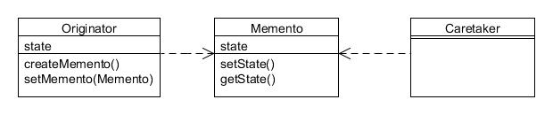
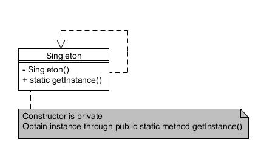

# Parte VII. Apéndices

## Apéndice A. Diagramas UML{#h2-44}

This book uses a simplified version of Unified Modeling Language (UML) diagrams to illustrate class hierarchies and usages for the patterns in this book. Each separate class is shown as a bounded rectangle with three horizontal sections, the top section containing the name of the class, the second section any relevant state (i.e. instance variables) and the third section containing the protocol (i.e. methods).

---

### Representando tipos{#h2-45}

Abstract classes, interfaces and abstract methods are shown in italicised text. The following figure shows an example of each sort of type and method:

Figura A.1 : Clase normal (izquierda), clase abstracta (centro), interfaz (derecha)

The majority of diagrams in this book omit the state, thus leaving a small gap between the two horizontal bars (see the interface example in Figura A.1). This should not be taken to mean there is no state in the actual class; rather that it would have cluttered the diagram unnecessarily. Likewise, only relevant methods are listed, and not necessarily all. Unless specified otherwise, you can assume that all listed methods are public.

---

### Representando herencia{#h2-46}

Inheritance is shown by a line connection between classes, with a hollow triangle pointing to the class being inherited or interfaces being implemented. Solid lines are shown for classes and dashed lines for interface connections:

Figura A.2 : Ampliar una clase (izquierda y centro), implementar una interfaz (derecha)

---

### Representando composición y uso{#h2-47}

When one class 'uses' another (i.e. holds a reference to it), this is shown by a dashed line with an open arrow pointing toward the class being used. The usage is usually through passing a reference to the using object’s constructor or a method, or by instantiating the object being used. In the following diagram each instance of ClassA holds or obtains a reference to an instance of ClassB:

Figura A.3 : ClassA usa ClassB

---

### Fragmentos de código{#h2-48}

Where useful, snippets of code will be shown in a grey box attached to a class with a dashed line:

Figura A.4 : Fragmento de código

---

### 'Cliente' y otras clases de color gris{#h2-49}

If a class rectangle is shown in grey this only for aesthetic purposes to separate it from other classes in the diagram. This is most often used in this book for 'client' classes, i.e. classes which make use of a particular pattern, as the following example for the Chain of Responsibility pattern illustrates:

Figura A.5 : Client class in grey

---

## Apéndice B. Referencia rápida de patrones de diseño{#h2-50}

This appendix provides an alphabetical quick-reference of each of the 23 main design patterns described in this book in their most general form.

Note that many of the patterns make use of abstract classes or interfaces. In most cases these are interchangeable and the choice of which to use depends entirely upon your project requirements. It may also appear that the general form of a particular pattern described in this chapter differs from the detailed example in the main body of this book, but this is just a consequence of the fact that patterns are adaptable to the needs of the situation, and the general form should not be construed as the only or 'correct' approach.

---

### Factoría abstracta (Abstract Factory){#h2-51}

Type: Creational

Purpose: Provide an interface for creating families of related or dependent objects without specifying their concrete classes.

Example usage: Commonly used when generating graphical 'widgets' for different look-and-feels. Used within the Java class libraries for that purpose.

Consequences: Isolates concrete classes. Enables easy exchange of product families. Promotes consistency among products.

* AbstractFactory defines an interface for methods that create abstract product objects;
* ConcreteFactory1 and ConcreteFactory2 take care of instantiating the appropriate product families (e.g. ConcreteFactory1 creates ProductA1 and ProductB1);
* AbstractProductA and AbstractProductB defines the interface of each different type of product;

Client programs only use the interfaces declared by AbstractFactory and AbstractProductA and AbstractProductB.

---

### Adaptador (Adapter){#h2-52}

Type: Structural

Purpose: Convert the interface of a class into another interface clients expect. Adapter lets classes work together that couldn't otherwise because of incompatible interfaces.

Example usage: Integration of independent and incompatible classes. The Java class libraries define WindowAdapter as a convenience class that 'adapts' the WindowListener interface with default empty method implementations.

Consequences: A single adapter can work with many adaptees.

* Target refers to the interface that the client program requires;
* Adapter is the class used by client programs to forward requests to Adaptee;
* Adaptee is the class that needs adapting.

---

### Puente (Bridge){#h2-53}

Type: Structural

Purpose: Decouple an abstraction from its implementation so that each may vary independently.

Example usage: GUI frameworks and persistence frameworks.

Consequences: An implementation is not permanently bound to an interface, and can be switched at run-time.

* Abstraction is the abstraction of the interface;
* ConcreteClass implements the `Abstraction interface and holds a reference to Implementor. It provides an implementation in terms of Implementor;
* Implementor is the implementation interface which may be quite different to the Abstraction interface;
* ConcreteImplementor1 and ConcreteImplementor2 implement the Implementor interface.

---

### Constructor (Builder){#h2-54}

Type: Creational

Purpose: Separate the construction of a complex object from its representation so that the same construction process can create different representations.

Example usage: Useful when there are several steps needed to create an object.

Consequences: Enables variations of a products internal representation. Isolates construction and representation.

* Builder defines an interface for creating parts of a 'product' object;
* ConcreteBuilder creates and assembles the 'product' parts step-by-step and provides a method to retrieve it during or after assembly;
* Director controls the actual assembly process.

---

### Cadena de responsabilidad (Chain of Responsibility){#h2-55}

Type: Behavioural

Purpose: Avoid coupling the sender of a request to its receiver by giving more than one object a chance to handle the request. Chain the receiving objects and pass the request along the chain until an object handles it.

Example usage: When more than one object can handle a request and the handler is not known in advance.

Consequences: Not every request needs to be handled, or maybe it needs to be handled by more than one handler.

* Handler defines an interface for handling requests;
* ConcreteHandler1 and ConcreteHandler2 each decide if they can handle the request itself or if it should be passed on to its successor.

Client programs send their requests to the first object in the chain.

---

### Comando (Command){#h2-56}

Type: Behavioural

Purpose: Encapsulate a request as an object, thereby letting you parameterise clients with different requests, queue or log requests, and support undoable operations.

Example usage: UI controls such as menu items and toolbar buttons. Undo/redo mechanisms.

Consequences: Strive to keep separate the objects that invoke the operation from the object that performs it.

* Command is the interface for executing an operation;
* ConcreteCommand performs the operation on the Receiver;
* Invoker asks the command to be carried out;
* Receiver knows how to perform the operations.

---

### Compuesto (Composite){#h2-57}

Type: Structural

Purpose: Compose objects into tree structures to represent part-whole hierarchies. Composite lets clients treat individual objects and compositions of objects uniformly.

Example usage: Graphical component hierarchies, etc.

Consequences: Simple objects can be combined into complex assemblies and all treated through a common interface. Adding new components should be straightforward.

* Component is the interface for both leaves and composites;
* LeafComponent defines objects that have no children;
* CompositeComponent defines objects that may have children.

---

### Decorador (Decorator){#h2-58}

Type: Structural

Purpose: Attach additional responsibilities to an object dynamically. Decorators provide a flexible alternative to subclassing for extending functionality.

Example usage: GUI toolkits, file and object input/output streams (e.g. buffering).

Consequences: Can be more flexible than direct inheritance and reduce number of classes required.

* Component defines the interface for objects that can have responsibilities added to them dynamically;
* ConcreteComponent implements the Component interface;
* Decorator maintains a reference to a Component object as well as defining an interface that matches that of Component;
* AddedStateDecorator and AddedBehaviourDecorator each decorate a Component by adding additional instance variables and/or methods.

---

### Fachada (Facade){#h2-59}

Type: Structural

Purpose: Provide a unified interface to a set of interfaces in a subsystem. Facade defines a higher-level interface that makes the subsystem easier to use.

Example usage: To simplify access to several objects through a single 'facade' object.

Consequences: Needs a new class to be created to serve as the 'facade'.

* Facade defines the class that provides the simplified interface to other classes;
* SomeClassA, etc. are various classes, related or not.

---

### Método de Factoría (Factory Method){#h2-60}

Type: Creational

Purpose: Define an interface for creating an object, but let subclasses decide which class to instantiate.

Example usage: When you can't anticipate the specific type of object to be created, or you want to localise the knowledge of which class gets created.

Consequences: Reduces the need for clients to use 'new' to instantiate objects.

* Product defines the interface of the product that is to be created;
* ConcreteProduct is an implementation of a particular product;
* Factory declares the factory method that returns a Product object;
* ConcreteFactory implements the factory method defined in Factory to return an instance of Product.

---

### Flyweight{#h2-61}

Type:Structural

Purpose: Use sharing to support large numbers of fine-grained objects efficiently.

Example usage: Text/graphic editors, etc.

Consequences: Saves memory through sharing shared state.

* Flyweight defines the interface through which flyweight objects can act on extrinsic state;
* ConcreteFlyweight implements Flyweight and stores intrinsic state. Must be shareable;
* FlyweightFactory creates and manages the flyweight objects through a 'pooling' mechanism.

Client programs maintain references to the flyweights obtained through the factory.

---

### Intérprete (Interpreter){#h2-62}

Type: Behavioural

Purpose: Given a language, define a representation for its grammar along with an interpreter that uses the representation to interpret sentences in the language.

Example usage: Simple grammars and mini-language processing.

Consequences: Not suitable for complex grammars and language processing.

* AbstractExpression defines the abstract method to interpret an element;
* TerminalExpression extends AbstractExpression for language elements that terminate an expression;
* NonTerminalExpression extends AbstractExpression for language elements that are just part of an expression;
* Context is the object that is being parsed (e.g. the grammar or language).

---

### Iterador (Iterator){#h2-63}

Type: Behavioural

Purpose: Provide a way to access the elements of an aggregate object sequentially without exposing its underlying representation.

Example usage: Wherever a collection or array of objects or values need to be processed in turn.

Consequences: The for-each syntax simplifies usage.

* Iterator defines the interface for the iterator;
* ConcreteIterator implements Iterator to perform the processing of each element in Aggregate;
* Aggregate defines the interface for the collection to be processed;
* ConcreteAggregate implements Aggregate for the actual collection.

---

### Mediador (Mediator){#h2-64}

Type: Behavioural

Purpose: Define an object that encapsulates how a set of objects interact. Mediator promotes loose coupling by keeping objects from referring to each other explicitly, and it lets you vary their interaction independently.

Example usage: Dialogs that control UI components, etc.

Consequences: The Mediator could be defined to use the Observer pattern to monitor the components.

* Mediator defines the interface for communication with Colleague objects;
* ConcreteMediator implements the Mediator interface and performs the communication;
* Colleague defines the interface for a component that needs communication with the Mediator;
* ConcreteColleague1 and ConcreteColleague2 implement the Colleague interface and performs the communication with the Mediator such that it needs no knowledge of any other Colleague.

---

### Recuerdo (Memento){#h2-65}

Type: Behavioural

Purpose: Without violating encapsulation, capture and externalise an object's internal state so that it can be restored to this state later.

Example usage: Undo & Redo processing, database transactions, etc.

Consequences: Encapsulates the storage of state external to the originating object, but might be expensive in terms of memory or performance.

* Originator creates the Memento object and uses it to restore its state;
* Memento stores the state of Originator;
* Caretaker keeps the memento.

---

### Observador (Observer){#h2-66}

Type: Behavioural

Purpose: Define a one-to-many dependency between objects so that when one object changes its state, all its dependants are notified and updated automatically.

Example usage: GUI controls, events, etc.

Consequences: Decouples classes through a common interface.

* Observable defines the mechanisms to register observers and notify them of events;
* ConcreteObservable extends Observable for a particular subject class;
* Observer defines an interface for interested classes;
* ConcreteObserver implements Observer for a particular interested class.

---

### Prototipo (Prototype){#h2-67}

Type: Creational

Purpose: Specify the kinds of objects to create using a prototypical instance, and create new objects by copying the prototype.

Example usage: Where easier or faster to clone than to instantiate.

Consequences: Cloning might become difficult in certain situations

* Prototype defines an interface that can 'clone' itself;
* ConcretePrototype performs the self-cloning.

Client programs create new objects by asking a prototype to clone itself.

---

### Apoderado (Proxy){#h2-68}

Type: Structural

Purpose: Provide a surrogate or place-holder for another object to control access to it.

Example usage: Java RMI, security proxies, etc.

Consequences: RMI runs on multiple JVMs.

* Subject defines the interface that needs to be accessed through a proxy;
* RealSubject defines the actual object which Proxy represents;
* Proxy maintains a reference to RealSubject so it can act on its behalf.

---

### Único (Singleton){#h2-69}

Type: Creational

Purpose: Ensure a class allows only one object to be created, providing a single point of access to it.

Example usage: Log files, configuration settings, etc.

Consequences: Often overused, difficult to subclass, can lead to tight coupling.

* Singleton defines a private constructor together with a public class (i.e. static) method as the only means of getting the instance.

Note that this book recommends using an enum to implement the Singleton pattern in most instances.

---

### Estado (State){#h2-70}

Type: Behavioural

Purpose: Allow an object to alter its behaviour when its internal state changes. The object will appear to change its class.

Example usage: UI shape components, etc.

Consequences: Localises state-specific behaviour and separates behaviour for different states.

 

* State defines the interface for handling different states in the handle() method;
* ConcreteStateA and ConcreteStateB implement the State interface for each separate state;
* Context holds a reference to a State object to request a particular state.

---

### Estrategia (Strategy){#h2-71}

Type: Behavioural

Purpose: Define a family of algorithms, encapsulate each one, and make them interchangeable. Strategy lets the algorithm vary independently from clients that use it.

Example usage: Java Swing borders.

Consequences: Might need to pass data to each strategy.

* Strategy defines the interface for the algorithms;
* ConcreteStrategyA and ConcreteStrategyB implement Strategy for a particular algorithm;
* Context holds a reference to the Strategy that is being used.

---

### Método de plantilla(Template Method){#h2-72}

Type: Behavioural

Purpose: Define the skeleton of an algorithm in a method, deferring some steps to subclasses. Template Method lets subclasses redefine certain steps of an algorithm without changing the algorithm's structure.

Example usage: When an algorithm's steps can be performed in different ways.

Consequences: Should prevent the template method from being overridden.

* AbstractClass defines the non-overridable templateMethod() that invokes a series of abstract methods defined in subclasses;
* Subclass1 and Subclass2 extend AbstractClass to define the code for each abstract method invoked by templateMethod().

---

### Visitante (Visitor){#h2-73}

Type: Behavioural

Purpose: Represent a method to be performed on the elements of an object structure. Visitor lets you define a new method without changing the classes of the elements on which it operates.

Example usage: Similar operations need performing on different types in a structure, or as a means to add functionality without extensive modifications.

Consequences: Adding new visitable objects can require modifying visitors.

Visitor defines the interface that declares methods to visit each kind of visitable Element;

* ConcreteVisitor1 and ConcreteVisitor2 implement the Visitor interface for each element that could be visited;
* Element defines the interface for all classes which could be visited;
* ConcreteElementA and ConcreteElementB implement the Element interface for each class that could be visited.
* ObjectStructure contains references to all objects that can be visited, enabling iteration through them.

---

## Apéndice C. Bibliografía{#h2-74}

Beck, Kent. _Extreme programming explained; Embrace Change_. Reading, MA: Addison-Wesley, 1999.

Bevis, Tony. _Java programming step-by-step_. Essex, UK: Ability First Limited, 2012.

Bloch, Joshua. _Effective Java: programming language guide_. River, NJ: Addison-Wesley, 2001.

Cooper, James W. _Java design patterns: a tutorial_. Reading, MA: Addison-Wesley, 2000.

Court, Lindsey, et al. _Software development with Java_. Milton Keynes, The Open University, 2007.

Fowler, Martin, et al. _Refactoring: improving the design of existing code_. River, NJ: Addison-Wesley, 2000.

Fowler, Martin, and Kendall Scott. _UML distilled, second edition: a brief guide to the standard object modeling language_. River, NJ: Addison-Wesley, 1999.

Freeman, Eric, et al. _Head first design patterns_. Sebastopol, CA : O'Reilly, 2004.

Gamma, Erich, et al. _Design patterns: elements of reusable object-oriented software_. River, NJ: Addison-Wesley, 1995.

Gilbert, Stephen, and Bill McCarty. _Object-oriented design in java_. Corte Madera, CA: Waite Group Press, 1998.

Laney, Robin, et al. _Software engineering with objects_. Milton Keynes, The Open University, 2008.

Langr, Jeff. _Java style: patterns for implementation_. River, NJ: Prentice-Hall PTR, 2000.