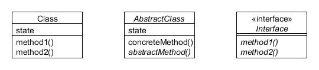
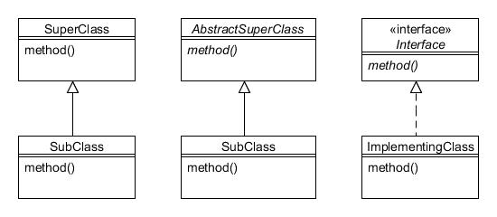

# Apéndice A. Diagramas UML

This book uses a simplified version of Unified Modeling Language (UML) diagrams to illustrate class hierarchies and usages for the patterns in this book. Each separate class is shown as a bounded rectangle with three horizontal sections, the top section containing the name of the class, the second section any relevant state (i.e. instance variables) and the third section containing the protocol (i.e. methods).

---

## Representando tipos{#h2-18}

Abstract classes, interfaces and abstract methods are shown in italicised text. The following figure shows an example of each sort of type and method:

Figura A.1 : Clase normal (izquierda), clase abstracta (centro), interfaz (derecha)

The majority of diagrams in this book omit the state, thus leaving a small gap between the two horizontal bars (see the interface example in Figura A.1). This should not be taken to mean there is no state in the actual class; rather that it would have cluttered the diagram unnecessarily. Likewise, only relevant methods are listed, and not necessarily all. Unless specified otherwise, you can assume that all listed methods are public.

---

## Representando herencia{#h2-19}

Inheritance is shown by a line connection between classes, with a hollow triangle pointing to the class being inherited or interfaces being implemented. Solid lines are shown for classes and dashed lines for interface connections:

Figura A.2 : Ampliar una clase (izquierda y centro), implementar una interfaz (derecha)

---

## Representando composición y uso{#h2-20}

When one class 'uses' another (i.e. holds a reference to it), this is shown by a dashed line with an open arrow pointing toward the class being used. The usage is usually through passing a reference to the using object’s constructor or a method, or by instantiating the object being used. In the following diagram each instance of ClassA holds or obtains a reference to an instance of ClassB:

Figura A.3 : ClassA usa ClassB

---

## Fragmentos de código{#h2-21}

Where useful, snippets of code will be shown in a grey box attached to a class with a dashed line:

Figura A.4 : Fragmento de código

---

## 'Cliente' y otras clases de color gris{#h2-22}

If a class rectangle is shown in grey this only for aesthetic purposes to separate it from other classes in the diagram. This is most often used in this book for 'client' classes, i.e. classes which make use of a particular pattern, as the following example for the Chain of Responsibility pattern illustrates:

Figura A.5 : Client class in grey
