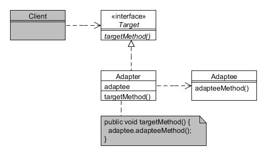

# Adaptador (Adapter)

Type: Structural

Purpose: Convert the interface of a class into another interface clients expect. Adapter lets classes work together that couldn't otherwise because of incompatible interfaces.

Example usage: Integration of independent and incompatible classes. The Java class libraries define WindowAdapter as a convenience class that 'adapts' the WindowListener interface with default empty method implementations.

Consequences: A single adapter can work with many adaptees.

* Target refers to the interface that the client program requires;
* Adapter is the class used by client programs to forward requests to Adaptee;
* Adaptee is the class that needs adapting.
