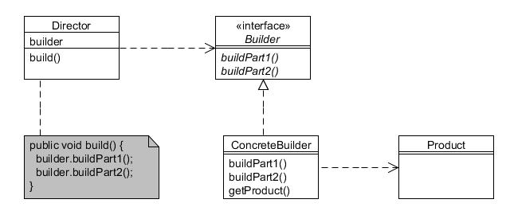

# Constructor (Builder)

Type: Creational

Purpose: Separate the construction of a complex object from its representation so that the same construction process can create different representations.

Example usage: Useful when there are several steps needed to create an object.

Consequences: Enables variations of a products internal representation. Isolates construction and representation.

* Builder defines an interface for creating parts of a 'product' object;
* ConcreteBuilder creates and assembles the 'product' parts step-by-step and provides a method to retrieve it during or after assembly;
* Director controls the actual assembly process.
