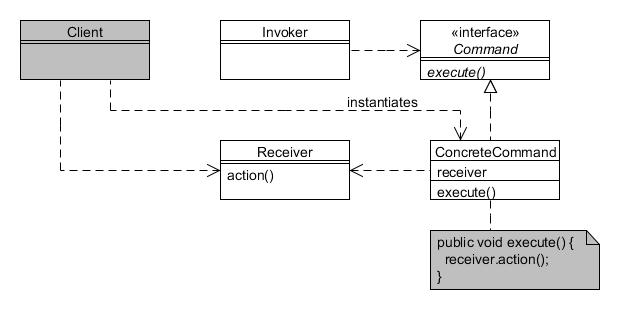

# Comando (Command)

Type: Behavioural

Purpose: Encapsulate a request as an object, thereby letting you parameterise clients with different requests, queue or log requests, and support undoable operations.

Example usage: UI controls such as menu items and toolbar buttons. Undo/redo mechanisms.

Consequences: Strive to keep separate the objects that invoke the operation from the object that performs it.

* Command is the interface for executing an operation;
* ConcreteCommand performs the operation on the Receiver;
* Invoker asks the command to be carried out;
* Receiver knows how to perform the operations.
