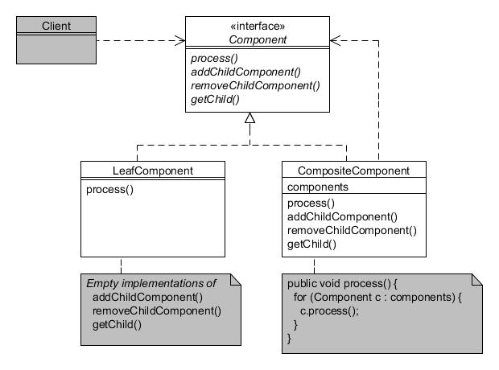

# Compuesto (Composite)

Type: Structural

Purpose: Compose objects into tree structures to represent part-whole hierarchies. Composite lets clients treat individual objects and compositions of objects uniformly.

Example usage: Graphical component hierarchies, etc.

Consequences: Simple objects can be combined into complex assemblies and all treated through a common interface. Adding new components should be straightforward.

* Component is the interface for both leaves and composites;
* LeafComponent defines objects that have no children;
* CompositeComponent defines objects that may have children.
