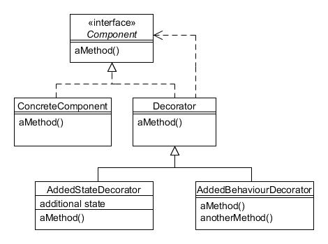

# Decorador (Decorator)

Type: Structural

Purpose: Attach additional responsibilities to an object dynamically. Decorators provide a flexible alternative to subclassing for extending functionality.

Example usage: GUI toolkits, file and object input/output streams (e.g. buffering).

Consequences: Can be more flexible than direct inheritance and reduce number of classes required.

* Component defines the interface for objects that can have responsibilities added to them dynamically;
* ConcreteComponent implements the Component interface;
* Decorator maintains a reference to a Component object as well as defining an interface that matches that of Component;
* AddedStateDecorator and AddedBehaviourDecorator each decorate a Component by adding additional instance variables and/or methods.
