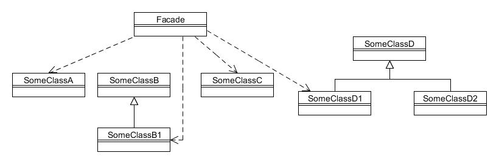

# Fachada (Facade){#h2-59}

Type: Structural

Purpose: Provide a unified interface to a set of interfaces in a subsystem. Facade defines a higher-level interface that makes the subsystem easier to use.

Example usage: To simplify access to several objects through a single 'facade' object.

Consequences: Needs a new class to be created to serve as the 'facade'.

* Facade defines the class that provides the simplified interface to other classes;
* SomeClassA, etc. are various classes, related or not.
