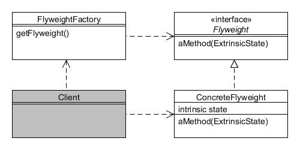

# Flyweight

Type:Structural

Purpose: Use sharing to support large numbers of fine-grained objects efficiently.

Example usage: Text/graphic editors, etc.

Consequences: Saves memory through sharing shared state.

* Flyweight defines the interface through which flyweight objects can act on extrinsic state;
* ConcreteFlyweight implements Flyweight and stores intrinsic state. Must be shareable;
* FlyweightFactory creates and manages the flyweight objects through a 'pooling' mechanism.

Client programs maintain references to the flyweights obtained through the factory.
