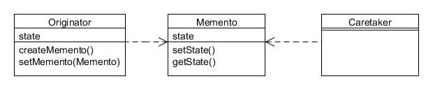

# Recuerdo (Memento)

Type: Behavioural

Purpose: Without violating encapsulation, capture and externalise an object's internal state so that it can be restored to this state later.

Example usage: Undo & Redo processing, database transactions, etc.

Consequences: Encapsulates the storage of state external to the originating object, but might be expensive in terms of memory or performance.

* Originator creates the Memento object and uses it to restore its state;
* Memento stores the state of Originator;
* Caretaker keeps the memento.
