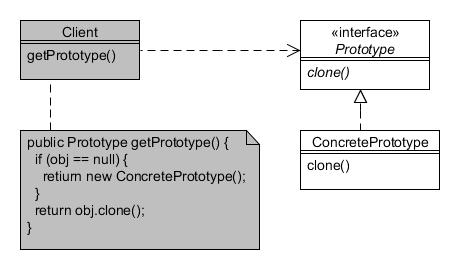

# Prototipo (Prototype)

Type: Creational

Purpose: Specify the kinds of objects to create using a prototypical instance, and create new objects by copying the prototype.

Example usage: Where easier or faster to clone than to instantiate.

Consequences: Cloning might become difficult in certain situations

* Prototype defines an interface that can 'clone' itself;
* ConcretePrototype performs the self-cloning.

Client programs create new objects by asking a prototype to clone itself.
