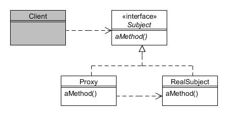

# Apoderado (Proxy)

Type: Structural

Purpose: Provide a surrogate or place-holder for another object to control access to it.

Example usage: Java RMI, security proxies, etc.

Consequences: RMI runs on multiple JVMs.

* Subject defines the interface that needs to be accessed through a proxy;
* RealSubject defines the actual object which Proxy represents;
* Proxy maintains a reference to RealSubject so it can act on its behalf.
