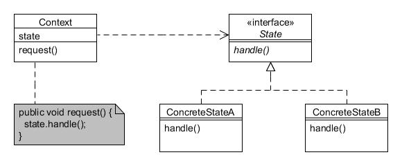

# Estado (State)

Type: Behavioural

Purpose: Allow an object to alter its behaviour when its internal state changes. The object will appear to change its class.

Example usage: UI shape components, etc.

Consequences: Localises state-specific behaviour and separates behaviour for different states.

 

* State defines the interface for handling different states in the handle() method;
* ConcreteStateA and ConcreteStateB implement the State interface for each separate state;
* Context holds a reference to a State object to request a particular state.
