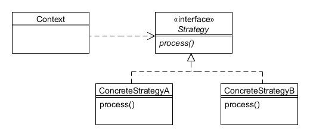

# Estrategia (Strategy)

Type: Behavioural

Purpose: Define a family of algorithms, encapsulate each one, and make them interchangeable. Strategy lets the algorithm vary independently from clients that use it.

Example usage: Java Swing borders.

Consequences: Might need to pass data to each strategy.

* Strategy defines the interface for the algorithms;
* ConcreteStrategyA and ConcreteStrategyB implement Strategy for a particular algorithm;
* Context holds a reference to the Strategy that is being used.
